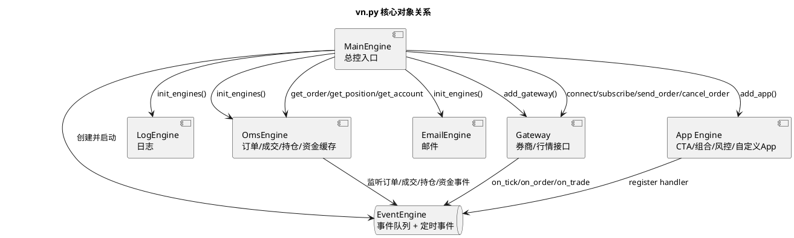
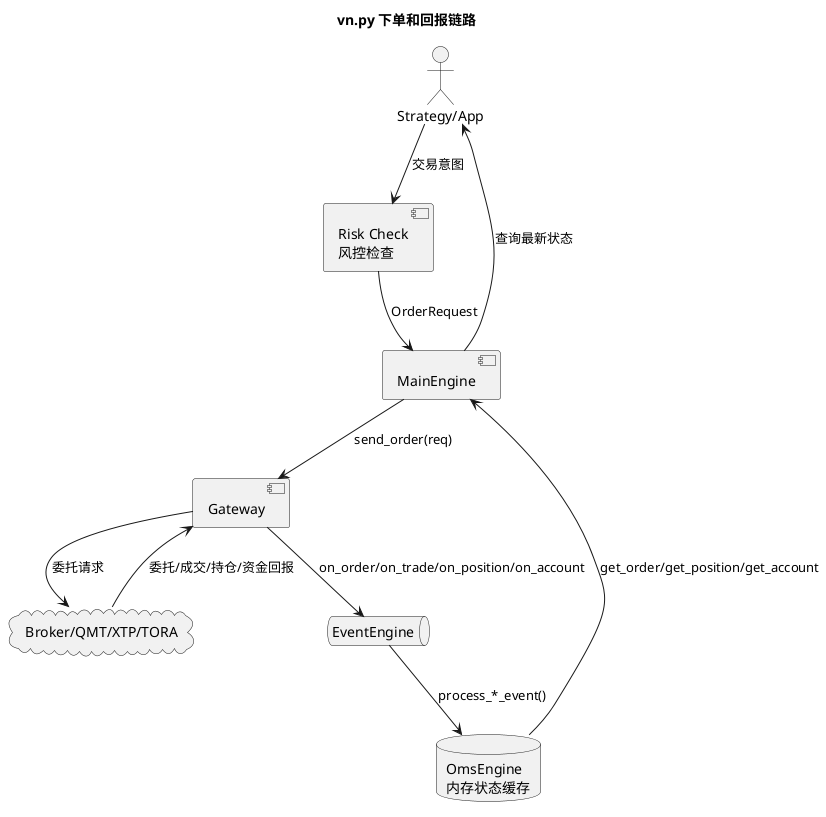
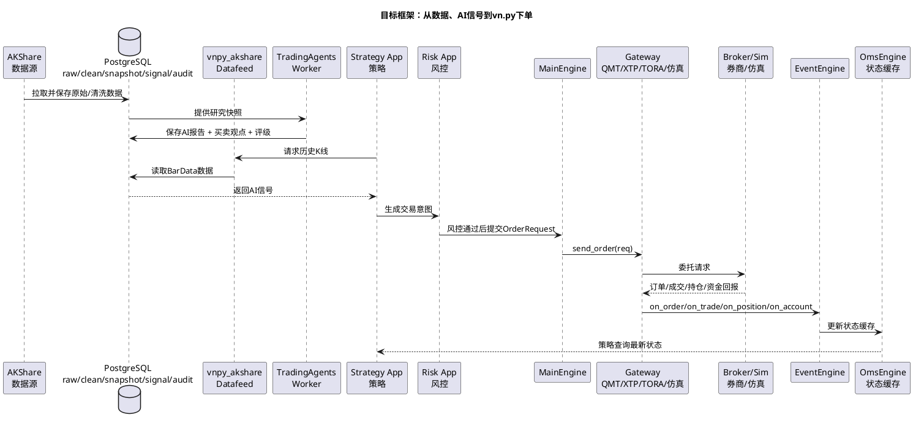
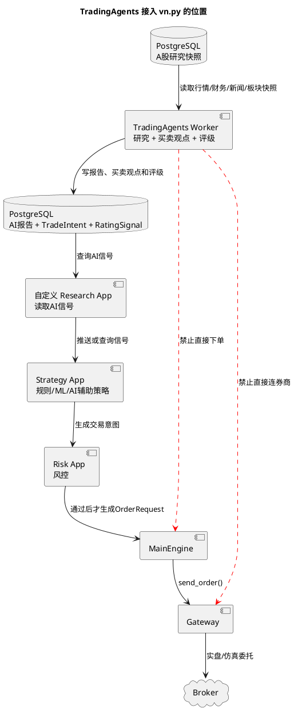
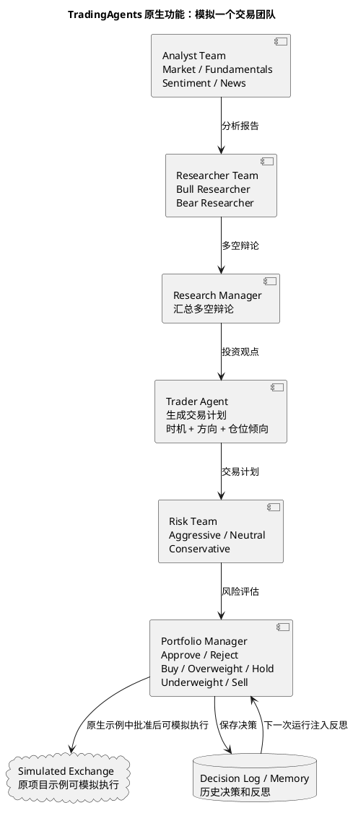
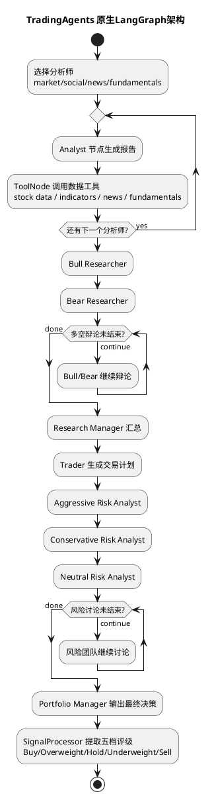
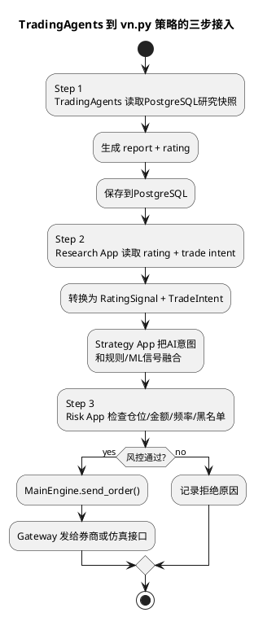

# 自定义 A 股量化架构方案：AKShare + TradingAgents + VeighNa

版本：v0.1

日期：2026-05-03

状态：方案草案

> 本文档用于本 fork 的二次开发规划，不构成任何投资建议。AKShare 和 TradingAgents 只能作为投研与信号辅助；实盘前必须经过回测、人工确认、风控、OMS 和账户对账。

## 1. 目标

基于 VeighNa / vn.py 的事件驱动交易框架，构建一套面向 A 股的个人量化架构：

- 使用 AKShare 作为免费投研数据源之一，补齐股票、指数、板块、基础财务和部分事件数据。
- 接入 TradingAgents 多智能体投研框架，把 LLM 输出落成可审计的研究报告和交易评级。
- 保留 VeighNa 的核心优势：`EventEngine`、`MainEngine`、`Gateway`、`Datafeed`、`OmsEngine`、策略 App 和风控 App。
- 持久化数据库统一选用 PostgreSQL，用于 raw data、清洗数据、质量报告、研究快照、AI 报告、信号和交易审计。
- 后续文档中的架构图、流程图和时序图统一使用 PlantUML，不再使用 Mermaid 作为图示格式。
- 第一阶段先做投研、数据和回测闭环，不让 AI 或策略绕过风控直接下单。

## 2. 调研结论

### 2.1 vn.py 社区已有 AKShare 插件

VeighNa 社区存在 AKShare datafeed 适配器，但不属于官方 datafeed 列表，建议作为参考而非直接生产依赖：

- `lpf6/vnpy_akshare`：社区在 2022-12-07 发布的 `vnpy_akshare` 数据服务适配器，分类为 datafeed，协议 MIT。
- `wade1010/vnpy_akshare`：2025-06-09 社区用户发布的修正版，PyPI 包名为 `vnpy_akshare_adapter`，说明中提到主要支持 A 股，tick 不支持，AKShare 抓取证券网站可能较慢。
- VeighNa 官方 datafeed 文档列出的标准数据服务包括 XT、RQData、TuShare、TQSDK、Wind、iFinD、Tinysoft 等，未把 AKShare 列为官方支持项。

工程判断：

- 不直接把社区插件作为生产数据源。
- 在本 fork 中实现自维护的 `vnpy_akshare` datafeed，接口遵守 VeighNa `BaseDatafeed`。
- 所有 AKShare 原始数据先进入缓存和质量检查，再转换为 `BarData` / `TickData` / 研究快照。

### 2.2 TradingAgents 更适合做投研 Worker

TradingAgents v0.2.4 已支持结构化输出、checkpoint、持久化决策日志和多 LLM provider。它默认偏美股数据栈，例如 yfinance、Alpha Vantage 和 SPY benchmark；A 股接入时不能直接复用默认数据工具。

推荐做法：

- 复用 TradingAgents 的多角色推理链路。
- 替换其数据工具，让 market、fundamentals、news、sentiment 都从本地 A 股数据快照读取。
- 将最终输出的 Buy / Overweight / Hold / Underweight / Sell 映射为 VeighNa 内部可消费的研究信号。
- TradingAgents 不持有交易接口，不直接调用 `MainEngine.send_order()`。

## 3. 先把 vn.py 架构看简单

一句话理解 vn.py：

```text
MainEngine 是总控；
EventEngine 是消息总线；
Gateway 是券商/行情接口；
OmsEngine 是订单、成交、持仓、资金的本地状态缓存；
App/Strategy 是你的策略和功能模块。
```

### 3.1 vn.py 启动后有哪些核心对象



这张图只表达一件事：**vn.py 不是一个“策略直接连券商”的框架，而是 MainEngine 把事件、接口、订单状态、策略 App 都装起来。**

### 3.2 实盘交易时一笔订单怎么走

```text
策略只应该产生 OrderRequest；
真正发单必须走 MainEngine.send_order()；
Gateway 发给券商后，再把订单/成交回报通过 EventEngine 推回来；
OmsEngine 监听这些事件，维护最新订单、成交、持仓和资金状态。
```



这张图的关键边界是：**TradingAgents 不能出现在 `MainEngine -> Gateway -> Broker` 这条实盘下单链路里。它最多给策略一个“研究信号”。**

### 3.3 历史数据和交易接口是两条线

很多人第一次看 vn.py 容易把 datafeed 和 gateway 混在一起。这里要拆开：

| 能力 | vn.py 抽象 | 本项目实现 |
| --- | --- | --- |
| 历史 K 线 | `BaseDatafeed.query_bar_history()` | `vnpy_akshare` 从 PostgreSQL/AKShare 返回 `BarData` |
| 历史 Tick | `BaseDatafeed.query_tick_history()` | 第一阶段明确不支持 |
| 实时行情 | `BaseGateway.subscribe()` + `on_tick()` | 后续走 QMT/XTP/TORA 等 gateway |
| 下单撤单 | `BaseGateway.send_order()` / `cancel_order()` | 后续走 QMT/XTP/TORA 等 gateway |
| 状态缓存 | `OmsEngine` | vn.py 原生维护订单、成交、持仓、资金 |

所以第一阶段 AKShare 做的是 **datafeed**，不是 gateway；它不应该承担实盘行情或实盘下单。

## 4. 目标框架：按一次信号到订单的流向看

这张图只按“时间顺序”看，不再把所有模块堆在一张总览图里：

```text
1. AKShare 拉数据，存 PostgreSQL。
2. TradingAgents 从 PostgreSQL 读研究快照，生成 AI 买卖观点和评级，也存 PostgreSQL。
3. vn.py Strategy App 读取历史 K 线和 AI 信号，生成交易意图。
4. Risk App 先做风控。
5. 风控通过后才走 MainEngine -> Gateway -> 券商。
6. 券商回报再通过 EventEngine 回到 OmsEngine。
```



如果只看 TradingAgents 接入 vn.py，就是下面这条更小的链路：



看图时抓住两个边界：

- TradingAgents 可以产出买入、卖出、持有、减仓这类“策略观点”。
- TradingAgents 不能直接执行买卖；执行仍然必须通过 Strategy App、Risk App、MainEngine 和 Gateway。

## 5. AKShare 接入设计

### 5.1 第一阶段支持范围

第一阶段只做稳定的日频研究数据：

- A 股股票列表和名称。
- 交易日历。
- 未复权日线。
- 前复权日线。
- 指数日线：上证指数、沪深 300、中证 500、中证 1000、创业板指。
- 板块、概念和行业标签。
- 基础财务和估值字段：总市值、流通市值、市盈率、市净率、营收同比、净利润同比。

分钟线、tick、实时盘口和实盘行情不作为 AKShare 第一阶段目标；实盘确认应优先使用券商或 QMT 行情。

### 5.2 模块建议

```text
vnpy/akshare_datafeed/
  __init__.py
  datafeed.py          # Datafeed(BaseDatafeed)
  client.py            # AKShare 调用封装
  storage.py           # PostgreSQL 持久化
  quality.py           # 数据质量检查
  mapper.py            # DataFrame -> BarData
```

`Datafeed` 负责对外适配 VeighNa：

```python
class Datafeed(BaseDatafeed):
    def init(self, output: Callable = print) -> bool:
        ...

    def query_bar_history(
        self,
        req: HistoryRequest,
        output: Callable = print,
    ) -> list[BarData]:
        ...

    def query_tick_history(
        self,
        req: HistoryRequest,
        output: Callable = print,
    ) -> list[TickData]:
        ...
```

第一版 `query_tick_history()` 可以明确返回空列表并输出“不支持 tick”，不要伪造数据。

### 5.3 数据质量规则

所有 AKShare 数据进入 VeighNa 前应检查：

- 必要字段是否存在。
- 日期是否可解析且无重复。
- 开高低收是否为非负。
- high >= max(open, close, low)。
- low <= min(open, close, high)。
- volume 和 amount 非负。
- 复权数据是否存在异常负价。
- 单日涨跌幅是否超过合理阈值，超过则标记为异常而非直接丢弃。

## 6. TradingAgents 原生功能和架构

### 6.1 TradingAgents 原本能做什么

TradingAgents 原生定位不是“只写研究报告”。它本来就是一个多智能体交易决策框架，会让分析师、研究员、交易员、风险团队和组合经理一起产出交易决策。

官方 README 里描述的原生团队分工可以画成：



所以答案是：**TradingAgents 可以做买卖策略，但它原生做的是“生成交易决策和交易计划”，不是可靠的券商执行系统。**

### 6.2 TradingAgents 原生 LangGraph 架构

TradingAgents 用 LangGraph 编排 Agent。简化后是这条链路：



原生状态里包含：

- `market_report`
- `sentiment_report`
- `news_report`
- `fundamentals_report`
- `investment_debate_state`
- `trader_investment_plan`
- `risk_debate_state`
- `final_trade_decision`

### 6.3 原生 TradingAgents 和本 fork 的区别

| 问题 | TradingAgents 原生做法 | 本 fork 中的做法 |
| --- | --- | --- |
| 数据 | 默认偏美股，常见工具包括 yfinance、Alpha Vantage、新闻和基本面工具 | 替换成 PostgreSQL 中的 A 股快照、AKShare、QMT 或其他 A 股数据 |
| Benchmark | 原生记忆/反思里偏 SPY alpha | 替换成沪深 300、中证 500 或策略自定义基准 |
| 交易决策 | Trader + Portfolio Manager 可以给出交易计划和最终评级 | 可以转成 `TradeIntent` 和 `RatingSignal` |
| 执行 | 原生示例可送到 simulated exchange | 本 fork 不让 TradingAgents 直接执行，必须走 vn.py 风控和 Gateway |
| 风险 | LLM 风险团队给建议 | LLM 风险建议之外，还必须有确定性 Risk App 硬规则 |

## 7. TradingAgents 接入设计

### 7.1 TradingAgents 在系统里的角色

TradingAgents 不是 vn.py 的 Gateway，也不是 Datafeed。它可以参与买卖策略，但更准确地说，它应该是 **AI 策略决策模块**，而不是 **交易执行模块**。

它在本项目里的角色是：

```text
研究员 / 分析师 / 辩论员 / 风险评论员
  -> 产出报告
  -> 产出买卖观点和评级
  -> 买卖观点变成 TradeIntent
  -> 评级变成 RatingSignal
  -> 策略和风控决定是否下单
```

三种接入等级：

| 等级 | TradingAgents 可以做什么 | 是否允许直接下单 |
| --- | --- | --- |
| 研究模式 | 生成报告、风险点、评级 | 不允许 |
| AI 信号模式 | 输出 `RatingSignal`，参与策略排序和过滤 | 不允许 |
| AI 策略模式 | 输出 `TradeIntent`，例如买入、卖出、减仓、持有 | 仍然不允许，必须经过 Risk App 和 MainEngine |

### 7.2 Worker 化

TradingAgents 建议作为独立 Worker 运行：

```text
VeighNa App / Script
  -> AgentResearchService
  -> tradingagents-worker
  -> report + rating + raw_state
```

原因：

- TradingAgents 依赖 LangGraph、多个 LLM provider、yfinance、stockstats 等库。
- VeighNa 主框架依赖 PySide6、TA-Lib、交易接口和 GUI 生态。
- 两套依赖放在同一进程里容易产生版本冲突。

### 7.3 A 股工具替换

TradingAgents 默认工具应替换为本地工具：

| TradingAgents 工具类型 | A 股实现 |
| --- | --- |
| stock data | 本地清洗后的 AKShare / QMT 日线和分钟线 |
| indicators | pandas / stockstats / VeighNa ArrayManager |
| fundamentals | AKShare 财务、估值、公告数据 |
| news | 公告、财报、新闻、板块事件 |
| sentiment | 可选，先用新闻事件标签和人工备注替代 |
| benchmark | 沪深 300 / 中证 500，而不是 SPY |

### 7.4 输出映射

TradingAgents 最终评级映射为内部研究信号；交易计划映射为内部交易意图：

| 评级 | 信号方向 | 建议强度 | A 股含义 |
| --- | --- | --- | --- |
| Buy | long | 0.8-1.0 | 强正向候选，不等于立即买入 |
| Overweight | long | 0.4-0.7 | 偏多，可提高排序权重 |
| Hold | neutral | 0.0 | 观望或维持 |
| Underweight | reduce | -0.4~-0.7 | 减仓或回避 |
| Sell | exit | -0.8~-1.0 | 卖出或退出候选 |

`TradeIntent` 建议字段：

```text
symbol
trade_date
action: buy / sell / reduce / hold
confidence
target_weight_hint
holding_period_hint
reason
risk_notes
source_run_id
```

输出必须保存：

- 输入快照 ID。
- 模型 provider 和模型名。
- 分析师报告。
- 牛熊辩论记录。
- 风险辩论记录。
- Portfolio Manager 最终决策。
- 解析后的评级。

### 7.5 从 TradingAgents 到 vn.py 策略的具体接入方式

接入分三步，不要一步到位直接实盘：



建议第一版只实现 Step 1 和 Step 2：

- Step 1：跑出报告、买卖观点和评级，落 PostgreSQL。
- Step 2：写一个 Research App 或服务，把输出转换成可查询的 `RatingSignal` 和 `TradeIntent`。
- Step 3：等回测和模拟盘验证后再接交易链路。

任何版本都不允许：

- TradingAgents 调用 `MainEngine.send_order()`。
- TradingAgents 调用 Gateway。
- TradingAgents 直接改持仓或订单。
- TradingAgents 输出绕过风控。

## 8. 开发阶段

### Phase 1：AKShare datafeed POC

目标：

- 实现 `vnpy_akshare` 或 `vnpy.akshare_datafeed`。
- 支持 `HistoryRequest -> list[BarData]`。
- 支持日线、周线、月线；tick 明确不支持。

验收：

- `datafeed.name=akshare` 后可以 `get_datafeed().query_bar_history(req)`。
- 样例股票 `600519.SH`、`000001.SZ`、`300750.SZ` 可返回日线。
- 有单元测试覆盖字段映射和异常响应。

### Phase 2：本地数据缓存和质量报告

目标：

- 使用 PostgreSQL 保存 raw data、清洗数据和数据质量报告，避免每次回测重复抓取。
- 增加数据质量报告。
- 区分未复权和前复权数据。

验收：

- 同一请求第二次优先读取 PostgreSQL 已保存数据。
- 异常价格和空响应有明确日志。
- 回测结果可追溯到数据版本。

### Phase 3：TradingAgents A 股研究 POC

目标：

- 单股票、单日期运行 TradingAgents。
- 输入来自本地研究快照。
- 输出研究报告和五档评级。

验收：

- 无交易接口权限也能运行。
- 输出不会调用 `send_order()`。
- 报告和 raw state 可落盘。

### Phase 4：信号融合和策略接入

目标：

- 将 TradingAgents 评级转换为策略可用的辅助信号。
- 与规则策略、ML 策略共同进入组合和风控。

验收：

- AI 信号可以参与排序，但不能绕过策略和风控。
- 风控拒绝时不会下单。
- 所有 AI 影响的决策可回放。

### Phase 5：实盘灰度

目标：

- 只在模拟盘和小资金实盘中启用。
- 使用真实 Gateway 行情做盘中确认。
- 增加一键暂停和风控硬阈值。

验收：

- AI、AKShare、TradingAgents 任一模块失败时，不影响手工风控和撤单。
- 实盘订单只来自受控策略和风控批准。

## 9. 风险控制

| 风险 | 控制措施 |
| --- | --- |
| AKShare 接口变动 | 缓存、fallback、数据质量报告、接口版本记录 |
| AKShare 数据异常 | 异常值标记、复权口径分离、关键数据人工抽检 |
| TradingAgents 美股默认假设 | 替换数据工具、替换 benchmark、注入 A 股交易规则 |
| LLM 幻觉 | 结构化输出、人工审核、报告落盘、信号强度上限 |
| Prompt injection | 外部文本清洗、来源记录、工具权限隔离 |
| 依赖冲突 | TradingAgents Worker 独立环境 |
| 策略绕过风控 | 所有订单必须经过 MainEngine/OmsEngine 和风控规则 |
| 实盘误触发 | 默认关闭实盘开关、模拟盘灰度、小资金验证、一键暂停 |

## 10. 推荐近期行动

1. 保持这个 fork 为主开发仓库，不再依赖旧项目文档。
2. 先做 AKShare datafeed POC，跑通 VeighNa 标准历史数据接口。
3. 同步补充数据质量报告，不急着做实时交易。
4. 再做 TradingAgents Worker POC，先输出报告和评级。
5. 最后把 AI 评级接入策略和风控链路。

## 11. 资料来源

- VeighNa GitHub: https://github.com/vnpy/vnpy
- VeighNa 数据服务文档: https://www.vnpy.com/docs/cn/community/info/datafeed.html
- VeighNa 交易接口文档: https://www.vnpy.com/docs/cn/community/info/gateway.html
- VeighNa 社区 `vnpy_akshare`: https://www.vnpy.com/forum/topic/31286-shu-ju-fu-wu-vnpy-akshare%3Aakshareshu-ju-fu-wu-gua-pei-qi?page=1
- `lpf6/vnpy_akshare`: https://github.com/lpf6/vnpy_akshare
- `wade1010/vnpy_akshare`: https://github.com/wade1010/vnpy_akshare
- TradingAgents: https://github.com/TauricResearch/TradingAgents
- TradingAgents Release: https://github.com/TauricResearch/TradingAgents/releases
- AKShare: https://github.com/akfamily/akshare
- AKShare 数据说明: https://akshare.akfamily.xyz/data_tips.html
