# 自定义 A 股量化架构方案：可切换数据源 + TradingAgents + VeighNa

版本：v0.1

日期：2026-05-03

状态：方案草案

> 本文档用于本 fork 的二次开发规划，不构成任何投资建议。任何数据源和 TradingAgents 都只能作为投研与信号辅助；实盘前必须经过回测、人工确认、风控、OMS 和账户对账。

## 1. 目标

基于 VeighNa / vn.py 的事件驱动交易框架，构建一套面向 A 股的个人量化架构：

- 数据源设计为可切换：AKShare 作为当前低门槛起步数据源之一，后续可切换或叠加 TuShare、QMT、XT、RQData、CSV/Parquet 本地数据等来源。
- 接入 TradingAgents 多智能体投研框架，把 LLM 输出落成可审计的研究报告和交易评级。
- 保留 VeighNa 的核心优势：`EventEngine`、`MainEngine`、`Gateway`、`Datafeed`、`OmsEngine`、策略 App 和风控 App。
- 持久化数据库统一选用 PostgreSQL，用于 raw data、清洗数据、质量报告、研究快照、AI 报告、信号和交易审计。
- 后续文档中的架构图、流程图和时序图统一使用 PlantUML，不再使用 Mermaid 作为图示格式。
- 第一阶段先做投研、数据和回测闭环，不让 AI 或策略绕过风控直接下单。

## 2. 调研结论

### 2.1 AKShare 是起步数据源，不是唯一数据源

提出接入 AKShare 的原因是现实约束：当前还没开通 QMT，TuShare 积分只有 100，付费数据源和高积分接口暂时不可依赖。因此 AKShare 适合作为第一阶段的免费起步数据源。

但工程设计不能把 AKShare 写死。VeighNa 社区存在 AKShare datafeed 适配器，但不属于官方 datafeed 列表，建议作为参考而非直接生产依赖：

- `lpf6/vnpy_akshare`：社区在 2022-12-07 发布的 `vnpy_akshare` 数据服务适配器，分类为 datafeed，协议 MIT。
- `wade1010/vnpy_akshare`：2025-06-09 社区用户发布的修正版，PyPI 包名为 `vnpy_akshare_adapter`，说明中提到主要支持 A 股，tick 不支持，AKShare 抓取证券网站可能较慢。
- VeighNa 官方 datafeed 文档列出的标准数据服务包括 XT、RQData、UData、TuShare、TQSDK、Wind、iFinD、Tinysoft 等，未把 AKShare 列为官方支持项。

工程判断：

- 不直接把社区插件作为生产唯一数据源。
- 在本 fork 中实现自维护的 `DataProviderAdapter` 体系，AKShare 只是其中一个 provider。
- 对外仍遵守 VeighNa `BaseDatafeed`，对内通过 `DataProviderRouter` 选择 AKShare、TuShare、QMT、XT、RQData 或本地文件。
- 所有外部原始数据先进入 PostgreSQL 缓存、来源标记和质量检查，再转换为 `BarData` / `TickData` / 研究快照。

### 2.2 vn.py 当前如何配置数据服务

vn.py 目前支持在主界面菜单栏的 **配置 -> 全局配置** 中配置数据服务。相关字段是：

- `datafeed.name`：数据服务接口名称，全称小写，例如 `tushare`、`rqdata`、`xt`。
- `datafeed.username`：数据服务用户名。
- `datafeed.password`：数据服务密码或 token。

代码上，`get_datafeed()` 会读取 `SETTINGS["datafeed.name"]`，然后按 `vnpy_{datafeed.name}` 这个模块名动态导入，并创建其中的 `Datafeed()` 实例。全局配置窗口保存后也明确提示需要重启才会生效。

这说明 vn.py 已经支持 **全局级别** 的 datafeed 切换，但还不是本项目需要的 **多 provider 并存、按用途自动切换、按字段 fallback** 的数据源管理。

本 fork 建议：

- 保留 vn.py 原生 `datafeed.name` 配置能力。
- 增加一个自定义 datafeed，例如 `datafeed.name=router`。
- `vnpy_router.Datafeed` 内部再根据 provider 配置、数据可用性、成本和质量分数选择 AKShare、TuShare、QMT、XT 或本地缓存。

### 2.3 TradingAgents 更适合做投研 Worker

TradingAgents v0.2.4 已支持结构化输出、checkpoint、持久化决策日志和多 LLM provider。它默认偏美股数据栈，例如 yfinance、Alpha Vantage 和 SPY benchmark；A 股接入时不能直接复用默认数据工具。

推荐做法：

- 复用 TradingAgents 的多角色推理链路。
- 替换其数据工具，让 market、fundamentals、news、sentiment 都从本地 A 股数据快照读取。
- 将最终输出的 Buy / Overweight / Hold / Underweight / Sell 映射为 VeighNa 内部可消费的研究信号。
- TradingAgents 不持有交易接口，不直接调用 `MainEngine.send_order()`。

## 3. 先把 vn.py 架构看简单

一句话理解 vn.py：

```text
MainEngine 是总控；
EventEngine 是消息总线；
Gateway 是券商/行情接口；
OmsEngine 是订单、成交、持仓、资金的本地状态缓存；
App/Strategy 是你的策略和功能模块。
```

### 3.1 vn.py 启动后有哪些核心对象

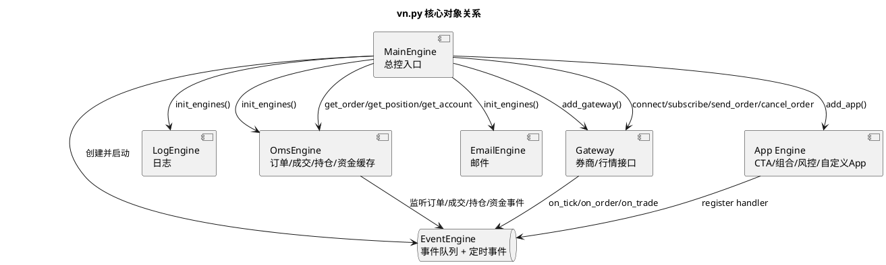

这张图只表达一件事：**vn.py 不是一个“策略直接连券商”的框架，而是 MainEngine 把事件、接口、订单状态、策略 App 都装起来。**

### 3.2 实盘交易时一笔订单怎么走

```text
策略只应该产生 OrderRequest；
真正发单必须走 MainEngine.send_order()；
Gateway 发给券商后，再把订单/成交回报通过 EventEngine 推回来；
OmsEngine 监听这些事件，维护最新订单、成交、持仓和资金状态。
```

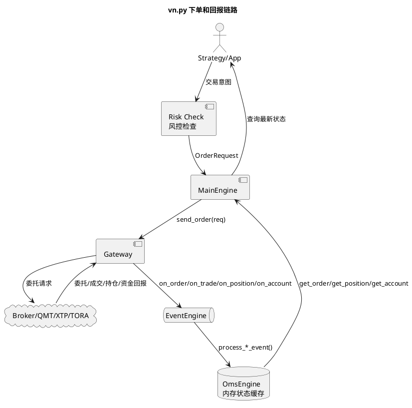

这张图的关键边界是：**TradingAgents 不能出现在 `MainEngine -> Gateway -> Broker` 这条实盘下单链路里。它最多给策略一个“研究信号”。**

### 3.3 历史数据和交易接口是两条线

很多人第一次看 vn.py 容易把 datafeed 和 gateway 混在一起。这里要拆开：

| 能力 | vn.py 抽象 | 本项目实现 |
| --- | --- | --- |
| 历史 K 线 | `BaseDatafeed.query_bar_history()` | `vnpy_router` 从 PostgreSQL 缓存或多个 provider 返回 `BarData` |
| 历史 Tick | `BaseDatafeed.query_tick_history()` | 第一阶段按 provider 能力决定，AKShare 路径明确不支持 |
| 实时行情 | `BaseGateway.subscribe()` + `on_tick()` | 后续走 QMT/XTP/TORA 等 gateway |
| 下单撤单 | `BaseGateway.send_order()` / `cancel_order()` | 后续走 QMT/XTP/TORA 等 gateway |
| 状态缓存 | `OmsEngine` | vn.py 原生维护订单、成交、持仓、资金 |

所以第一阶段 AKShare 只是 **data provider**，不是 gateway，也不是唯一 datafeed；它不应该承担实盘行情或实盘下单。

## 4. vn.py 如何支持日内分时和长期操作

vn.py 的日内分时和长期操作不是两套底层框架，而是同一个事件驱动架构上不同的策略周期和执行方式。

一句话区分：

```text
日内分时：实时 tick/分钟K线驱动，策略持续运行，盘中不断判断和下单。
长期操作：日线/周线/月线或盘前盘后信号驱动，低频产生目标仓位，盘中只做执行和风控。
```

### 4.1 日内分时操作怎么实现

vn.py 的日内分时链路主要依赖 `Gateway` 的实时行情推送、策略 App 的 `on_tick/on_bar` 回调、算法委托执行和事前风控。

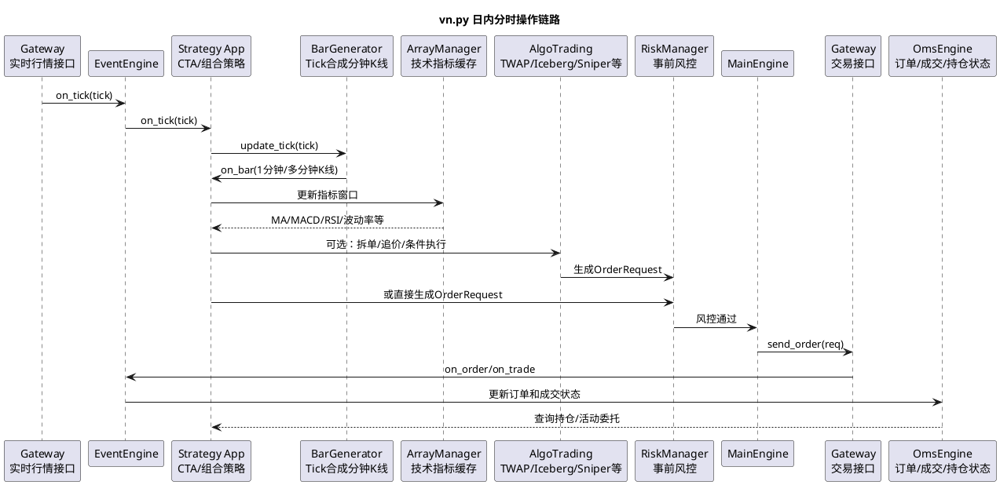

日内分时适合：

- CTA 策略：趋势突破、均线、动量、止损、止盈。
- 组合策略：多个标的同时看盘、联动调仓。
- 算法交易：TWAP、冰山、狙击手、条件单、最优限价等。
- 盘中风控：委托流控、单笔数量、活动委托、撤单次数、成交上限。

核心特点：

- 策略必须在交易时段持续运行。
- 初始化时先加载历史 K 线，保证指标状态正确。
- 启动后 `trading=True`，策略里的买卖函数才真正发单。
- 停止策略时应撤销活动委托，并保存策略变量和逻辑持仓。

### 4.2 长期操作怎么实现

长期操作不是靠每个 tick 决策，而是用低频数据生成目标仓位，再在盘中执行。

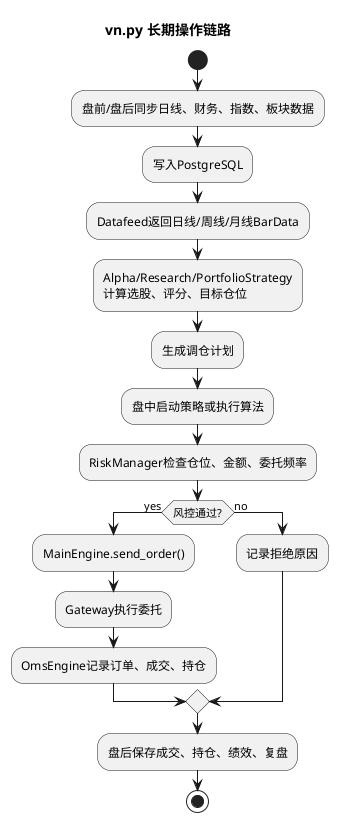

长期操作适合：

- 日线级多因子选股。
- 周期性组合调仓。
- 指数增强、ETF 轮动、行业轮动。
- AI/TradingAgents 产出的低频观点和风险复盘。

长期操作的关键不是毫秒级执行，而是：

- 数据版本可复现。
- 回测和实盘使用同一套复权、交易日历和交易规则。
- 目标仓位和真实持仓能对账。
- 盘中执行可以交给 AlgoTrading 分批完成，降低冲击成本。

### 4.3 日内和长期在 vn.py 里的关系

| 维度 | 日内分时操作 | 长期操作 |
| --- | --- | --- |
| 主要数据 | Tick、1分钟/5分钟K线、盘口 | 日线、周线、月线、财务、板块 |
| 触发方式 | `on_tick/on_bar` 实时回调 | 盘前/盘后批处理，或日线 bar 更新 |
| 主要 App | CTA、PortfolioStrategy、AlgoTrading、RiskManager | Alpha、PortfolioStrategy、DataManager/Datafeed、AlgoTrading |
| 交易频率 | 高频或中低频盘中多次 | 低频调仓，通常日级或周级 |
| 执行重点 | 盘口、滑点、撤单、追价、止损 | 目标仓位、换手率、组合约束、对账 |
| 风险重点 | 委托流控、撤单次数、活动委托、成交上限 | 仓位上限、行业集中度、回撤、再平衡纪律 |

## 5. 目标框架：按一次信号到订单的流向看

这张图只按“时间顺序”看，不再把所有模块堆在一张总览图里：

```text
1. DataProviderRouter 选择 AKShare、TuShare、QMT、XT 或本地缓存，拉数据并存 PostgreSQL。
2. TradingAgents 从 PostgreSQL 读研究快照，生成 AI 买卖观点和评级，也存 PostgreSQL。
3. vn.py Strategy App 读取历史 K 线和 AI 信号，生成交易意图。
4. Risk App 先做风控。
5. 风控通过后才走 MainEngine -> Gateway -> 券商。
6. 券商回报再通过 EventEngine 回到 OmsEngine。
```

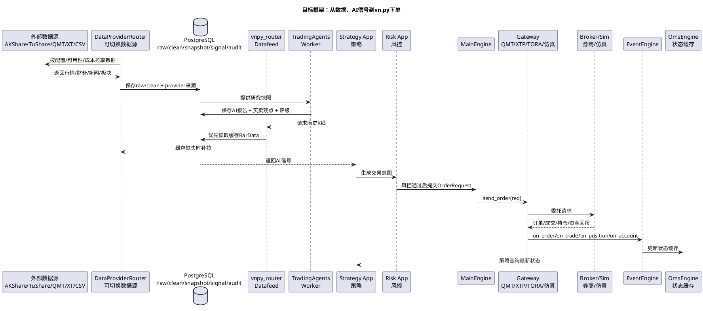

如果只看 TradingAgents 接入 vn.py，就是下面这条更小的链路：

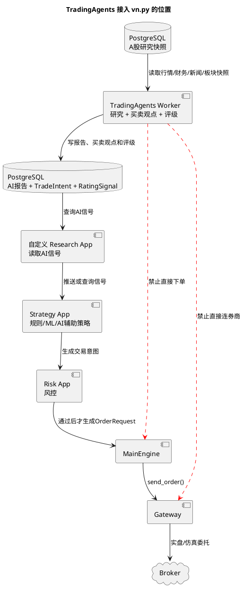

看图时抓住两个边界：

- TradingAgents 可以产出买入、卖出、持有、减仓这类“策略观点”。
- TradingAgents 不能直接执行买卖；执行仍然必须通过 Strategy App、Risk App、MainEngine 和 Gateway。

## 6. 可切换数据源接入设计

### 6.1 第一阶段支持范围

第一阶段先做稳定的历史数据和研究数据，不把任何单一 provider 写死：

- A 股股票列表和名称。
- 交易日历。
- 未复权日线。
- 前复权日线。
- 指数日线：上证指数、沪深 300、中证 500、中证 1000、创业板指。
- 板块、概念和行业标签。
- 基础财务和估值字段：总市值、流通市值、市盈率、市净率、营收同比、净利润同比。

默认 provider 可以先选 AKShare，因为它当前成本最低；但配置和表结构必须允许切换到 TuShare、QMT、XT、RQData 或本地文件。分钟线、tick、实时盘口和实盘行情不作为 AKShare 路径的第一阶段目标；实盘确认应优先使用券商或 QMT 行情。

### 6.2 数据源切换模型

对 vn.py 来说，只暴露一个 `vnpy_router.Datafeed`；对本项目内部来说，`DataProviderRouter` 可以挂多个 provider。

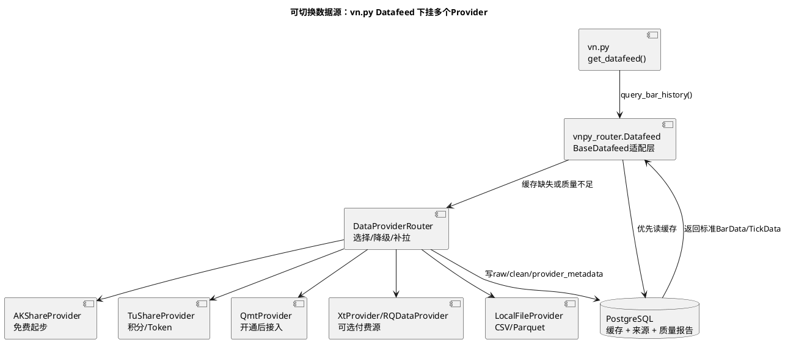

切换原则：

- `datafeed.name=router`：vn.py 仍按原生方式加载 `vnpy_router.Datafeed`。
- `provider.default=akshare`：默认从 AKShare 补拉。
- `provider.priority=postgres,qmt,tushare,akshare,local`：按优先级选择。
- `provider.fallback=true`：某个 provider 缺字段、超时或质量失败时，允许降级到下一个 provider。
- `provider.lock_for_backtest=true`：回测时锁定数据版本，避免同一策略每次回测拿到不同数据。

### 6.3 模块建议

```text
vnpy/data_router/
  __init__.py
  datafeed.py              # Datafeed(BaseDatafeed)，对vn.py暴露统一入口
  router.py                # provider选择、fallback、缓存策略
  storage.py               # PostgreSQL持久化
  quality.py               # 数据质量检查
  mapper.py                # provider DataFrame -> BarData/TickData
  providers/
    base.py                # Provider接口定义
    akshare.py             # AKShareProvider
    tushare.py             # TuShareProvider
    qmt.py                 # QmtProvider
    local_file.py          # LocalFileProvider
```

`Datafeed` 负责对外适配 VeighNa：

```python
class Datafeed(BaseDatafeed):
    def init(self, output: Callable = print) -> bool:
        ...

    def query_bar_history(
        self,
        req: HistoryRequest,
        output: Callable = print,
    ) -> list[BarData]:
        ...

    def query_tick_history(
        self,
        req: HistoryRequest,
        output: Callable = print,
    ) -> list[TickData]:
        ...
```

第一版 `query_tick_history()` 不做统一承诺：如果当前 provider 不支持 tick，就明确返回空列表并输出“不支持 tick”；不要为了补齐接口伪造 tick。

### 6.4 provider 元数据

PostgreSQL 中所有数据都要带来源信息，避免以后混用 AKShare、TuShare、QMT 后无法追溯：

```text
provider_name        # akshare / tushare / qmt / xt / rqdata / local_file
provider_endpoint    # 具体函数、接口或文件路径
provider_version     # Python包版本、接口版本或文件hash
adjustment           # none / qfq / hfq
pulled_at            # 拉取时间
trade_date_range     # 数据覆盖区间
quality_status       # passed / warning / failed
quality_report_id    # 质量报告ID
```

### 6.5 数据质量规则

所有 provider 数据进入 VeighNa 前应检查：

- 必要字段是否存在。
- 日期是否可解析且无重复。
- 开高低收是否为非负。
- high >= max(open, close, low)。
- low <= min(open, close, high)。
- volume 和 amount 非负。
- 复权数据是否存在异常负价。
- 单日涨跌幅是否超过合理阈值，超过则标记为异常而非直接丢弃。

## 7. TradingAgents 原生功能和架构

### 7.1 TradingAgents 原本能做什么

TradingAgents 原生定位不是“只写研究报告”。它本来就是一个多智能体交易决策框架，会让分析师、研究员、交易员、风险团队和组合经理一起产出交易决策。

官方 README 里描述的原生团队分工可以画成：

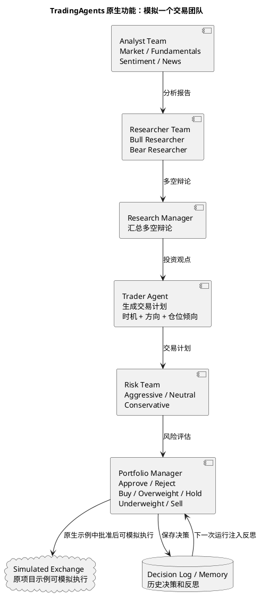

所以答案是：**TradingAgents 可以做买卖策略，但它原生做的是“生成交易决策和交易计划”，不是可靠的券商执行系统。**

### 7.2 TradingAgents 原生 LangGraph 架构

TradingAgents 用 LangGraph 编排 Agent。简化后是这条链路：

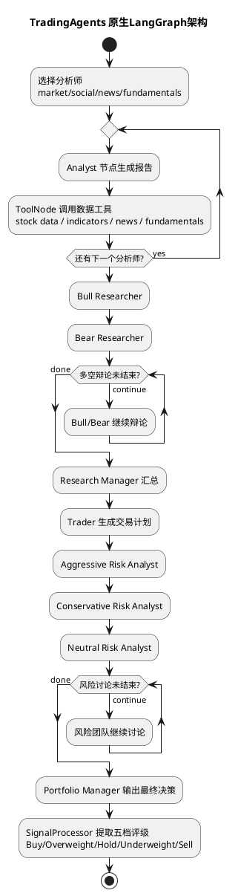

原生状态里包含：

- `market_report`
- `sentiment_report`
- `news_report`
- `fundamentals_report`
- `investment_debate_state`
- `trader_investment_plan`
- `risk_debate_state`
- `final_trade_decision`

### 7.3 原生 TradingAgents 和本 fork 的区别

| 问题 | TradingAgents 原生做法 | 本 fork 中的做法 |
| --- | --- | --- |
| 数据 | 默认偏美股，常见工具包括 yfinance、Alpha Vantage、新闻和基本面工具 | 替换成 PostgreSQL 中带 provider 来源的 A 股快照 |
| Benchmark | 原生记忆/反思里偏 SPY alpha | 替换成沪深 300、中证 500 或策略自定义基准 |
| 交易决策 | Trader + Portfolio Manager 可以给出交易计划和最终评级 | 可以转成 `TradeIntent` 和 `RatingSignal` |
| 执行 | 原生示例可送到 simulated exchange | 本 fork 不让 TradingAgents 直接执行，必须走 vn.py 风控和 Gateway |
| 风险 | LLM 风险团队给建议 | LLM 风险建议之外，还必须有确定性 Risk App 硬规则 |

## 8. TradingAgents 接入设计

### 8.1 TradingAgents 在系统里的角色

TradingAgents 不是 vn.py 的 Gateway，也不是 Datafeed。它可以参与买卖策略，但更准确地说，它应该是 **AI 策略决策模块**，而不是 **交易执行模块**。

它在本项目里的角色是：

```text
研究员 / 分析师 / 辩论员 / 风险评论员
  -> 产出报告
  -> 产出买卖观点和评级
  -> 买卖观点变成 TradeIntent
  -> 评级变成 RatingSignal
  -> 策略和风控决定是否下单
```

三种接入等级：

| 等级 | TradingAgents 可以做什么 | 是否允许直接下单 |
| --- | --- | --- |
| 研究模式 | 生成报告、风险点、评级 | 不允许 |
| AI 信号模式 | 输出 `RatingSignal`，参与策略排序和过滤 | 不允许 |
| AI 策略模式 | 输出 `TradeIntent`，例如买入、卖出、减仓、持有 | 仍然不允许，必须经过 Risk App 和 MainEngine |

### 8.2 Worker 化

TradingAgents 建议作为独立 Worker 运行：

```text
VeighNa App / Script
  -> AgentResearchService
  -> tradingagents-worker
  -> report + rating + raw_state
```

原因：

- TradingAgents 依赖 LangGraph、多个 LLM provider、yfinance、stockstats 等库。
- VeighNa 主框架依赖 PySide6、TA-Lib、交易接口和 GUI 生态。
- 两套依赖放在同一进程里容易产生版本冲突。

### 8.3 A 股工具替换

TradingAgents 默认工具应替换为本地工具：

| TradingAgents 工具类型 | A 股实现 |
| --- | --- |
| stock data | 本地清洗后的多 provider 日线和分钟线 |
| indicators | pandas / stockstats / VeighNa ArrayManager |
| fundamentals | PostgreSQL 中的财务、估值、公告快照，来源可为 AKShare、TuShare、QMT 或其他 provider |
| news | 公告、财报、新闻、板块事件 |
| sentiment | 可选，先用新闻事件标签和人工备注替代 |
| benchmark | 沪深 300 / 中证 500，而不是 SPY |

### 8.4 输出映射

TradingAgents 最终评级映射为内部研究信号；交易计划映射为内部交易意图：

| 评级 | 信号方向 | 建议强度 | A 股含义 |
| --- | --- | --- | --- |
| Buy | long | 0.8-1.0 | 强正向候选，不等于立即买入 |
| Overweight | long | 0.4-0.7 | 偏多，可提高排序权重 |
| Hold | neutral | 0.0 | 观望或维持 |
| Underweight | reduce | -0.4~-0.7 | 减仓或回避 |
| Sell | exit | -0.8~-1.0 | 卖出或退出候选 |

`TradeIntent` 建议字段：

```text
symbol
trade_date
action: buy / sell / reduce / hold
confidence
target_weight_hint
holding_period_hint
reason
risk_notes
source_run_id
```

输出必须保存：

- 输入快照 ID。
- 模型 provider 和模型名。
- 分析师报告。
- 牛熊辩论记录。
- 风险辩论记录。
- Portfolio Manager 最终决策。
- 解析后的评级。

### 8.5 从 TradingAgents 到 vn.py 策略的具体接入方式

接入分三步，不要一步到位直接实盘：

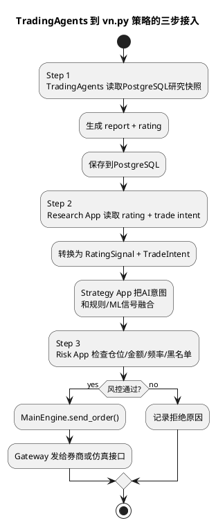

建议第一版只实现 Step 1 和 Step 2：

- Step 1：跑出报告、买卖观点和评级，落 PostgreSQL。
- Step 2：写一个 Research App 或服务，把输出转换成可查询的 `RatingSignal` 和 `TradeIntent`。
- Step 3：等回测和模拟盘验证后再接交易链路。

任何版本都不允许：

- TradingAgents 调用 `MainEngine.send_order()`。
- TradingAgents 调用 Gateway。
- TradingAgents 直接改持仓或订单。
- TradingAgents 输出绕过风控。

### 8.6 TradingAgents 能不能做日内分时操作建议

可以，但要定义清楚：TradingAgents 可以做 **日内分时操作建议**，不适合做 **逐 tick 高频执行器**。

推荐接入方式：

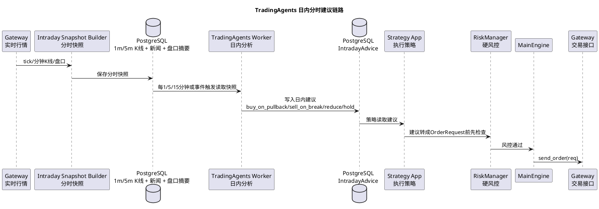

适合让 TradingAgents 做的日内建议：

- “分时回踩 5 分钟均线但承接较强，可以观察低吸”。
- “放量跌破开盘价且板块转弱，建议减仓或不加仓”。
- “冲高回落且盘口撤单明显，追高风险上升”。
- “已有长期持仓，日内不建议新增，只允许止盈/止损”。

不适合让 TradingAgents 做的事情：

- 每个 tick 都请求大模型。
- 毫秒级追价、抢单、撤单。
- 直接决定委托价格和数量后绕过风控下单。
- 用非实时 provider 数据做实盘盘口判断。

工程建议：

- 日内建议频率先从 5 分钟或 15 分钟开始，不要逐 tick。
- 输入给 TradingAgents 的不是原始 tick 流，而是压缩后的 `IntradaySnapshot`：价格位置、均线、成交量、盘口摘要、新闻事件、当前持仓和当天交易纪律。
- 输出落成 `IntradayAdvice`，再由策略和风控决定是否变成 `OrderRequest`。
- 对短线执行，仍交给 vn.py 的 Strategy App、AlgoTrading 和 RiskManager。

### 8.7 vn.py 全局接入点盘点

从本 fork 的代码结构看，TradingAgents 不应该只接在“策略”一个点上，而是应该拆成研究、信号、执行辅助、审计四层接入。

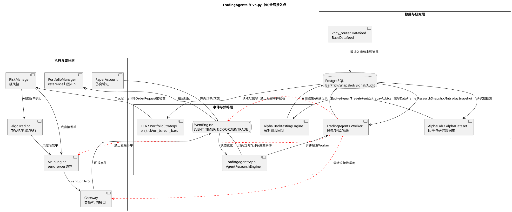

推荐接入点按优先级排序：

| 优先级 | vn.py 接入点 | 适合 TradingAgents 做什么 | 关键边界 |
| --- | --- | --- | --- |
| P0 | 自定义 `TradingAgentsApp` / `AgentResearchEngine` | 作为控制面：管理 Worker、定时任务、状态查询、日志和 UI | 不在事件线程里直接跑 LLM |
| P0 | PostgreSQL + 自定义信号表 | 保存 `AgentRun`、报告、评级、意图、建议、审计链路 | 所有输出必须可回放 |
| P0 | `vnpy_router.Datafeed` | 给 TradingAgents 和回测提供可切换数据源 | 数据源只提供数据，不提供交易决策 |
| P1 | `EventEngine` | 监听 `EVENT_TIMER`、`EVENT_TICK`、`EVENT_ORDER`、`EVENT_TRADE`，触发快照构建 | 只投递任务，耗时分析放 Worker |
| P1 | `OmsEngine` 查询接口 | 读取最新 tick、活动委托、持仓、资金，作为 AI 上下文 | 只读，不改 OMS 状态 |
| P1 | `vnpy.alpha` | 长期选股、评级、组合意图、模型信号、长期回测 | TradingAgents 作为信号源，不替代回测 |
| P1 | CTA / PortfolioStrategy | 日内读取 `IntradayAdvice`，长期读取 `RatingSignal/PortfolioIntent` | 策略仍要有规则确认 |
| P1 | RiskManager | 对 AI 信号加硬规则：仓位、金额、频率、黑名单、回撤、有效期 | AI 风险评论不能替代硬风控 |
| P2 | AlgoTrading | 把已经批准的调仓意图拆成 TWAP、冰山、追价等执行算法 | AI 不决定每一笔子单 |
| P2 | PaperAccount | 先用真实行情做 AI 策略仿真 | 实盘前必须经过模拟盘 |
| P2 | PortfolioManager | 用 `OrderRequest.reference` 做 AI 归因和绩效复盘 | 每笔 AI 影响订单要能查 source_run_id |
| P2 | DataManager / DataRecorder | 下载、导入、录制数据，并生成研究/分时快照 | DataRecorder 依赖真实 Gateway 行情 |
| P3 | ChartWizard / WebTrader / ExcelRTD | 展示 AI 评级、建议、风险原因和人工确认状态 | 只做展示，不做执行入口 |
| P3 | RpcService | 让 TradingAgents Worker 跨进程查询或推送信号 | 不开放直接 RPC 下单权限 |

长期操作优先接 `vnpy.alpha`：

- `AlphaLab` 已有 daily/minute/component/model/signal 目录概念，适合保存研究数据集和 AI 信号。
- `AlphaDataset` 可以把 `RatingSignal`、情绪分、财务摘要分、风险分作为特征。
- `AlphaModel` 可以把 TradingAgents 视为一个外部模型或 ensemble 输入。
- `BacktestingEngine.get_signal()` 已经按当前回放时间返回信号 DataFrame，适合回放 `RatingSignal/PortfolioIntent`。
- `AlphaStrategy.on_bars()` 和 `set_target()` 适合把长期组合意图转成目标仓位。

日内操作优先接 `EventEngine + 自定义 App + Strategy`：

- `EventEngine` 每秒产生 `EVENT_TIMER`，Gateway 也会推 `EVENT_TICK/ORDER/TRADE/POSITION/ACCOUNT`。
- 自定义 `TradingAgentsApp` 监听这些事件，构建 `IntradaySnapshot`，异步交给 Worker。
- CTA 或 PortfolioStrategy 只读取最近有效的 `IntradayAdvice`。
- 策略在 `on_tick/on_bar/on_bars` 里只能做轻量判断，不能同步等待 LLM。

执行和审计优先接 `RiskManager + AlgoTrading + PortfolioManager`：

- 风控检查 AI 信号是否过期、置信度是否达标、是否和长期仓位纪律冲突。
- AlgoTrading 只处理已经批准的目标单或调仓计划，负责降低冲击成本。
- `OrderRequest.reference` 可以记录 `AI:{source_run_id}` 或 `Strategy:{name}:AI:{source_run_id}`，让 PortfolioManager 做归因和复盘。

明确不建议接入的位置：

- 不要把 TradingAgents 做成 Gateway。
- 不要让 TradingAgents 直接调用 `MainEngine.send_order()`。
- 不要让 TradingAgents 直接调用 `Gateway.send_order()` 或 `cancel_order()`。
- 不要在 `on_tick/on_bar/on_bars` 回调里同步请求大模型。
- 不要把 AI 输出混进 `BarData/TickData` 本身；行情数据和 AI 信号要分表保存。

### 8.8 TradingAgents 信息来源设计

TradingAgents 的信息来源分成 **原生默认来源** 和 **本 fork 生产来源** 两层。

原生 TradingAgents 当前设计：

- Agent 角色包括 market/technical、fundamentals、news、sentiment/social 分析师，后面接多空研究员、Trader、Risk Team、Portfolio Manager。
- 默认工具层按 `core_stock_apis`、`technical_indicators`、`fundamental_data`、`news_data` 分类。
- 默认 provider 主要是 `yfinance`，并支持 `alpha_vantage` fallback。
- 记忆/反思默认按 ticker 记录历史决策，并用后续收益和相对 SPY 的 alpha 做反思。

这套默认来源偏美股，不适合作为 A 股生产输入。因此本 fork 的原则是：

```text
TradingAgents 不直接访问 yfinance、Alpha Vantage、AKShare、TuShare 或 QMT；
TradingAgents 只访问 PostgreSQL 中已经固化的数据快照；
具体数据来自哪个 provider，由 vnpy_router 和快照构建任务负责。
```

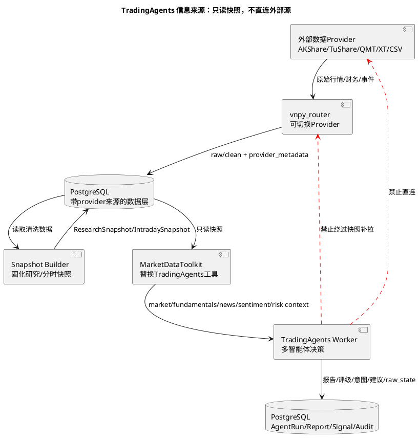

第一版信息来源确定如下：

| TradingAgents 信息类型 | 第一版来源 | 说明 |
| --- | --- | --- |
| market / technical | `ResearchSnapshot` 的日线/周线/月线，`IntradaySnapshot` 的 1m/5m/15m 聚合 | 来自 `vnpy_router` 缓存，不直接绑定 AKShare |
| fundamentals | `FundamentalSnapshot` / `ValuationSnapshot` | PE/PB/市值/营收同比/净利润同比等，provider 可切换 |
| news | `NewsEvent` / `AnnouncementEvent` / `IndustryEvent` | 第一版优先公告、财报、板块事件和人工整理事件，不追求全网新闻覆盖 |
| sentiment/social | `SentimentSnapshot` | 第一版可以为空、人工标签或由新闻事件打分，暂不把社媒作为强依赖 |
| benchmark | `BenchmarkSnapshot` | 默认沪深 300/中证 500/中证 1000，而不是 SPY |
| portfolio/risk context | `OmsSnapshot` / `PortfolioSnapshot` / `RiskRuleSnapshot` | 持仓、现金、活动委托、当日成交、风控规则，只读 |
| memory/reflection | `AgentDecisionLog` + 回测/仿真/实盘结果 | 用 A 股 benchmark alpha、真实成交和组合绩效做反思，不用 SPY alpha |

第一版不确定或不纳入强依赖的来源：

- 全网实时新闻。
- 雪球、股吧、微博等社媒情绪。
- 逐 tick 盘口深度分析。
- 供应商不可稳定复现的网页抓取结果。

这些来源可以后续作为 `NewsProvider` 或 `SentimentProvider` 插件接入，但必须先落 PostgreSQL，带 provider、抓取时间、原文 hash、清洗版本和质量状态，再进入 TradingAgents。

### 8.9 实时新闻和社媒情绪接入路线

实时新闻和社媒情绪不应该由 TradingAgents 临时抓取，而应该走独立的事件数据管线：

```text
NewsProvider / SocialProvider
  -> RawEvent 入库
  -> 清洗、去重、实体识别、情绪打分
  -> NewsEvent / SentimentSnapshot
  -> MarketDataToolkit 只读快照
  -> TradingAgents
```

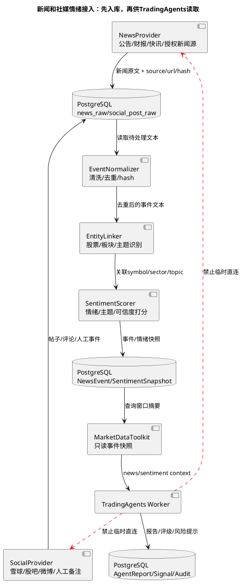

接入优先级：

| 阶段 | 来源 | 目标 | 说明 |
| --- | --- | --- | --- |
| 第一版 | AKShare 个股新闻、公告、财报事件、人工备注 | 低成本验证事件上下文 | 不承诺全网覆盖，不作为强下单信号 |
| 第二版 | TuShare 新闻快讯或其他正式授权新闻源 | 提高来源稳定性和覆盖面 | 如果需要额外权限，作为可选 provider |
| 第三版 | 雪球、股吧、微博等社媒情绪 | 只做情绪辅助和风险提示 | 必须有去重、反垃圾、可信度和异常传播识别 |
| 生产版 | Wind、iFinD、财联社、交易所公告、巨潮资讯等正式源 | 可审计、可追溯、低延迟 | 实盘优先使用授权稳定来源 |

第一版给 TradingAgents 的不是原文洪流，而是窗口摘要：

```text
symbol: 600519.SH
window: 2026-05-03 10:00:00 ~ 10:15:00
news_count: 6
sentiment_score: 0.32
topics: ["业绩预期", "消费板块", "资金流入"]
risk_flags: ["重复转载较多", "无交易所公告确认"]
top_events:
  - source: announcement
    title: ...
    confidence: high
  - source: news
    title: ...
    confidence: medium
```

建议的 PostgreSQL 表：

| 表 | 用途 |
| --- | --- |
| `news_raw` | 保存原始新闻，带 source、url、hash、pulled_at、provider_version |
| `news_event` | 清洗后的新闻事件，带 symbol、sector、topic、event_time、confidence |
| `social_post_raw` | 保存原始社媒内容，带 source、author_hash、url、hash、pulled_at |
| `sentiment_snapshot` | 按 symbol/sector/window 聚合后的情绪和主题摘要 |
| `event_symbol_link` | 新闻/帖子和股票、板块、主题的关联 |
| `event_quality_report` | 解析失败率、重复率、延迟、来源质量和异常传播标记 |

工程边界：

- 新闻和社媒情绪只能作为 TradingAgents 上下文，不直接生成订单。
- 低可信度事件只能降低信号置信度或触发人工复核，不能单独触发买入。
- 所有外部文本必须保留 source、hash、抓取时间和清洗版本，方便复盘。
- 若事件管线失败，`MarketDataToolkit` 返回“无可靠新闻/情绪快照”，TradingAgents 降级到行情、财务和持仓上下文。

### 8.10 TradingAgents 开关和降级运行

TradingAgents 必须能被前端开关控制。关闭后，数据、策略、风控、下单和手工交易都要继续正常运行，只是不再使用 AI 报告、评级和日内建议。

推荐做三层开关：

| 开关 | 作用 | 默认值 |
| --- | --- | --- |
| 全局开关 `tradingagents.enabled` | 是否启动 TradingAgents Worker 和自定义 App 任务 | `false` |
| 策略开关 `strategy.use_ai_signal` | 某个策略是否读取 AI 信号 | `false` |
| 实盘开关 `tradingagents.live_enabled` | AI 信号是否允许影响实盘交易意图 | `false` |

前端建议在自定义 `TradingAgentsApp` 界面提供：

- 启用/停用 TradingAgents。
- 日内建议启用/停用。
- 长期评级启用/停用。
- 只读模式：只生成报告，不进入策略。
- 模拟盘模式：只允许影响 PaperAccount 或仿真 Gateway。
- 实盘允许模式：需要二次确认，并显示当前风控规则。
- 一键暂停：停止 Worker 任务、标记 AI 信号不可用、通知策略刷新状态。

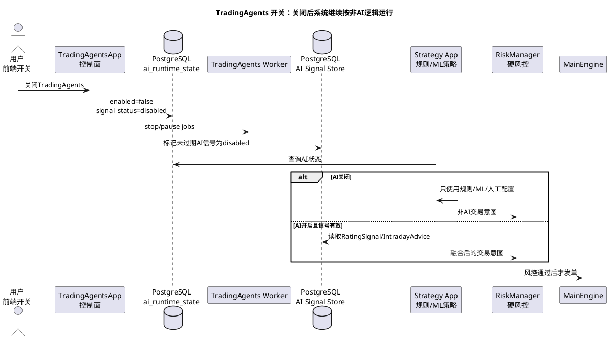

关闭后的系统行为：

- `vnpy_router` 仍正常提供历史数据。
- DataRecorder/DataManager 仍正常工作。
- CTA、PortfolioStrategy、Alpha 回测仍可按规则/ML 信号运行。
- RiskManager、AlgoTrading、PaperAccount、Gateway、MainEngine 不依赖 TradingAgents。
- 策略读取 AI 状态为 disabled 时，必须忽略 `RatingSignal`、`TradeIntent`、`IntradayAdvice`。
- 已生成但未使用的 AI 信号要标记为 disabled 或 expired，避免开关关闭后被延迟采纳。

需要记录的运行状态：

| 字段 | 含义 |
| --- | --- |
| `enabled` | 全局是否启用 TradingAgents |
| `live_enabled` | 是否允许影响实盘 |
| `mode` | report_only / paper_only / live_allowed |
| `disabled_reason` | 用户关闭、异常熔断、依赖失败、风控触发 |
| `last_heartbeat_at` | Worker 最近心跳 |
| `last_successful_run_id` | 最近成功运行 |
| `signal_status` | active / disabled / expired / degraded |

降级规则：

- Worker 超时：本轮 AI 信号缺失，策略按非 AI 逻辑继续。
- 新闻/社媒管线失败：TradingAgents 使用行情、财务、benchmark 和持仓上下文继续，报告标记 `degraded`。
- 数据 provider 失败：`vnpy_router` 尝试 fallback；fallback 失败则快照不更新，策略使用已有缓存或跳过。
- 前端关闭开关：所有策略立即进入非 AI 模式。
- 风控触发熔断：即使前端开关打开，也禁止 AI 信号影响新订单。

## 9. 开发阶段

开发阶段不再只按“先报告、再信号、最后交易”一条线推进，而是拆成一个公共底座和两条 TradingAgents 接入链路：

```text
公共底座：可切换数据源 + PostgreSQL + vn.py Datafeed + TradingAgents Worker
日内链路：IntradaySnapshot -> TradingAgents -> IntradayAdvice -> Strategy/Risk
长期链路：ResearchSnapshot -> TradingAgents -> RatingSignal/PortfolioIntent -> PortfolioStrategy/Risk
```

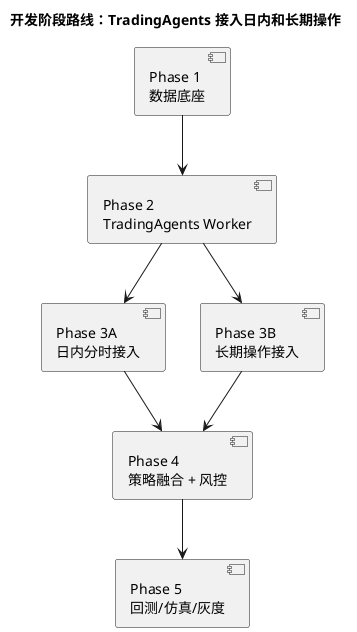

### Phase 1：公共数据底座

目标：

- 实现 `vnpy_router` datafeed，支持 `HistoryRequest -> list[BarData]`。
- PostgreSQL 保存 raw data、清洗数据、数据质量报告、研究快照和分时快照。
- 至少接入 AKShare 和本地文件两个 provider；后续可插入 TuShare、QMT、XT、RQData。
- 支持日线、周线、月线；tick 按 provider 能力处理，AKShare 路径明确不支持。
- 为长期操作准备 `ResearchSnapshot`，为日内操作预留 `IntradaySnapshot` 表结构。

交付：

- `RouterDatafeed`：对外遵守 VeighNa `BaseDatafeed`。
- `DataProviderRouter`：封装 provider 优先级、fallback 和缓存策略。
- `AkshareProvider`：封装 AKShare 调用，作为第一批 provider。
- `LocalFileProvider`：支持 CSV/Parquet 导入，方便手工补数据和离线测试。
- `MarketDataStorage`：负责 PostgreSQL 读写和缓存命中。
- `DataQualityReport`：记录 provider、缺字段、重复日期、异常价格、空响应和复权异常。
- `ResearchSnapshotBuilder`：生成日线级行情、估值、财务、板块和基准快照。
- `IntradaySnapshotBuilder`：先定义结构，后续接真实 Gateway 行情生成分钟级快照。

验收：

- `datafeed.name=router` 后可以 `get_datafeed().query_bar_history(req)`。
- 样例股票 `600519.SH`、`000001.SZ`、`300750.SZ` 可返回日线。
- 同一请求第二次优先读取 PostgreSQL 已保存数据。
- 回测结果可追溯到 provider、数据版本、复权口径和质量报告。

### Phase 2：TradingAgents Worker 基础接入

目标：

- 把 TradingAgents 独立成 Worker，不放进 vn.py 主进程。
- 替换 TradingAgents 默认美股数据工具，改为读取 PostgreSQL 中的 A 股快照。
- 输出结构化报告、五档评级、交易意图和完整 raw state。
- 先做到无交易接口权限也能运行，保证它只能写信号，不能下单。

交付：

- `tradingagents-worker`：独立运行入口。
- `AgentResearchService`：vn.py App 或脚本调用 Worker 的边界服务。
- `MarketDataToolkit`：为 TradingAgents 提供行情、指标、财务、新闻、板块、benchmark 工具，底层读取 PostgreSQL 快照而不是直接绑定某个 provider。
- `AgentRun` / `AgentReport` / `RatingSignal` / `TradeIntent` 数据表。
- `SnapshotSourcePolicy`：定义 market/fundamentals/news/sentiment/benchmark/portfolio context 分别来自哪类快照、是否必填、缺失时如何降级。
- Prompt 模板：注入 A 股 T+1、涨跌停、交易时间、停牌和仓位规则。

验收：

- 单股票、单日期可运行 TradingAgents。
- 输出不会调用 `MainEngine.send_order()`、Gateway 或任何交易接口。
- Worker 运行时不直接访问 yfinance、Alpha Vantage、AKShare、TuShare、QMT；所有输入来自 PostgreSQL 快照。
- 报告、评级、交易意图、模型信息、输入快照 ID 和 raw state 全部落 PostgreSQL。
- 同一输入快照可以复跑并对比输出差异。

### Phase 3A：TradingAgents 接入日内分时操作

目标：

- TradingAgents 不读取原始 tick 流，只读取压缩后的 `IntradaySnapshot`。
- 以 5 分钟或 15 分钟为默认频率，事件触发作为补充。
- 输出 `IntradayAdvice`，例如 `buy_on_pullback`、`sell_on_break`、`reduce`、`hold`。
- 日内建议只作为 Strategy App 的辅助输入，不直接生成订单。

交付：

- `IntradaySnapshot`：包含分钟 K 线、VWAP、均线、成交量变化、盘口摘要、板块状态、新闻事件、当前持仓和当日交易纪律。
- `IntradayAgentJob`：盘中定时或事件触发调用 TradingAgents。
- `IntradayAdvice`：保存建议方向、适用窗口、置信度、失效条件、风险备注和来源 run id。
- `IntradayAdviceReader`：Strategy App 查询最近有效建议。
- 降级策略：Worker 超时、LLM 失败或快照缺失时，策略继续按原规则运行。

验收：

- 盘中每 5/15 分钟最多生成一次建议，不逐 tick 请求大模型。
- `IntradayAdvice` 过期后不会再被策略使用。
- 策略把建议转成 `OrderRequest` 前必须经过规则信号确认和 RiskManager。
- 回放某个交易日时，可以看到每次建议使用了哪个快照、哪份报告和哪条风控结果。

### Phase 3B：TradingAgents 接入长期操作

目标：

- TradingAgents 读取日线、周线、月线、财务、估值、行业和新闻组成的 `ResearchSnapshot`。
- 输出长期评级 `RatingSignal` 和组合意图 `PortfolioIntent`。
- 低频生成候选池、目标仓位建议、调仓理由和持有周期提示。
- 长期操作由 PortfolioStrategy 或自定义 Alpha/Research App 消费，不做盘中即时追价。

交付：

- `ResearchSnapshot`：按交易日固化行情、复权口径、财务字段、行业/概念标签、benchmark 和数据版本。
- `LongHorizonAgentJob`：盘前、盘后或周末批量运行 TradingAgents。
- `RatingSignal`：保存 Buy/Overweight/Hold/Underweight/Sell、强度、原因、风险点和有效期。
- `PortfolioIntent`：保存目标权重提示、加减仓方向、持有周期、最大风险暴露和再平衡备注。
- `PortfolioSignalReader`：PortfolioStrategy 查询候选池和目标仓位建议。

验收：

- 可以对一组股票批量生成长期评级，并按日期回放。
- `PortfolioIntent` 只影响目标仓位和排序权重，不直接下单。
- 长期调仓计划必须经过组合约束、仓位上限、行业集中度和回撤规则。
- 调仓后可以把真实成交、持仓、绩效写回 PostgreSQL，作为下一次 TradingAgents 反思输入。

### Phase 4：策略融合和硬风控

目标：

- 把日内 `IntradayAdvice` 和长期 `RatingSignal/PortfolioIntent` 接入 vn.py 策略层。
- 明确日内和长期信号的优先级，避免 AI 日内建议破坏长期仓位纪律。
- 所有交易意图必须经过确定性 Risk App，再走 `MainEngine -> Gateway`。

交付：

- `SignalFusionService`：融合规则策略、ML 信号、长期 AI 评级和日内 AI 建议。
- `AiSignalPolicy`：定义 AI 信号强度上限、有效期、冲突处理和禁用开关。
- `RiskRuleSet`：仓位上限、单笔金额、撤单频率、涨跌停、黑名单、最大日内成交额和最大回撤。
- `DecisionAudit`：记录每笔订单前的规则信号、AI 信号、风控输入和风控结论。

验收：

- AI 信号可以参与排序、过滤、加减仓提示，但不能绕过策略和风控。
- 长期信号为 `Sell/Underweight` 时，日内建议不能触发新增买入。
- 风控拒绝时不会下单，并记录拒绝原因。
- 所有 AI 影响过的决策可以按 `source_run_id` 回放。

### Phase 5：回测、仿真和实盘灰度

目标：

- 先完成历史回放和模拟盘验证，再考虑小资金实盘灰度。
- 日内链路验证建议过期、盘中风控和订单执行。
- 长期链路验证选股、调仓、组合约束、换手率和回撤。
- 增加一键暂停、AI 禁用开关和手工接管流程。

交付：

- 日内回放脚本：复盘 `IntradaySnapshot -> IntradayAdvice -> Strategy -> Risk`。
- 长期回测脚本：复盘 `ResearchSnapshot -> RatingSignal/PortfolioIntent -> PortfolioStrategy -> Risk`。
- 仿真 Gateway 配置：只在仿真账户启用 AI 信号。
- 灰度运行面板或日志：展示最新 AI 建议、策略采纳情况、风控拒绝和真实成交。

验收：

- AI、任一数据 provider、TradingAgents 任一模块失败时，不影响手工风控、撤单和持仓查询。
- 实盘订单只来自受控策略和风控批准。
- 模拟盘连续稳定运行后，才能进入小资金实盘。
- 每次实盘灰度必须能导出完整决策审计。

## 10. 风险控制

| 风险 | 控制措施 |
| --- | --- |
| 单一 provider 接口变动 | 缓存、fallback、数据质量报告、接口版本记录 |
| 单一 provider 数据异常 | 异常值标记、复权口径分离、关键数据人工抽检、跨 provider 抽样对比 |
| TradingAgents 美股默认假设 | 替换数据工具、替换 benchmark、注入 A 股交易规则 |
| LLM 幻觉 | 结构化输出、人工审核、报告落盘、信号强度上限 |
| Prompt injection | 外部文本清洗、来源记录、工具权限隔离 |
| 依赖冲突 | TradingAgents Worker 独立环境 |
| 策略绕过风控 | 所有订单必须经过 MainEngine/OmsEngine 和风控规则 |
| 实盘误触发 | 默认关闭实盘开关、模拟盘灰度、小资金验证、一键暂停 |

## 11. 推荐近期行动

1. 保持这个 fork 为主开发仓库，不再依赖旧项目文档。
2. 先做公共数据底座：`vnpy_router` datafeed、PostgreSQL 缓存、质量报告、`ResearchSnapshot` 和 `IntradaySnapshot` 表结构。
3. 再做 TradingAgents Worker 基础接入，保证它只读快照、只写报告和结构化信号，不接触交易接口。
4. 长期链路先落地：用 `ResearchSnapshot -> RatingSignal/PortfolioIntent` 跑通候选池、目标仓位和组合回测。
5. 日内链路随后落地：用 `IntradaySnapshot -> IntradayAdvice` 跑通 5/15 分钟建议、过期机制和日内回放。
6. 最后做 `SignalFusionService`、`AiSignalPolicy` 和 Risk App 硬规则，统一控制日内建议和长期意图进入订单链路的边界。

## 12. 资料来源

- VeighNa GitHub: https://github.com/vnpy/vnpy
- VeighNa 数据服务文档: https://www.vnpy.com/docs/cn/community/info/datafeed.html
- VeighNa 交易接口文档: https://www.vnpy.com/docs/cn/community/info/gateway.html
- VeighNa 社区 `vnpy_akshare`: https://www.vnpy.com/forum/topic/31286-shu-ju-fu-wu-vnpy-akshare%3Aakshareshu-ju-fu-wu-gua-pei-qi?page=1
- `lpf6/vnpy_akshare`: https://github.com/lpf6/vnpy_akshare
- `wade1010/vnpy_akshare`: https://github.com/wade1010/vnpy_akshare
- TradingAgents: https://github.com/TauricResearch/TradingAgents
- TradingAgents Release: https://github.com/TauricResearch/TradingAgents/releases
- AKShare: https://github.com/akfamily/akshare
- AKShare 数据说明: https://akshare.akfamily.xyz/data_tips.html
