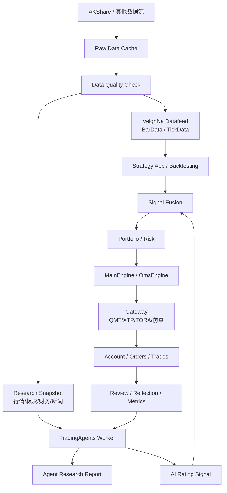

# 自定义 A 股量化架构方案：AKShare + TradingAgents + VeighNa

版本：v0.1

日期：2026-05-03

状态：方案草案

> 本文档用于本 fork 的二次开发规划，不构成任何投资建议。AKShare 和 TradingAgents 只能作为投研与信号辅助；实盘前必须经过回测、人工确认、风控、OMS 和账户对账。

## 1. 目标

基于 VeighNa / vn.py 的事件驱动交易框架，构建一套面向 A 股的个人量化架构：

- 使用 AKShare 作为免费投研数据源之一，补齐股票、指数、板块、基础财务和部分事件数据。
- 接入 TradingAgents 多智能体投研框架，把 LLM 输出落成可审计的研究报告和交易评级。
- 保留 VeighNa 的核心优势：`EventEngine`、`MainEngine`、`Gateway`、`Datafeed`、`OmsEngine`、策略 App 和风控 App。
- 第一阶段先做投研、数据和回测闭环，不让 AI 或策略绕过风控直接下单。

## 2. 调研结论

### 2.1 vn.py 社区已有 AKShare 插件

VeighNa 社区存在 AKShare datafeed 适配器，但不属于官方 datafeed 列表，建议作为参考而非直接生产依赖：

- `lpf6/vnpy_akshare`：社区在 2022-12-07 发布的 `vnpy_akshare` 数据服务适配器，分类为 datafeed，协议 MIT。
- `wade1010/vnpy_akshare`：2025-06-09 社区用户发布的修正版，PyPI 包名为 `vnpy_akshare_adapter`，说明中提到主要支持 A 股，tick 不支持，AKShare 抓取证券网站可能较慢。
- VeighNa 官方 datafeed 文档列出的标准数据服务包括 XT、RQData、TuShare、TQSDK、Wind、iFinD、Tinysoft 等，未把 AKShare 列为官方支持项。

工程判断：

- 不直接把社区插件作为生产数据源。
- 在本 fork 中实现自维护的 `vnpy_akshare` datafeed，接口遵守 VeighNa `BaseDatafeed`。
- 所有 AKShare 原始数据先进入缓存和质量检查，再转换为 `BarData` / `TickData` / 研究快照。

### 2.2 TradingAgents 更适合做投研 Worker

TradingAgents v0.2.4 已支持结构化输出、checkpoint、持久化决策日志和多 LLM provider。它默认偏美股数据栈，例如 yfinance、Alpha Vantage 和 SPY benchmark；A 股接入时不能直接复用默认数据工具。

推荐做法：

- 复用 TradingAgents 的多角色推理链路。
- 替换其数据工具，让 market、fundamentals、news、sentiment 都从本地 A 股数据快照读取。
- 将最终输出的 Buy / Overweight / Hold / Underweight / Sell 映射为 VeighNa 内部可消费的研究信号。
- TradingAgents 不持有交易接口，不直接调用 `MainEngine.send_order()`。

## 3. VeighNa 原生架构

VeighNa 的底层可以抽象为：

```text
EventEngine
  -> MainEngine
     -> LogEngine / OmsEngine / EmailEngine
     -> Gateway: CTP / XTP / TORA / IB / RPC / ...
     -> App: CTA / PortfolioStrategy / AlgoTrading / RiskManager / ...
     -> Datafeed / Database / UI / Script
```

关键对象：

- `EventEngine`：事件总线，负责事件队列、事件处理线程和定时器事件。
- `MainEngine`：主编排器，负责添加 gateway、engine、app，并对外提供连接、订阅、下单、撤单和历史查询接口。
- `OmsEngine`：订单管理状态缓存，监听 tick、order、trade、position、account、contract 等事件。
- `BaseGateway`：交易接口抽象，负责 connect、subscribe、send_order、cancel_order、query_account、query_position。
- `BaseDatafeed`：历史数据服务抽象，核心方法为 `query_bar_history()` 和 `query_tick_history()`。

二次开发时应保持这些边界：

- 数据服务走 `BaseDatafeed`。
- 交易接口走 `BaseGateway`。
- 策略信号进入策略 App 或自定义研究 App。
- 订单必须经过 `OmsEngine`、风控 App 或自定义风险规则。

## 4. 目标架构



分层说明：

- 数据层：负责 AKShare 调用、缓存、清洗、字段标准化和质量报告。
- Datafeed 层：把清洗后数据转换为 VeighNa 标准 `BarData` / `TickData`。
- 研究层：构造 A 股研究快照，供 TradingAgents 使用。
- 信号层：规则策略、机器学习策略和 TradingAgents 评级统一落成内部信号。
- 风控和交易层：仍然由 VeighNa 的 MainEngine、OmsEngine、Gateway 和风控规则控制。

## 5. AKShare 接入设计

### 5.1 第一阶段支持范围

第一阶段只做稳定的日频研究数据：

- A 股股票列表和名称。
- 交易日历。
- 未复权日线。
- 前复权日线。
- 指数日线：上证指数、沪深 300、中证 500、中证 1000、创业板指。
- 板块、概念和行业标签。
- 基础财务和估值字段：总市值、流通市值、市盈率、市净率、营收同比、净利润同比。

分钟线、tick、实时盘口和实盘行情不作为 AKShare 第一阶段目标；实盘确认应优先使用券商或 QMT 行情。

### 5.2 模块建议

```text
vnpy/akshare_datafeed/
  __init__.py
  datafeed.py          # Datafeed(BaseDatafeed)
  client.py            # AKShare 调用封装
  cache.py             # 本地缓存
  quality.py           # 数据质量检查
  mapper.py            # DataFrame -> BarData
```

`Datafeed` 负责对外适配 VeighNa：

```python
class Datafeed(BaseDatafeed):
    def init(self, output: Callable = print) -> bool:
        ...

    def query_bar_history(
        self,
        req: HistoryRequest,
        output: Callable = print,
    ) -> list[BarData]:
        ...

    def query_tick_history(
        self,
        req: HistoryRequest,
        output: Callable = print,
    ) -> list[TickData]:
        ...
```

第一版 `query_tick_history()` 可以明确返回空列表并输出“不支持 tick”，不要伪造数据。

### 5.3 数据质量规则

所有 AKShare 数据进入 VeighNa 前应检查：

- 必要字段是否存在。
- 日期是否可解析且无重复。
- 开高低收是否为非负。
- high >= max(open, close, low)。
- low <= min(open, close, high)。
- volume 和 amount 非负。
- 复权数据是否存在异常负价。
- 单日涨跌幅是否超过合理阈值，超过则标记为异常而非直接丢弃。

## 6. TradingAgents 接入设计

### 6.1 Worker 化

TradingAgents 建议作为独立 Worker 运行：

```text
VeighNa App / Script
  -> AgentResearchService
  -> tradingagents-worker
  -> report + rating + raw_state
```

原因：

- TradingAgents 依赖 LangGraph、多个 LLM provider、yfinance、stockstats 等库。
- VeighNa 主框架依赖 PySide6、TA-Lib、交易接口和 GUI 生态。
- 两套依赖放在同一进程里容易产生版本冲突。

### 6.2 A 股工具替换

TradingAgents 默认工具应替换为本地工具：

| TradingAgents 工具类型 | A 股实现 |
| --- | --- |
| stock data | 本地清洗后的 AKShare / QMT 日线和分钟线 |
| indicators | pandas / stockstats / VeighNa ArrayManager |
| fundamentals | AKShare 财务、估值、公告数据 |
| news | 公告、财报、新闻、板块事件 |
| sentiment | 可选，先用新闻事件标签和人工备注替代 |
| benchmark | 沪深 300 / 中证 500，而不是 SPY |

### 6.3 输出映射

TradingAgents 最终评级映射为内部研究信号：

| 评级 | 信号方向 | 建议强度 | A 股含义 |
| --- | --- | --- | --- |
| Buy | long | 0.8-1.0 | 强正向候选，不等于立即买入 |
| Overweight | long | 0.4-0.7 | 偏多，可提高排序权重 |
| Hold | neutral | 0.0 | 观望或维持 |
| Underweight | reduce | -0.4~-0.7 | 减仓或回避 |
| Sell | exit | -0.8~-1.0 | 卖出或退出候选 |

输出必须保存：

- 输入快照 ID。
- 模型 provider 和模型名。
- 分析师报告。
- 牛熊辩论记录。
- 风险辩论记录。
- Portfolio Manager 最终决策。
- 解析后的评级。

## 7. 开发阶段

### Phase 1：AKShare datafeed POC

目标：

- 实现 `vnpy_akshare` 或 `vnpy.akshare_datafeed`。
- 支持 `HistoryRequest -> list[BarData]`。
- 支持日线、周线、月线；tick 明确不支持。

验收：

- `datafeed.name=akshare` 后可以 `get_datafeed().query_bar_history(req)`。
- 样例股票 `600519.SH`、`000001.SZ`、`300750.SZ` 可返回日线。
- 有单元测试覆盖字段映射和异常响应。

### Phase 2：本地数据缓存和质量报告

目标：

- 增加缓存，避免每次回测重复抓取。
- 增加数据质量报告。
- 区分未复权和前复权数据。

验收：

- 同一请求第二次优先命中缓存。
- 异常价格和空响应有明确日志。
- 回测结果可追溯到数据版本。

### Phase 3：TradingAgents A 股研究 POC

目标：

- 单股票、单日期运行 TradingAgents。
- 输入来自本地研究快照。
- 输出研究报告和五档评级。

验收：

- 无交易接口权限也能运行。
- 输出不会调用 `send_order()`。
- 报告和 raw state 可落盘。

### Phase 4：信号融合和策略接入

目标：

- 将 TradingAgents 评级转换为策略可用的辅助信号。
- 与规则策略、ML 策略共同进入组合和风控。

验收：

- AI 信号可以参与排序，但不能绕过策略和风控。
- 风控拒绝时不会下单。
- 所有 AI 影响的决策可回放。

### Phase 5：实盘灰度

目标：

- 只在模拟盘和小资金实盘中启用。
- 使用真实 Gateway 行情做盘中确认。
- 增加一键暂停和风控硬阈值。

验收：

- AI、AKShare、TradingAgents 任一模块失败时，不影响手工风控和撤单。
- 实盘订单只来自受控策略和风控批准。

## 8. 风险控制

| 风险 | 控制措施 |
| --- | --- |
| AKShare 接口变动 | 缓存、fallback、数据质量报告、接口版本记录 |
| AKShare 数据异常 | 异常值标记、复权口径分离、关键数据人工抽检 |
| TradingAgents 美股默认假设 | 替换数据工具、替换 benchmark、注入 A 股交易规则 |
| LLM 幻觉 | 结构化输出、人工审核、报告落盘、信号强度上限 |
| Prompt injection | 外部文本清洗、来源记录、工具权限隔离 |
| 依赖冲突 | TradingAgents Worker 独立环境 |
| 策略绕过风控 | 所有订单必须经过 MainEngine/OmsEngine 和风控规则 |
| 实盘误触发 | 默认关闭实盘开关、模拟盘灰度、小资金验证、一键暂停 |

## 9. 推荐近期行动

1. 保持这个 fork 为主开发仓库，不再依赖旧项目文档。
2. 先做 AKShare datafeed POC，跑通 VeighNa 标准历史数据接口。
3. 同步补充数据质量报告，不急着做实时交易。
4. 再做 TradingAgents Worker POC，先输出报告和评级。
5. 最后把 AI 评级接入策略和风控链路。

## 10. 资料来源

- VeighNa GitHub: https://github.com/vnpy/vnpy
- VeighNa 数据服务文档: https://www.vnpy.com/docs/cn/community/info/datafeed.html
- VeighNa 交易接口文档: https://www.vnpy.com/docs/cn/community/info/gateway.html
- VeighNa 社区 `vnpy_akshare`: https://www.vnpy.com/forum/topic/31286-shu-ju-fu-wu-vnpy-akshare%3Aakshareshu-ju-fu-wu-gua-pei-qi?page=1
- `lpf6/vnpy_akshare`: https://github.com/lpf6/vnpy_akshare
- `wade1010/vnpy_akshare`: https://github.com/wade1010/vnpy_akshare
- TradingAgents: https://github.com/TauricResearch/TradingAgents
- TradingAgents Release: https://github.com/TauricResearch/TradingAgents/releases
- AKShare: https://github.com/akfamily/akshare
- AKShare 数据说明: https://akshare.akfamily.xyz/data_tips.html
