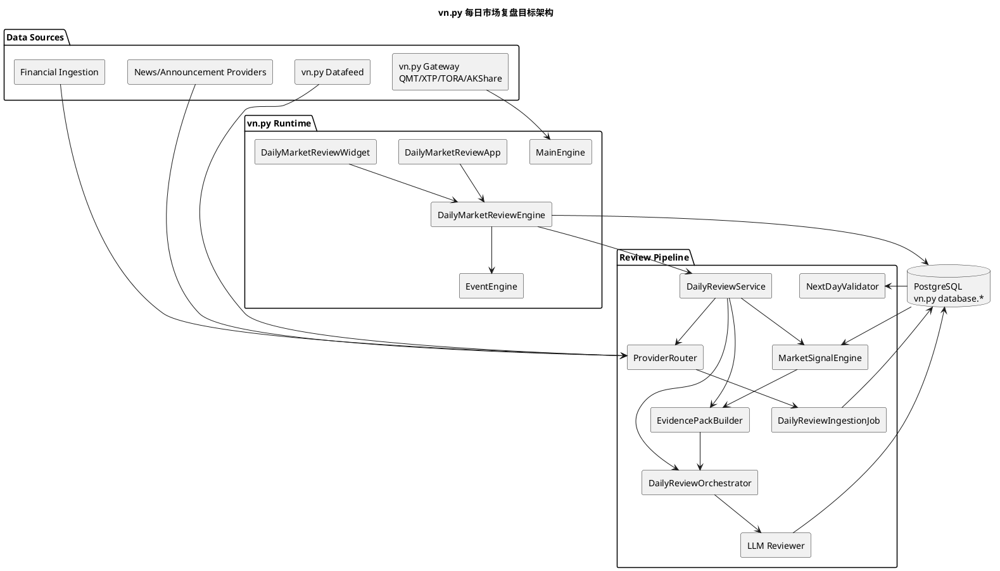

# AI 每日全市场复盘技术方案

版本：v0.3

日期：2026-05-11

状态：vn.py 版方案，P29 正在落地核心复盘流水线

> 本文档定义的是“AI 根据全市场数据自动生成每日市场复盘和明日观察计划”的 vn.py 版本架构。它不是旧 `quantitative-try` 项目中的 FastAPI/HTML 页面，也不是 TradingAgents 单票研究页。每日市场复盘默认只生成报告和观察计划，不直接下单。

## 1. 结论

当前 vn.py fork 中已经有：

- AKShare Gateway：可在未开通 QMT 前提供只读行情。
- TradingAgents 分析管理：单票 AI 分析、历史报告、新闻、财报和配置。
- 新闻、公告、财报入库链路：为 AI 分析提供上下文。

但还没有：

- 独立的 vn.py `每日市场复盘` App。
- 全市场行情、板块、涨停生态、龙虎榜、分时异动、新闻公告和财报证据的复盘编排。
- 明日观察计划、次日验证和复盘报告的独立 UI。

因此新增 `vnpy_daily_review` 模块。当前 vn.py 迁移版已经不再只停留在
`not_configured` 边界，而是接入了第一版 `DailyReviewService`：

- `VnpyAkshareDailyReviewProvider`：优先读取 vn.py 当前 tick；没有实时 tick 时降级读取 AKShare 全市场快照。
- `MarketBreadthEngine`：计算上涨/下跌/涨跌停/市场宽度/情绪分。
- `SectorRotationEngine`：读取 AKShare 板块，失败时从个股快照中的行业字段推断。
- `LimitUpEmotionEngine`：读取 AKShare 涨停池，失败时降级为空并记录质量告警。
- `LeaderScoringEngine`：生成明日观察候选标的。
- `EvidencePackBuilder`：生成带证据 ID 的 Evidence Pack。
- `PeeweeDailyReviewRepository`：复用 vn.py `database.*` 和 Peewee `create_tables()` 保存复盘报告、Evidence Pack、明日观察计划和模型审计。
- `DailyReviewMarkdownComposer`：先生成确定性 Markdown 复盘报告，并列出证据 ID；后续再把 Evidence Pack 接入可审计 LLM 编排。

## 2. 与现有模块的边界

| 模块 | 解决的问题 | 不做什么 |
| --- | --- | --- |
| TradingAgents 分析管理 | 单票研究、评级、报告、新闻和财报上下文 | 不负责全市场复盘，不直接吞全市场原始数据 |
| CTA 策略/回测 | 规则策略执行和回测 | 不负责生成市场叙事 |
| AKShare Gateway/Datafeed | 免费行情和历史 K 线补充 | 不保证生产级实时行情 SLA |
| 每日市场复盘 | 全市场结构、主线、风向标、明日观察计划 | 不直接下单，不替代策略和风控 |

每日市场复盘可以给 TradingAgents 提供候选标的，也可以给策略配置提供人工审核后的股票池，但交易前仍需走策略、回测、风控、OMS 和人工确认。

## 3. 目标效果

每日复盘报告应稳定输出：

1. 今日市场状态：指数、成交额、涨跌家数、涨跌停、连板高度、情绪周期。
2. 主线和分支：哪些板块是主线，哪些是防御、过渡或退潮。
3. 核心风向标：中军、连板高度标、趋势核心、逆势抗跌标、龙虎榜资金标。
4. 明日观察计划：重点方向、重点个股、触发条件、放弃条件和仓位纪律。
5. 风险提示：指数关键位、缩量、题材高位兑现、财报公告风险。
6. 次日验证：昨日观察计划是否触发、是否正确、遗漏了什么。

## 4. vn.py 目标架构



## 5. 数据源策略

每日市场复盘复用 vn.py 和本 fork 已有能力，不重新发明独立数据配置：

- 实时行情优先从 vn.py Gateway 获取。QMT 开通后自然接入；未开通时可用 AKShare 只读 Gateway 做研究和演示。
- 历史 K 线优先复用 vn.py Datafeed 和当前数据库。
- 新闻公告复用当前 `NewsProvider`、`AnnouncementProvider`、`PostgresEventStorage`。
- 财报上下文复用 P28 财报入库和 `MarketDataToolkit`。
- 所有扩展表复用 vn.py `database.*` 配置和 PostgreSQL，不新增独立 DSN。

公开免费源无 SLA，只能作为研究、预警、模拟和报告证据。生产交易仍应优先接 QMT/券商/商业数据源。

## 6. 数据表建议

当前 `DailyReviewService` 第一版已经把报告历史和 Evidence Pack 写入
PostgreSQL。表结构通过 vn.py 现有 Peewee/create_tables 初始化，不新增独立 DSN。

| 表 | 作用 |
| --- | --- |
| `daily_review_raw_fetch` | provider 拉取记录、耗时、错误和质量状态 |
| `daily_market_snapshot` | 指数、成交额、涨跌家数、涨跌停和市场宽度 |
| `daily_stock_snapshot` | 全市场个股日线、成交额、换手、涨跌停状态 |
| `daily_sector_snapshot` | 板块涨跌幅、成交额、成分股强度 |
| `daily_limit_up_snapshot` | 涨停、炸板、连板高度、晋级失败 |
| `daily_lhb_snapshot` | 龙虎榜席位、买卖额、净买、机构/游资标签 |
| `daily_intraday_anomaly` | 分时放量拉升、跳水、回封、尾盘异动 |
| `daily_review_evidence` | 复盘证据条目，带证据 ID |
| `daily_review_report` | Markdown 报告、摘要、模型版本和质量评分，已实现 |
| `daily_watch_plan` | 明日观察计划，已实现 |
| `daily_watch_plan_item` | 个股或板块级观察项，已实现 |
| `daily_watch_plan_result` | 次日验证结果 |
| `daily_review_model_audit` | prompt、模型、耗时、token、失败重试和输出校验，已实现基础审计 |

## 7. 信号层

LLM 之前必须先完成结构化计算，避免让模型直接吞全市场原始表。

核心计算包括：

- 市场宽度：上涨家数、下跌家数、成交额、缩量/放量、指数关键位。
- 板块轮动：板块强度、持续性、扩散度、前排和后排分化。
- 涨停生态：涨停数、炸板率、连板高度、晋级失败、情绪拐点。
- 龙虎榜和资金：净买、机构席位、游资标签、买卖集中度。
- 分时异动：早盘强度、午后回封、尾盘异动、逆势抗跌。
- 风向标评分：中军、趋势核心、逆势标、情绪锚点。

## 8. AI 编排

AI 只读取 Evidence Pack，不直接查数据库、不直接访问 provider。

建议分工：

- `MarketRegimeAnalyst`：判断市场状态和指数风险。
- `ThemeRotationAnalyst`：判断主线、分支、防御和退潮。
- `LeaderAnalyst`：挑选风向标和观察标的。
- `RiskCritic`：审查追高、缩量、节假日、财报风险。
- `WatchPlanWriter`：生成 Markdown 报告和明日观察计划。

日内快速复盘默认不开 thinking；盘后深度复盘默认可开 thinking，超时可复用 TradingAgents 的长任务配置。

## 9. UI 设计

新增独立 vn.py App：`每日市场复盘`。

页面结构：

```text
每日市场复盘
  今日报告
  明日观察
  市场信号
  验证复盘
  配置
```

第一版已经做到：

- 在 vn.py `功能` 菜单和左侧工具栏可见。
- 打开后是独立大窗口，行为类似 `CTA策略`。
- `运行预览` 能通过 vn.py tick/AKShare provider 生成确定性复盘报告。
- `历史报告` 能读取已落库报告并双击回看。
- 不混入交易面板，不占用 TradingAgents 单票分析页。

## 10. 安全和生产边界

- 每日市场复盘只能生成报告和观察计划，不能创建订单。
- 观察计划进入交易链路前必须人工确认、回测、风控和 OMS。
- 所有 AI 输出必须保存证据 ID、模型、prompt 版本、耗时和错误信息。
- 免费数据源失败不能影响 vn.py 启动。
- 任何外部 provider 都必须 lazy import。

## 11. P29 落地路线

1. 文档落地：迁入本 vn.py 仓库并改写为 vn.py 版本。
2. UI 可见：新增 `vnpy_daily_review` App、Engine 和 PySide Widget。
3. 核心流水线：接入 `DailyReviewService`、vn.py tick/AKShare provider、信号计算、Evidence Pack 和确定性报告。
4. 只读查询：接入 PostgreSQL 中已有新闻、财报、行情快照。
5. 报告落库：报告、观察计划、证据和模型审计写入 PostgreSQL。
6. 证据增强：新闻、财报、龙虎榜和基础分时异动加入 Evidence Pack。
7. AI 编排：在 Evidence Pack 上增加可审计 LLM 阶段，保留确定性兜底。
8. 次日验证：观察计划触发情况、MFE/MAE、遗漏和误判统计。
9. 生产验证：真实数据源 smoke、连续运行、成本、超时和审计落档。
