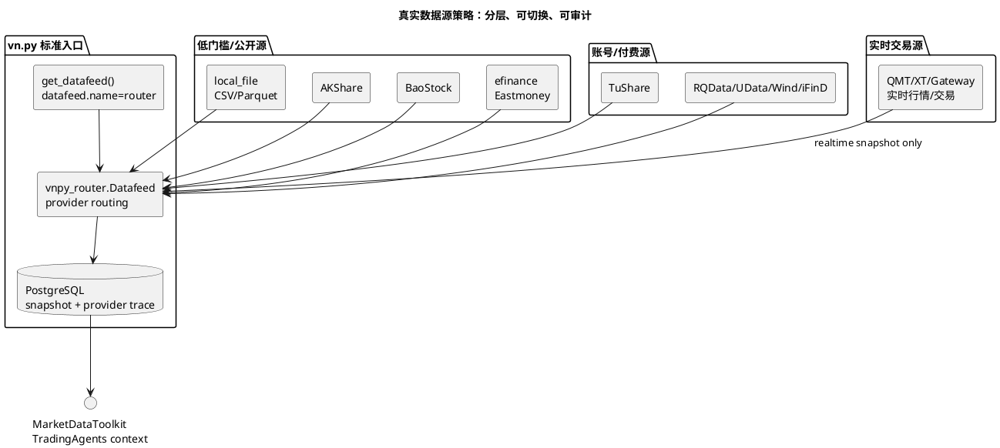

# 公开数据源方案调研

调研日期：2026-05-05

本文用于回答“真实数据源策略怎么选”。结论不是把某一个免费源写死，而是把数据源分层接入 `vnpy_router.Datafeed`，统一落 PostgreSQL 快照，TradingAgents 只读取快照上下文。

## 1. 推荐接入原则

设计口径：

1. `local_file` 永远保留，作为离线回归、灾备和可复现测试基线。
2. AKShare、BaoStock、efinance 适合无账号阶段获取 A 股日线、基础数据和公开信息，但要按“无 SLA、可能限流、接口可能变化”处理。
3. TuShare 适合作为低成本升级路径；当前 100 积分阶段能力有限，至少 120 积分才覆盖股票非复权日线，分钟、新闻舆情等需要更高或单独权限。
4. vn.py 已有 datafeed 插件优先复用，例如 `vnpy_tushare`、`vnpy_rqdata`、`vnpy_baostock`；本 fork 只做 provider routing 和 provider trace。
5. QMT/XT 这类交易终端优先通过 vn.py Gateway/Datafeed 接入实时行情和交易，不作为本 fork 直接重写的数据源。
6. TradingAgents 不直接访问任何 provider，只读 PostgreSQL 快照。

## 2. 公开/低门槛方案对比

| 方案 | 适合数据 | 准入门槛 | 优点 | 主要风险 | 建议定位 |
| --- | --- | --- | --- | --- | --- |
| local_file | CSV/Parquet 本地 K 线、新闻、情绪 fixture | 无 | 可复现、无网络、适合测试 | 需要人工准备，不能自动更新 | 必备 baseline |
| AKShare | A 股、基金、期货、宏观、指数、部分实时和特色数据 | Python 包，无 token | 覆盖广、更新活跃、开源 | 官方声明偏研究用途，公开网页源可能变化 | 第一阶段主力公开源 |
| BaoStock | A 股历史行情、财务等 | 无需 token | 免费、pandas DataFrame、已有 vn.py 插件 | 覆盖面偏 A 股，实时和另类数据弱 | A 股日线/财务备选源 |
| efinance | 东方财富股票、基金、债券、期货数据 | 无 token | 使用简单，适合个人研究 | 项目声明不用于商业，可能限流 | AKShare 失效时的补充源 |
| TuShare | A 股行情、基础、财务、部分资讯 | token + 积分/权限 | API 结构清晰，生态成熟，有 vn.py 插件 | 当前 100 积分能力有限，分钟/新闻另开权限 | 有积分后作为质量增强源 |
| yfinance | 美股、港股、ETF、基金、期权等 | 无 token | 国际市场方便 | 官方免责声明为个人/研究用途，非 Yahoo 官方背书 | 海外研究补充，不做 A 股生产主源 |
| Alpha Vantage | 全球股票、外汇、加密、技术指标、新闻情绪 | API key | API 化、覆盖全球、含新闻情绪 | 免费额度/频率限制，生产成本需评估 | 海外/新闻情绪备选 |
| Nasdaq Data Link | 宏观、机构数据、免费和 premium 数据集 | API key/订阅 | 数据集体系清晰，有免费和付费层 | 专业数据多为 premium | 宏观/海外数据补充 |

## 3. 对本项目的落地策略

第一阶段，无 QMT、TuShare 积分不足：

- 默认 `router.providers=local_file,akshare`。
- 增加 `baostock` 和 `efinance` provider 作为 A 股日线 fallback 候选。
- 对同一标的同一日期的 OHLCV 做二源交叉校验，字段不一致时写 `quality_report`，不直接喂给 TradingAgents 执行链路。

第二阶段，有 TuShare 120+ 积分：

- 增加 `tushare` provider，只拉权限覆盖内的日线和基础信息。
- TuShare 与 AKShare/BaoStock 做复权、交易日历、停复牌、ST 状态校验。
- 分钟、新闻舆情不假设可用，只有实际开通权限后才进入 readiness ready。

第三阶段，开通 QMT/XT 或付费数据：

- QMT/XT 实时行情走 vn.py Gateway/Datafeed；历史回补仍优先走标准 Datafeed。
- 对生产策略设置 provider 优先级：付费/终端源 > TuShare > AKShare/BaoStock/efinance > local_file。
- provider trace、拉取时间、数据版本、复权方式和质量评分必须落 PostgreSQL。

## 4. 生产准入口径

一个 provider 进入生产候选前至少要满足：

- 能跑 `HistoryRequest` 的日线和目标分钟级别 smoke。
- 支持交易日历、停牌、复权或明确标记“不支持”。
- 有超时、重试、限流和 fallback。
- 每条快照记录 `provider_name`、`provider_endpoint`、`fetched_at`、`quality_status`。
- 与至少一个备选 provider 做抽样交叉校验。
- 公开源只能作为研究和低风险辅助信号来源；真实下单仍由策略、风控和 MainEngine 控制。

## 5. 调研来源

- vn.py 官方数据服务文档：`https://www.vnpy.com/docs/cn/community/info/datafeed.html`
- AKShare GitHub/Wiki：`https://github.com/akfamily/akshare`，`https://github.com/akfamily/akshare/wiki`
- TuShare 积分和权限说明：`https://tushare.pro/document/1?doc_id=290`，`https://tushare.pro/document/2?doc_id=108`
- BaoStock PyPI：`https://pypi.org/project/baostock/`
- efinance PyPI/GitHub：`https://pypi.org/project/efinance/`，`https://github.com/Micro-sheep/efinance`
- yfinance 文档：`https://ranaroussi.github.io/yfinance/`
- Alpha Vantage 官网：`https://www.alphavantage.co/`
- Nasdaq Data Link 文档：`https://docs.data.nasdaq.com/docs/getting-started`
