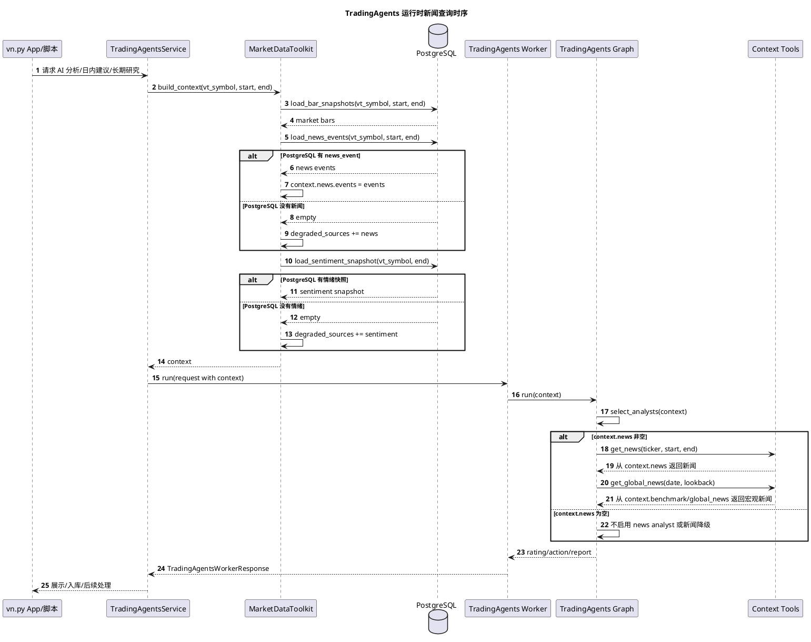
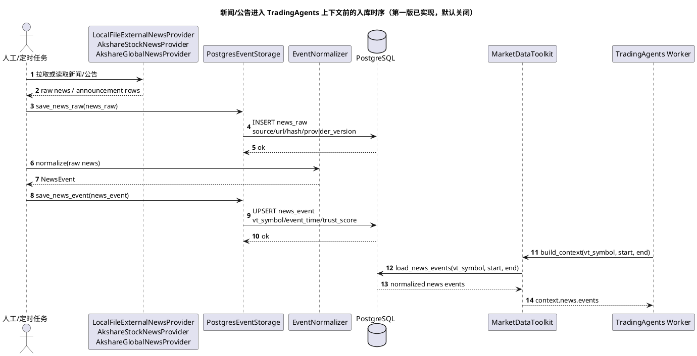

# TradingAgents 新闻查询时序

日期：2026-05-06

## 1. 结论

当前实现里，TradingAgents **运行时不会直接访问外网新闻源**。

它只读取已经进入本地上下文的新闻数据：

- 优先从 PostgreSQL 的 `news_event` 表按 `vt_symbol/start/end` 读取。
- 如果 reader 不支持 `load_news_events()`，再尝试读取 `news` 类型的快照。
- 如果没有新闻，系统继续运行，并在 `degraded_sources` 中标记 `news` 降级。
- 只有 context 中存在非空 `news/events/announcements` 时，TradingAgents 才会启用 `news` analyst。

也就是说，新闻数据进入 TradingAgents 的正确路径是：

`外部新闻源/本地文件 -> 入库 -> 归一化 -> PostgreSQL 快照 -> MarketDataToolkit -> TradingAgents`

不是：

`TradingAgents -> 临时访问 AKShare/网页/API 抓新闻`

## 2. 运行时新闻查询时序

这张图描述的是一次 TradingAgents 分析/建议运行时，系统如何读取新闻上下文。



## 3. 新闻入库时序

这张图描述的是新闻如何提前进入 PostgreSQL。当前项目已经有本地 `NewsProvider`、`AnnouncementProvider`、`PostgresEventStorage` 和 `EventNormalizer` 这条基础链路；真实外部新闻源后续应该接到这条链路前面，而不是让 TradingAgents 直接抓取。

当前状态：

- 本地 `NewsProvider`/`AnnouncementProvider`、`PostgresEventStorage`、`EventNormalizer` 已有基础实现。
- 第一版外部新闻入库链路已实现：`LocalFileExternalNewsProvider`、`AkshareStockNewsProvider`、`AkshareGlobalNewsProvider`、`ExternalNewsIngestionJob`、`ExternalNewsIngestionScheduler`。
- 第一版默认关闭，启用后仍只把新闻写入 PostgreSQL，不让 TradingAgents 运行时直接抓取外部接口。
- AKShare/公开网页源只作为研究增强源；真实公网稳定性和来源 SLA 需要后续单独验证。



## 4. 会触发新闻读取的场景

### 4.1 TradingAgents Worker 构造上下文

只要调用 `MarketDataToolkit.build_context()`，就会尝试读取新闻：

1. 读取行情 K 线。
2. 读取 fundamentals/valuation/industry/benchmark/portfolio/alpha 等快照。
3. 调用 `load_news_events(vt_symbol, start, end)`。
4. 调用 `load_sentiment_snapshot(vt_symbol, end)`。
5. 生成 `context` 和 `degraded_sources`。

如果新闻为空，系统不会失败，只会标记：

```json
{
  "degraded_sources": ["news"]
}
```

### 4.2 TradingAgents Graph 选择分析师

TradingAgents context-only runner 会根据 context 内容选择 analyst：

- 默认总是有 `market`。
- `social/sentiment` 非空时增加 `social`。
- `news/events/announcements` 非空时增加 `news`。
- `fundamentals/valuation/financials` 非空时增加 `fundamentals`。

所以，只有新闻上下文非空时，才会启用 `news` analyst。

### 4.3 News Analyst 调用工具

启用 `news` analyst 后，它调用的是 context-only 工具：

- `get_news()`：从 `context.news` 读取。
- `get_global_news()`：从 `context.macro`、`context.benchmark` 或 `context.global_news` 读取。

这些工具不会联网，也不会临时访问 AKShare、TuShare、NewsAPI 或网页。

### 4.4 手动构造日内/长期快照

`IntradaySnapshotBuilder` 和 `ResearchSnapshotBuilder` 支持传入 `news_events`：

- 调用方传入新闻时，新闻会进入快照。
- 调用方不传时，默认是空列表。
- Builder 自身不会主动查询新闻。

## 5. 当前不会发生的事情

当前实现不会做这些事：

- TradingAgents 运行时不会直接抓取 AKShare 新闻接口。
- TradingAgents 运行时不会访问 NewsAPI、GDELT、微博、雪球、东方财富股吧等外部源。
- 新闻缺失不会阻塞行情、回测、paper/simulation 或 TradingAgents 基础分析。
- 新闻/社媒不会直接触发下单，只能作为 AI 上下文的一部分，后续仍要经过策略、风控和 vn.py MainEngine/Gateway。

## 6. 相关代码入口

| 功能 | 文件 |
| --- | --- |
| TradingAgents 上下文构造 | `vnpy_tradingagents/toolkit.py` |
| 选择 analyst 和 context-only 工具 | `vnpy_tradingagents/tradingagents_factory.py` |
| 新闻事件表和读取接口 | `vnpy_router/event_storage.py` |
| 本地新闻 provider | `vnpy_router/providers/news.py` |
| 公告 provider | `vnpy_router/providers/announcement.py` |
| 事件归一化 | `vnpy_router/event_normalizer.py` |
| 日内快照手动传入新闻 | `vnpy_tradingagents/intraday.py` |
| 长期研究快照手动传入新闻 | `vnpy_tradingagents/research.py` |
