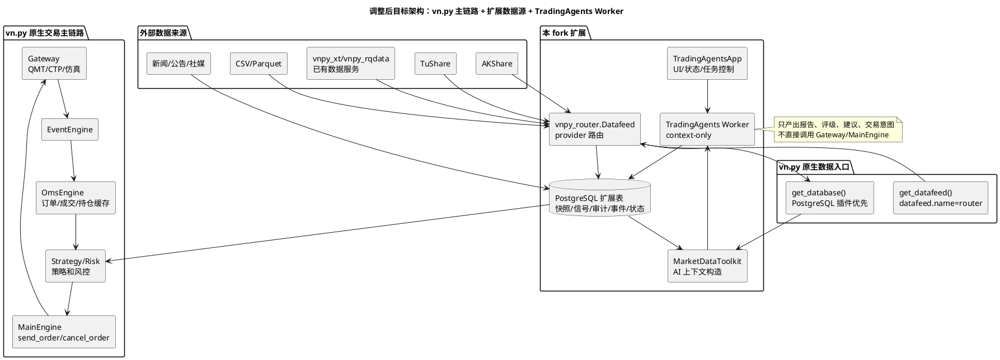
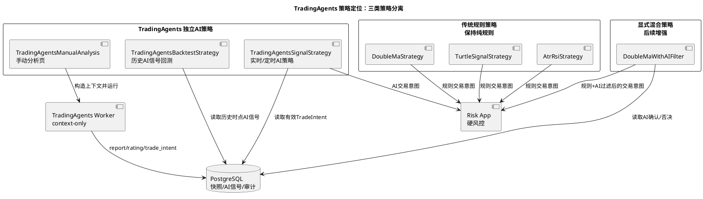
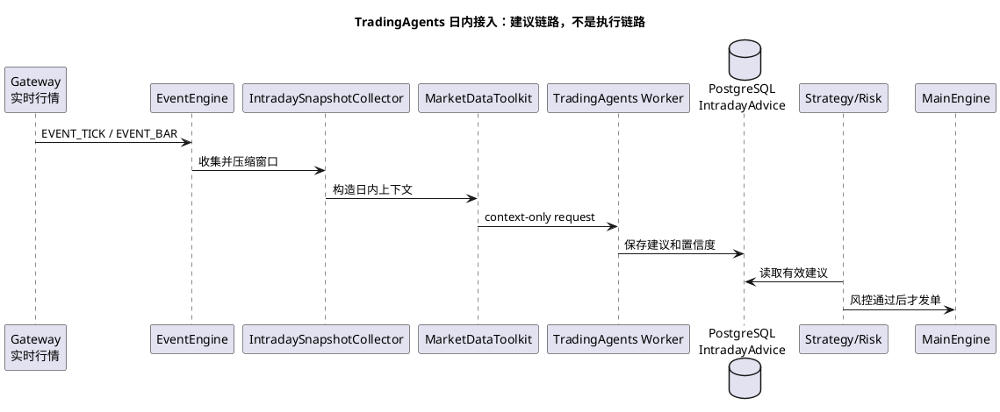
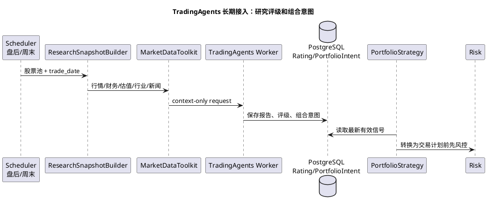

# vn.py 优先复用技术路线调整方案

> 本文是 `custom_quant_architecture.md` 的纠偏补充。新的原则是：优先复用 vn.py 已有的 Datafeed、Database、Gateway、App、EventEngine、OmsEngine、Backtesting 和 Risk 体系；本 fork 只扩展可切换数据源、AI 投研信号、快照上下文、审计和运维能力。

## 1. 调整结论

当前技术路线可以继续做，但要从“围绕 AKShare + TradingAgents 自建一套旁路框架”调整为“在 vn.py 原有架构上增加扩展 App 和扩展 Datafeed”。

新的主线：

1. vn.py 仍负责交易主链路：`Gateway -> EventEngine -> OmsEngine -> Strategy/Risk -> MainEngine.send_order()`。
2. vn.py 原生 `get_datafeed()` 仍负责统一历史数据入口，通过 `datafeed.name=router` 接入本 fork 的可切换数据源。
3. vn.py 原生 `get_database()` 仍负责 K 线、Tick、成交、持仓等标准交易数据的落库，PostgreSQL 作为首选数据库插件。
4. 本 fork 的 PostgreSQL 扩展表只保存 provider trace、研究快照、TradingAgents 输出、审计、事件和运维状态。
5. TradingAgents 作为 vn.py App 内的同进程 context-only Worker 接入，只产出报告、评级、日内建议和交易意图，不直接持有 Gateway、账号、订单接口。
6. AKShare、TuShare、QMT、XT、RQData、本地 CSV/Parquet 都只是 provider 或 vn.py datafeed 的来源，不写死到策略和 TradingAgents 中。
7. 传统规则策略和 TradingAgents 独立 AI 策略分开实现：`DoubleMaStrategy` 等规则策略默认不消费 AI 信号，TradingAgents 通过手动分析页、`TradingAgentsSignalStrategy` 和 `TradingAgentsBacktestStrategy` 独立落地。
8. AI 过滤传统策略是后续显式混合策略路线，例如 `DoubleMaWithAIFilter`；不能在用户无感的情况下改变原有规则策略语义。

## 2. 需要修改的技术路线

| 原路线 | 问题 | 新路线 |
| --- | --- | --- |
| 自维护 `DataProviderAdapter` 体系直接管理 AKShare/TuShare/QMT/XT | 容易重复 vn.py `Datafeed` 插件机制，QMT/XT 还会重复 Gateway/Datafeed 能力 | 保留 `vnpy_router.Datafeed`，但内部 provider 优先包装 vn.py 已有 datafeed；AKShare/本地文件只是补充 provider |
| `QmtProvider` / `XtProvider` 直接接 `xtquant.xtdata` | vn.py 生态本身已有 XT/QMT 方向插件，直接实现会产生双轨维护 | 改为 `VnpyDatafeedProvider(name="xt")` 或 Gateway 行情订阅；只有 vn.py 插件不存在时才做最薄兼容层 |
| PostgreSQL bar snapshot 作为行情主缓存 | 可能绕过 vn.py Database，形成第二套行情库 | 标准 bar/tick 优先走 vn.py Database；AI 所需 provider trace、quality、研究快照单独进扩展表 |
| TradingAgents Runner 兼容裸 `propagate(symbol, date)` | 裸调用可能走 TradingAgents 默认 yfinance/Alpha Vantage 工具 | 只允许 context-only runner；如使用原生 TradingAgentsGraph，必须先替换数据工具 |
| TradingAgentsEngine 只做内存开关 | 无法跨重启恢复，UI 也不能真正停止任务或禁用信号 | 接入 PostgreSQL `ai_runtime_state`，并由 vn.py App 管理 Worker lifecycle、任务、状态和手工接管 |
| 把 TradingAgents 默认接到传统 CTA 策略 | 会让规则策略、AI 策略和回测含义混在一起，用户难以判断交易来自规则还是 AI | 传统策略保持纯规则；新增独立 AI 策略、AI 回测策略和显式混合过滤策略 |
| PaperAccountBridge 独立模拟成交 | 容易和 vn.py 回测/Paper/Gateway 的成交状态不一致 | Paper bridge 仅做 smoke；真实模拟盘优先接 vn.py 回测引擎、仿真 Gateway 或已有 paper 体系 |
| Event/news/sentiment schema 与 Toolkit 分离 | 数据入库后无法进入 TradingAgents 上下文 | 补 normalized event reader、sentiment snapshot reader，并由 `MarketDataToolkit` 按时间窗口读取 |
| 文档把 P1-P11 标记为完成 | 当前更多是骨架完成，不是生产完成 | 改为“骨架完成 / 生产待完成 / 阻塞项”，后续任务按 vn.py 复用路线重排 |

## 3. 目标架构

## 4. 数据源路线

### 4.1 vn.py Datafeed 是统一入口

保留 vn.py 原生用法：

- 页面配置仍走 **配置 -> 全局配置**。
- `datafeed.name=router` 时，vn.py 加载 `vnpy_router.Datafeed`。
- `vnpy_router.Datafeed` 内部再按 provider 配置选择数据源。

### 4.2 provider 分层

| provider 类型 | 例子 | 定位 |
| --- | --- | --- |
| vn.py 原生 provider wrapper | `vnpy_xt`、`vnpy_rqdata`、后续 QMT/XT 插件 | 优先复用，避免重复实现 |
| 免费或低门槛 provider | AKShare、本地 CSV/Parquet | 开发、研究、无账号阶段使用 |
| 付费 provider | TuShare、RQData | 有账号后补齐数据质量和稳定性 |
| Gateway 实时流 | QMT、CTP、仿真 Gateway | 实时行情、订单、成交、持仓，不混进历史 Datafeed provider |

### 4.3 PostgreSQL 分工

PostgreSQL 不再承担所有职责：

- vn.py 标准数据库：K 线、Tick、成交、持仓、回测需要的标准交易数据。
- 扩展快照表：provider trace、quality report、fundamental/valuation/industry/benchmark/portfolio/alpha_factor snapshot。
- 事件表：新闻、公告、社媒、情绪、实体链接、质量报告。
- AI 表：agent run、report、rating signal、intraday advice、trade intent、decision audit、runtime state。

### 4.4 可选依赖组合

核心 vn.py 环境不强制安装所有外部数据源和 LLM 依赖。按用途选择 extras：

| extra | 用途 |
| --- | --- |
| `router-postgres` | 安装 PostgreSQL 扩展依赖，扩展表初始化复用 Peewee Model + `create_tables()` |
| `akshare` | 安装 AKShare，适合无账号阶段拉公开数据 |
| `tushare` | 安装 TuShare，适合有 token 后补齐行情和基础数据 |
| `alpha` | 安装 `vnpy.alpha` 因子研究依赖，用于 Alpha101/Alpha158、因子分析和模型研究；Polars 使用 `rtcompat` 运行时以避开部分 macOS/Python 组合的 CPU 指令兼容问题 |
| `prod` | vn.py 主进程的 PostgreSQL、AKShare、TuShare 生产候选组合 |

`alpha` 是可选研究增强模块，不随 vn.py 主进程启动自动安装。`vnpy.alpha` 入口采用懒加载，未安装 `alpha` extra 时，主交易、数据路由、TradingAgents 基础上下文不受影响；只有实际使用 AlphaDataset、Alpha101、因子模型或 tear sheet 分析时才需要安装。

本 fork 当前把 `tradingagents` 放入主依赖，目的是让默认 context-only factory 在部署阶段即可解析并验证；但它仍然是懒加载：vn.py 启动不会自动调用大模型，未启用 TradingAgents 或缺少 API key 时会结构化降级。QMT/XT/RQData 这类 vn.py 插件不放入本 fork 的默认依赖，由使用者按券商和账号情况单独安装对应 vn.py datafeed/gateway 包。

## 5. TradingAgents 路线

TradingAgents 继续接入，但边界要更硬：

1. 不能直接访问外部数据源。
2. 不能直接访问 `Gateway`、`MainEngine`、账号、持仓修改接口。
3. 不能在 vn.py 主事件线程里跑 LLM。
4. 输入必须来自 `MarketDataToolkit` 构造的本地快照上下文。
5. 输出必须先落库，再由策略、风控或人工 UI 读取。
6. 传统规则策略默认不读取 TradingAgents 输出；独立 AI 策略和 AI 回测策略单独实现。
7. 混合策略必须显式命名、显式开关、显式回测，不能悄悄改变原有策略行为。

### 5.0 策略定位

这次路线调整的核心是：TradingAgents 可以做买卖判断，但要作为独立 AI 策略出现；传统策略继续承担 vn.py 主链路验证和规则策略实盘职责。

### 5.1 日内接入

日内场景走压缩快照，不走 tick 高频执行：

### 5.2 长期接入

长期场景走研究快照和批量调度：

## 6. 代码调整清单

| 优先级 | 模块 | 调整 |
| --- | --- | --- |
| P0 | `vnpy_router.datafeed` | PostgreSQL 配置只读取 vn.py `database.*`；扩展表初始化复用 Peewee Model + `create_tables()`；真实 Postgres 集成测试必须通过 |
| P0 | `vnpy_router.providers.qmt/xt` | 废弃直接 provider，替换为 vn.py datafeed wrapper 或标为 blocked |
| P0 | `vnpy_tradingagents.real_runner` | 移除生产路径中的裸 `propagate(symbol, date)`；只允许 context-only runner |
| P0 | `vnpy_tradingagents.worker_process` | 增加可配置真实 runner 加载入口，而不是默认 `runner_not_configured` |
| P0 | `vnpy_tradingagents.ui` | 增加手动分析入口，用户输入标的后展示报告、评级、动作、置信度和风险点 |
| P0 | `vnpy_tradingagents.strategies` + 根目录 `strategies/` | 新增 `TradingAgentsSignalStrategy`，作为独立 AI 策略读取已落库意图；新增 `TradingAgentsCtaSignalStrategy` 作为 vn.py CTA UI 可见包装层；不改造传统 CTA 策略 |
| P0 | `vnpy_tradingagents.backtesting` | 新增 `TradingAgentsBacktestStrategy`，回测仅读取历史时点固化 AI 信号，不在每根 K 线上调用 LLM |
| P1 | `vnpy_tradingagents.engine/ui` | 状态持久化到 PostgreSQL，UI 真正控制 worker/scheduler/signal status |
| P1 | `vnpy_router.event_storage` | 补 normalized event、sentiment snapshot、entity link 的 save/read 接口 |
| P1 | `vnpy_router.storage` | 补通用 payload snapshot 保存入口，Alpha 因子落 `alpha_factor_snapshot` |
| P1 | `vnpy_tradingagents.toolkit` | 补技术指标、估值、行业、新闻、情绪、benchmark、持仓、alpha_factors 窗口 |
| P1 | 回测/Paper | 优先接 vn.py Backtesting/Paper/Gateway，现有 bridge 保留为 smoke |
| P2 | readiness/ops | 检查真实 DB、schema、runner、datafeed smoke、worker smoke、paper smoke |
| P2 | 文档任务 | 把 P1-P11 改为“骨架完成”，新增生产化阶段任务 |

## 7. 文档调整清单

需要修改现有文档：

1. `custom_quant_architecture.md`
   - 把“自维护 provider 体系”改成“vn.py datafeed wrapper 优先”。
   - 把 QMT/XT 从直接 provider 改成 vn.py 插件复用。
   - 把 P1-P11 的“已完成”降级为“骨架完成”。
   - 补充 PostgreSQL 分工：vn.py 标准库和 AI 扩展表分离。

2. `docs/community/tasks/tradingagents_next_steps/README.md`
   - 修改状态规则：`[x]` 只表示当前阶段代码完成，不代表生产可用。
   - 新增“生产化缺口”章节。

3. `01-data-snapshot-foundation.md`
   - 修正 `news/sentiment` 已完成描述。
   - 增加真实 PostgreSQL row factory 和集成测试任务。

4. `09-production-data-sources.md`
   - 去掉直接实现 QMT/XT provider 的路线。
   - 改为复用 vn.py datafeed/gateway 插件。

5. `10-vnpy-paper-backtest-integration.md`
   - 区分 smoke bridge 和真实 vn.py Backtesting/Paper 接入。

## 8. 新阶段建议

建议新增 P12-P15，按 vn.py 复用路线生产化；P27 专门处理 TradingAgents 策略定位纠偏：

| 阶段 | 名称 | 目标 |
| --- | --- | --- |
| P12 | vn.py 复用纠偏 | 修 PostgreSQL row factory、文档状态、QMT/XT provider 路线、datafeed wrapper |
| P13 | TradingAgents 真实 Worker | context-only runner、替换数据工具、worker 配置、smoke |
| P14 | 事件和 Toolkit 生产化 | 新闻/公告/社媒 normalized pipeline、Toolkit 窗口上下文 |
| P15 | vn.py 真实运行链路 | EventEngine 接入、Backtesting/Paper 接入、UI 状态持久化、readiness 完整检查 |
| P27 | TradingAgents 独立 AI 策略定位 | 已代码级落地手动分析页、独立 AI 策略、CTA UI 可见包装、AI 回测策略、混合过滤策略边界，传统策略默认不接 AI |

## 9. 验收标准

完成路线调整后，至少要满足：

1. `datafeed.name=router` 可通过 vn.py `get_datafeed()` 查询历史 K 线。
2. PostgreSQL 复用 vn.py `database.*`，扩展表通过 Peewee Model + `create_tables()` 初始化，schema status/read/write 全部通过。
3. 关闭 TradingAgents 后，vn.py 数据、策略、风控、下单、手工交易不受影响。
4. TradingAgents Worker 无法拿到 Gateway、MainEngine、账号、密钥或外部 provider handle。
5. AKShare 不再写死；切换 provider 不需要改策略或 TradingAgents prompt。
6. QMT/XT 接入优先复用 vn.py 插件，不重复实现交易和实时行情。
7. 日内建议和长期评级都必须先落 PostgreSQL，再由独立 AI 策略、显式混合策略或人工界面读取。
8. readiness 能发现 DB、schema、provider、worker、secret、paper smoke 的真实问题。
9. `DoubleMaStrategy`、`TurtleSignalStrategy` 等传统策略在未显式创建混合版本时，不读取 TradingAgents 输出。
