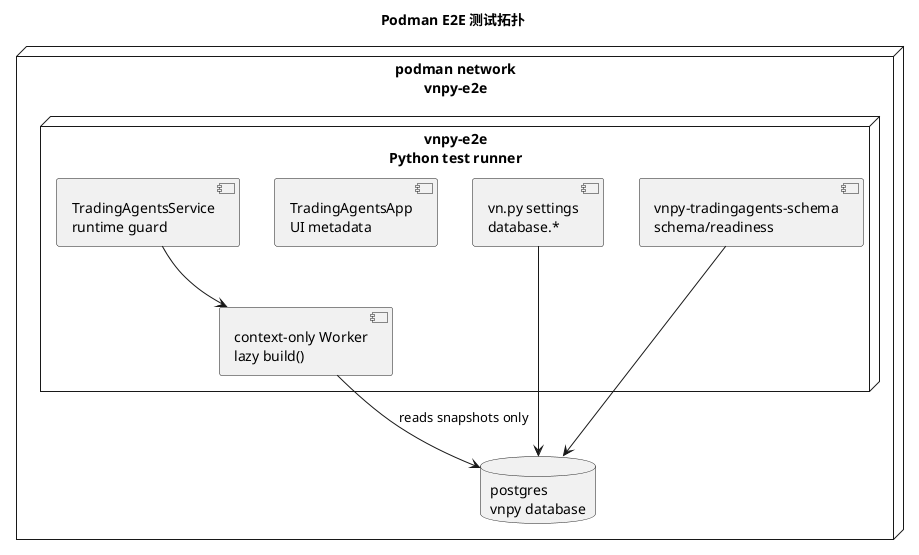

# Podman 端到端测试用例

本文档定义本 fork 在 Podman 环境中的端到端测试用例。本文只描述测试设计和验收口径，不执行 Podman 启动、构建或测试命令。

## 1. 测试目标

Podman E2E 要验证本轮改动在接近生产的隔离环境中能否串起来：

1. PostgreSQL 使用 vn.py 原生 `database.*` 配置，不再依赖 `router.postgres.dsn` 或 `QUANT_DATABASE_URL`。
2. TradingAgents/router 扩展表通过 Peewee Model + `create_tables(..., safe=True)` 初始化。
3. `examples/veighna_trader/run.py` 能注册 `TradingAgentsApp`。
4. `tradingagents.worker_factory` 和 `TRADINGAGENTS_WORKER_FACTORY` 都能加载默认同进程 context-only Worker。
5. TradingAgents Worker 只能读取 `native_input["context"]`，不能直连外部数据源、Gateway、MainEngine 或 `send_order`。
6. LLM API key 可通过 UI 安全输入或环境变量进入运行时，但不写入 `vt_setting.json`、日志、DB payload 或 worker context。
7. 关闭 TradingAgents 后，vn.py 主链路、数据源、风控和手工交易逻辑仍能正常降级运行。

## 2. 当前容器现状

当前仓库已经补齐测试专用 Podman E2E 栈：

- `tools/podman/Containerfile.e2e`：构建 Python 测试镜像，包含 `git`、PostgreSQL client、Qt headless import 所需系统库。
- `tools/podman/run_e2e.sh`：构建镜像、启动 PostgreSQL、执行 pre/post restart 两段 E2E。
- `tools/podman/e2e_runner.py`：按 PE2E 用例写入结构化结果。
- `tools/podman/README.md`：记录运行方式和容器依赖。
- `tools/production/closed_loop_validation.py`：Python 层面的生产闭环验证脚本。

```text
tools/podman/Containerfile.e2e
tools/podman/run_e2e.sh
tools/podman/e2e_runner.py
tools/podman/README.md
```

这些脚本只用于 E2E，不改变 vn.py 正常源码启动方式。

## 3. 建议测试拓扑



第一版 E2E 使用两个容器即可：

| 容器 | 是否必须 | 作用 |
| --- | --- | --- |
| `vnpy-e2e-postgres` | 必须 | 存 vn.py 原生表和 TradingAgents/router 扩展表 |
| `vnpy-e2e` | 必须 | 构建源码、运行 CLI、pytest、closed-loop validation |

## 4. 测试数据和配置

建议 E2E 使用可审计的本地数据，不在测试中请求真实行情、新闻或社媒接口：

| 项目 | 建议值 |
| --- | --- |
| PostgreSQL DB | `vnpy` |
| PostgreSQL user | `vnpy` |
| PostgreSQL password | 测试专用 secret |
| `database.name` | `postgresql` |
| `database.host` | `vnpy-e2e-postgres` |
| `database.port` | `5432` |
| `router.providers` | `local_file` |
| `router.local_path` | `/workspace/tests/fixtures/e2e` |
| `tradingagents.worker_factory` | `vnpy_tradingagents.tradingagents_factory:build` |
| `tradingagents.api_key_env_var` | `OPENAI_API_KEY` |
| `OPENAI_API_KEY` | 测试假值，仅用于 readiness，不调用真实 LLM |

测试数据文件建议包含：

```text
tests/fixtures/e2e/600519.SSE_d.csv
tests/fixtures/e2e/news.json
tests/fixtures/e2e/sentiment.json
tests/fixtures/e2e/vt_setting.postgres.json
```

注意：`router.providers=local_file:/path` 属于本 fork 曾经引入的 readiness-only 写法，已经废弃。为了和 vn.py Datafeed 配置保持一致，路径只允许写在 `router.local_path`。

## 5. 测试用例总览

`当前结果` 在每次执行后更新。可选值见下一节：`未执行`、`通过`、`失败`、`阻塞`、`跳过`。

| ID | 用例 | 类型 | 必须 | 当前结果 | 证据路径 |
| --- | --- | --- | --- | --- | --- |
| PE2E-00 | Podman 测试栈构建 | 基础设施 | 是 | 通过 | `docs/community/ops/validation_results/podman-e2e/20260505-161512/pe2e_results.md` |
| PE2E-01 | PostgreSQL 启动和连接 | 基础设施 | 是 | 通过 | `docs/community/ops/validation_results/podman-e2e/20260505-161512/pe2e_results.md` |
| PE2E-02 | vn.py 原生 PostgreSQL 配置注入 | 配置 | 是 | 通过 | `docs/community/ops/validation_results/podman-e2e/20260505-161512/pe2e_results.md` |
| PE2E-03 | 扩展表 schema init/status | DB | 是 | 通过 | `docs/community/ops/validation_results/podman-e2e/20260505-161512/pe2e_results.md` |
| PE2E-04 | readiness 缺配置时明确失败 | 负向 | 是 | 通过 | `docs/community/ops/validation_results/podman-e2e/20260505-161512/pe2e_results.md` |
| PE2E-05 | readiness 完整配置时通过关键门禁 | 正向 | 是 | 通过 | `docs/community/ops/validation_results/podman-e2e/20260505-161512/pe2e_results.md` |
| PE2E-06 | 数据源 router/local_file 到 PostgreSQL 快照 | 数据 | 是 | 通过 | `docs/community/ops/validation_results/podman-e2e/20260505-161512/pe2e_results.md` |
| PE2E-07 | context-only Worker factory 懒加载 | Worker | 是 | 通过 | `docs/community/ops/validation_results/podman-e2e/20260505-161512/pe2e_results.md` |
| PE2E-08 | Worker 禁止外部数据源和交易句柄 | 安全 | 是 | 通过 | `docs/community/ops/validation_results/podman-e2e/20260505-161512/pe2e_results.md` |
| PE2E-09 | LLM key UI/环境变量不明文落盘 | 安全 | 是 | 通过 | `docs/community/ops/validation_results/podman-e2e/20260505-161512/pe2e_results.md` |
| PE2E-10 | TradingAgentsApp 启动入口注册 | vn.py UI | 是 | 通过 | `docs/community/ops/validation_results/podman-e2e/20260505-161512/pe2e_results.md` |
| PE2E-11 | 生产闭环 validation local profile | 运维 | 是 | 通过 | `docs/community/ops/validation_results/podman-e2e/20260505-161512/pe2e_results.md` |
| PE2E-12 | 生产闭环 validation production profile | 运维 | 是 | 通过 | `docs/community/ops/validation_results/podman-e2e/20260505-161512/pe2e_results.md` |
| PE2E-13 | Paper smoke 不触发 live Gateway | 交易安全 | 是 | 通过 | `docs/community/ops/validation_results/podman-e2e/20260505-161512/pe2e_results.md` |
| PE2E-14 | TradingAgents 关闭后主链路降级可用 | 降级 | 是 | 通过 | `docs/community/ops/validation_results/podman-e2e/20260505-161512/pe2e_results.md` |
| PE2E-15 | 容器重启后 PostgreSQL 状态持久 | 稳定性 | 是 | 通过 | `docs/community/ops/validation_results/podman-e2e/20260505-161512/pe2e_results.md` |

## 6. 测试结果标记规范

每次执行 Podman E2E 后，需要同时更新第 5 节总览表和本节结果登记表。

| 状态 | 含义 | 对验收的影响 |
| --- | --- | --- |
| 未执行 | 尚未运行该用例 | 不计入通过 |
| 通过 | 实际结果满足预期结果 | 可计入通过 |
| 失败 | 已执行，但实际结果不满足预期 | 必须修复或记录豁免 |
| 阻塞 | 前置条件缺失，无法执行 | 必须补齐前置条件 |
| 跳过 | 本轮不适用，且有明确理由 | 必须记录跳过原因 |

结果登记表：

| ID | 执行结果 | 执行时间 | Git commit | 执行环境 | 证据路径 | 备注 |
| --- | --- | --- | --- | --- | --- | --- |
| PE2E-00 | 通过 | 2026-05-05T08:16:12+00:00 | e81ff256 | Podman linux/arm64, Python 3.13 | `docs/community/ops/validation_results/podman-e2e/20260505-161512/` | Podman image built and postgres runner container started by `tools/podman/run_e2e.sh` |
| PE2E-01 | 通过 | 2026-05-05T08:16:12+00:00 | e81ff256 | Podman linux/arm64, Python 3.13 | `docs/community/ops/validation_results/podman-e2e/20260505-161512/` | PostgreSQL `select 1` succeeded |
| PE2E-02 | 通过 | 2026-05-05T08:16:13+00:00 | e81ff256 | Podman linux/arm64, Python 3.13 | `docs/community/ops/validation_results/podman-e2e/20260505-161512/` | Peewee params came from vn.py `database.*` settings |
| PE2E-03 | 通过 | 2026-05-05T08:16:14+00:00 | e81ff256 | Podman linux/arm64, Python 3.13 | `docs/community/ops/validation_results/podman-e2e/20260505-161512/` | 25 extension tables are ready |
| PE2E-04 | 通过 | 2026-05-05T08:16:14+00:00 | e81ff256 | Podman linux/arm64, Python 3.13 | `docs/community/ops/validation_results/podman-e2e/20260505-161512/` | Missing PostgreSQL/provider/API key readiness fails explicitly |
| PE2E-05 | 通过 | 2026-05-05T08:16:14+00:00 | e81ff256 | Podman linux/arm64, Python 3.13 | `docs/community/ops/validation_results/podman-e2e/20260505-161512/` | Readiness status is ready |
| PE2E-06 | 通过 | 2026-05-05T08:16:14+00:00 | e81ff256 | Podman linux/arm64, Python 3.13 | `docs/community/ops/validation_results/podman-e2e/20260505-161512/` | `local_file` provider returned and persisted 3 bars |
| PE2E-07 | 通过 | 2026-05-05T08:16:14+00:00 | e81ff256 | Podman linux/arm64, Python 3.13 | `docs/community/ops/validation_results/podman-e2e/20260505-161512/` | Worker loaded lazily; response action=`hold`, error_type=`dependency_error` |
| PE2E-08 | 通过 | 2026-05-05T08:16:14+00:00 | e81ff256 | Podman linux/arm64, Python 3.13 | `docs/community/ops/validation_results/podman-e2e/20260505-161512/` | Forbidden trading handles blocked before runner execution |
| PE2E-09 | 通过 | 2026-05-05T08:16:14+00:00 | e81ff256 | Podman linux/arm64, Python 3.13 | `docs/community/ops/validation_results/podman-e2e/20260505-161512/` | UI guidance is present; runtime secret stays out of settings and secret policy blocks value leaks |
| PE2E-10 | 通过 | 2026-05-05T08:16:14+00:00 | e81ff256 | Podman linux/arm64, Python 3.13 | `docs/community/ops/validation_results/podman-e2e/20260505-161512/` | TradingAgentsApp is registered and UI module imports |
| PE2E-11 | 通过 | 2026-05-05T08:16:24+00:00 | e81ff256 | Podman linux/arm64, Python 3.13 | `docs/community/ops/validation_results/podman-e2e/20260505-161512/` | Local closed-loop report: `closed_loop_local.md` |
| PE2E-12 | 通过 | 2026-05-05T08:16:42+00:00 | e81ff256 | Podman linux/arm64, Python 3.13 | `docs/community/ops/validation_results/podman-e2e/20260505-161512/` | Production profile rejects missing key and passes with configured gates |
| PE2E-13 | 通过 | 2026-05-05T08:16:43+00:00 | e81ff256 | Podman linux/arm64, Python 3.13 | `docs/community/ops/validation_results/podman-e2e/20260505-161512/` | Paper smoke buy/hold paths passed without live Gateway |
| PE2E-14 | 通过 | 2026-05-05T08:16:43+00:00 | e81ff256 | Podman linux/arm64, Python 3.13 | `docs/community/ops/validation_results/podman-e2e/20260505-161512/` | Disabled TradingAgents service degraded without worker call |
| PE2E-15 | 通过 | 2026-05-05T08:17:22+00:00 | e81ff256 | Podman linux/arm64, Python 3.13 | `docs/community/ops/validation_results/podman-e2e/20260505-161512/` | Persistence sentinel survived PostgreSQL container restart |

本次执行摘要：

- 执行命令：`tools/podman/run_e2e.sh`
- 执行窗口：2026-05-05 16:15:13 到 16:17:21（Asia/Shanghai）
- 结果计数：16 通过，0 阻塞，0 跳过，0 失败。
- 证据目录：`docs/community/ops/validation_results/podman-e2e/20260505-161512/`
- 已修复项：E2E 镜像已安装 `git` 和 Qt headless import 所需系统库；`local_file` 配置已统一为 `router.providers=local_file` + `router.local_path=/path`。
- 生产门禁：PE2E-12 已通过，`closed_loop_production.md` 显示 `production_ready=true`。

推荐证据目录：

```text
docs/community/ops/validation_results/podman-e2e/<YYYYMMDD-HHMMSS>/
```

每个用例至少保留对应的命令日志、关键输出或截图。失败、阻塞、跳过必须在备注中写明原因。

## 7. 详细测试用例

### PE2E-00 Podman 测试栈构建

**目的**：确认仓库具备可重复启动的 Podman E2E 测试栈。

**前置条件**：

- 已补 `tools/podman/Containerfile.e2e`。
- 已补 `tools/podman/run_e2e.sh`。
- 已补 `tools/podman/e2e_runner.py`。

**步骤**：

1. 构建 `vnpy-e2e` 镜像。
2. 创建 `vnpy-e2e-postgres` 和 `vnpy-e2e` 运行容器。
3. 挂载当前源码到 `/workspace`。
4. 配置测试环境变量，不传入真实生产 key。

**预期结果**：

- 镜像构建成功。
- `vnpy-e2e-postgres` healthcheck 通过。
- `vnpy-e2e` 可以执行 `uv run python -V`。

**证据落档**：

- 构建日志。
- 容器列表。
- 镜像 digest。

### PE2E-01 PostgreSQL 启动和连接

**目的**：验证 PostgreSQL 服务在 Podman 网络内可访问。

**步骤**：

1. 从 `vnpy-e2e` 容器连接 `vnpy-e2e-postgres:5432`。
2. 查询 `select 1`。
3. 确认数据库名、用户名和时区。

**预期结果**：

- 数据库连接成功。
- `select 1` 返回 `1`。

### PE2E-02 vn.py 原生 PostgreSQL 配置注入

**目的**：确认扩展只读取 vn.py 原生 `database.*` 配置。

**步骤**：

1. 写入测试 `vt_setting.json`，包含 `database.name=postgresql` 和完整 `database.*`。
2. 同时设置一个干扰项 `router.postgres.dsn=postgresql://must-not-be-used`。
3. 运行配置 helper 测试。

**预期结果**：

- Peewee 参数来自 `database.*`。
- 干扰项不会被读取。

### PE2E-03 扩展表 schema init/status

**目的**：验证扩展表初始化复用 Peewee `create_tables(..., safe=True)`。

**步骤**：

1. 执行 `vnpy-tradingagents-schema schema init`。
2. 执行 `vnpy-tradingagents-schema schema status`。
3. 在 PostgreSQL 中查询核心扩展表。
4. 重复执行 schema init。

**预期结果**：

- `market_bar_snapshot`、`agent_run`、`agent_report`、`rating_signal`、`trade_intent`、`decision_audit` 等表存在。
- 重复 init 幂等成功。
- 不创建或依赖 `schema_migration` 表作为 readiness 依据。

### PE2E-04 readiness 缺配置时明确失败

**目的**：验证缺少生产配置时系统不会误报 ready。

**步骤**：

1. 使用缺失 PostgreSQL、provider、API key 的配置运行：
   `vnpy-tradingagents-schema readiness --json`

**预期结果**：

- `vnpy_postgres_config` 为 `failed`。
- `tradingagents_api_key` 为 `failed`。
- provider 缺失为 `failed` 或 `warning`。
- 命令输出 JSON 可被解析。

### PE2E-05 readiness 完整配置时通过关键门禁

**目的**：验证配置完整时 readiness 可以达到非 failed。

**步骤**：

1. 配置完整 `database.*`。
2. 配置 `router.providers=local_file` 和 `router.local_path=<fixture_dir>`。
3. 配置 `tradingagents.worker_factory=vnpy_tradingagents.tradingagents_factory:build`。
4. 设置 `OPENAI_API_KEY` 为测试假值。
5. 运行 readiness。

**预期结果**：

- PostgreSQL 配置为 ready。
- Peewee 为 ready。
- Worker factory 为 ready。
- API key 环境变量为 ready。
- local_file provider 为 ready。

### PE2E-06 数据源 router/local_file 到 PostgreSQL 快照

**目的**：验证可切换数据源第一版能使用本地 fixture，并落 PostgreSQL 快照。

**步骤**：

1. 使用 `local_file` provider 读取 K 线 fixture。
2. 通过 router/datafeed 写入或读取快照。
3. 查询 `market_bar_snapshot`。

**预期结果**：

- 快照包含 provider trace。
- 数据源不写死 AKShare。
- PostgreSQL 连接来自 vn.py `database.*`。

### PE2E-07 context-only Worker factory 懒加载

**目的**：验证 Worker 是可插拔懒加载入口。

**步骤**：

1. 不启动额外容器；Worker 在 vn.py 进程内按需懒加载。
2. 配置 `tradingagents.worker_factory=vnpy_tradingagents.tradingagents_factory:build`。
3. 调用 `load_configured_worker()`。
4. 构造最小 `TradingAgentsWorkerRequest`。

**预期结果**：

- Worker 可被加载。
- 未调用任务前不触发 LLM。
- 缺少上游 TradingAgents 依赖时返回 `dependency_error`，不崩溃 vn.py 主进程。

### PE2E-08 Worker 禁止外部数据源和交易句柄

**目的**：验证 TradingAgents 不能绕过快照上下文。

**步骤**：

1. 构造包含 `gateway`、`main_engine`、`send_order`、`akshare`、`yfinance` 等字段的 context。
2. 调用 Worker adapter。
3. 调用 context 工具但不设置 active context。

**预期结果**：

- adapter 返回 `forbidden_context`。
- context 工具返回 fail closed 文案。
- 不发起外部网络数据请求。
- 不出现任何 Gateway/MainEngine 调用。

### PE2E-09 LLM key UI/环境变量不明文落盘

**目的**：验证真实 key 不进入明文配置和模型上下文。

**步骤**：

1. 通过 UI 逻辑模拟输入 `tradingagents.api_key <secret>`。
2. 保存全局配置。
3. 读取 `vt_setting.json`。
4. 构造包含 `OPENAI_API_KEY=sk-...` 的 context，调用 secret policy。

**预期结果**：

- `vt_setting.json` 不包含真实 key。
- 当前进程环境变量可读取测试 key。
- 安装 keyring 时可写入系统钥匙串；未安装时只 session 生效。
- secret policy 拦截 context 中的 key 字段和值。

### PE2E-10 TradingAgentsApp 启动入口注册

**目的**：验证源码启动脚本能把 TradingAgents 暴露到 vn.py UI。

**步骤**：

1. 静态解析 `examples/veighna_trader/run.py`。
2. 检查导入 `TradingAgentsApp`。
3. 检查 `main_engine.add_app(TradingAgentsApp)`。
4. 导入 `TradingAgentsApp.app_module + ".ui"`。

**预期结果**：

- 启动脚本注册 TradingAgentsApp。
- UI 模块能导入 `TradingAgentsWidget`。

**说明**：

Podman 中不强制启动真实 Qt GUI；GUI 冒烟测试以导入、metadata 和静态注册为主。真实 UI 点击测试可在宿主机或带 X11/VNC 的独立 GUI 容器中执行。

### PE2E-11 生产闭环 validation local profile

**目的**：验证本地 profile 可以在容器中生成报告。

**步骤**：

1. 运行 `tools.production.closed_loop_validation --profile local`。
2. 输出 Markdown 和 JSON 到 `docs/community/ops/validation_results/`。

**预期结果**：

- lint、非 alpha pytest、compileall、diff check 通过。
- 缺少真实生产外部依赖时显示 `blocked`，local profile 命令仍可完成。

### PE2E-12 生产闭环 validation production profile

**目的**：验证 production profile 不会放过缺失生产门禁。

**步骤**：

1. 不配置 API key 或 provider 时运行 production profile。
2. 配齐 PostgreSQL、worker factory、fake API key 和 local_file provider 后再次运行。

**预期结果**：

- 缺门禁时 `production_ready=false` 且命令失败。
- 配齐门禁后，除真实上游 TradingAgents/LLM 网络调用外，代码门禁应通过。

### PE2E-13 Paper smoke 不触发 live Gateway

**目的**：验证 AI 输出只进入 paper/仿真闭环，不触发实盘 Gateway。

**步骤**：

1. 构造 worker 响应 `buy/sell/hold/watch`。
2. 运行 `TradingAgentsPaperSmoke`。
3. 检查 paper fill、feedback 和 audit。
4. 注入 fake Gateway，记录是否被调用。

**预期结果**：

- `buy/sell/reduce/cover` 才能产生 paper fill。
- `hold/watch` 不写成交。
- 不调用 live Gateway。

### PE2E-14 TradingAgents 关闭后主链路降级可用

**目的**：验证前端开关关闭后系统仍可用。

**步骤**：

1. 设置 TradingAgents runtime 为 disabled。
2. 调用 `TradingAgentsService.run()`。
3. 执行非 AI 的策略/风控基础 smoke。

**预期结果**：

- service 返回 `None` 或降级状态。
- 不生成 AI 评级和交易意图。
- vn.py 原有数据、策略、风控、下单路径不依赖 TradingAgents。

### PE2E-15 容器重启后 PostgreSQL 状态持久

**目的**：验证 PostgreSQL volume 和扩展表状态可恢复。

**步骤**：

1. 运行 schema init。
2. 写入一条 market snapshot 和 agent_run。
3. 重启 `vnpy-e2e-postgres` 容器。
4. 再次运行 schema status 并查询数据。

**预期结果**：

- 扩展表仍为 ready。
- 已写入数据未丢失。
- 重复 init 不破坏数据。

## 8. 验收标准

Podman E2E 通过标准：

1. 容器栈验收：PE2E-00 到 PE2E-15 全部通过。
2. 生产发布验收：PE2E-12 必须在 clean worktree 下通过，且 `pytest_non_alpha` 等生产门禁不能失败。
3. 所有测试结果落档到 `docs/community/ops/validation_results/`。
4. `production_ready` 判断和实际门禁一致，不误报。
5. 没有真实 secret 出现在配置文件、日志、报告、DB payload 和 context。
6. TradingAgents 不能直接调用 Gateway、MainEngine 或 `send_order`。
7. 关闭 TradingAgents 后，非 AI 主链路仍可运行。

## 9. 暂不覆盖范围

以下内容不作为第一版 Podman E2E 必过项：

- 真实 QMT/XT Gateway 接入。
- 真实券商交易。
- 真实新闻/社媒情绪实时抓取。
- 真实桌面 Qt 点击测试。
- 真实 LLM 计费调用。

## 10. 风险和注意事项

- PySide6 GUI 在普通容器中运行需要 X11、Wayland、VNC 或 xvfb，第一版 E2E 应优先做 headless 启动入口验证。
- 上游 TradingAgents 默认 `propagate(symbol, date)` 会使用外部数据工具，本 fork 的 E2E 必须验证 context-only factory 生效。
- 测试用 API key 必须是假值；如果需要真实 LLM smoke，应单独开 production 手工门禁并限制成本。
- PostgreSQL 测试库必须和本机生产库隔离，避免清表或 fixture 污染真实数据。
