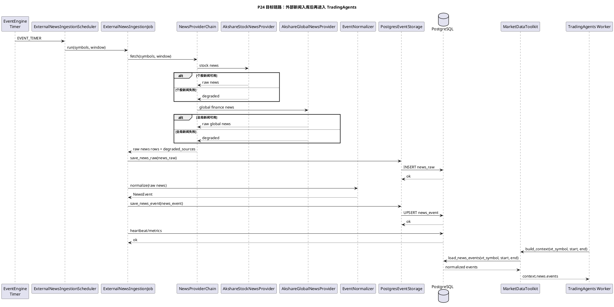

# P24 外部新闻入库定时任务

目标：补齐“真实请求外部接口获取新闻/公告，并入库 PostgreSQL”的第一版可用链路。该阶段只负责把外部新闻变成本地 `news_raw/news_event` 数据，不让 TradingAgents 在运行时直接访问外部新闻源。

## 范围边界

### 第一版要做

- 使用 vn.py 进程内任务，不启动独立新闻服务。
- 默认关闭，通过 vn.py 全局配置开启。
- 第一版 provider 选择低门槛来源：
  - `local_file`：本地 fixture/人工事件，作为可复现 baseline。
  - `akshare_stock_news`：AKShare 个股新闻，作为第一版外部接口来源。
  - `akshare_global_news`：AKShare 财经快讯/宏观新闻，作为可选补充。
- 统一写入 PostgreSQL：
  - raw 原文写 `news_raw`。
  - 归一化事件写 `news_event`。
  - 运行状态写 heartbeat/metrics。
- 外部源失败时只记录 degraded，不影响 vn.py 行情、回测、Paper、TradingAgents 基础分析。

### 第一版不做

- 不接社媒抓取；雪球、微博、股吧、X/Reddit 等放到后续阶段。
- 不承诺新闻源生产 SLA；AKShare/公开网页源只能作为研究增强源。
- 不让 TradingAgents 直接调用 AKShare/NewsAPI/GDELT。
- 不把新闻直接用于下单；新闻只进入 AI context，后续仍经过策略、风控和 MainEngine/Gateway。
- 不新增独立 PostgreSQL DSN，继续复用 vn.py `database.*`。

## 目标链路

## 配置草案

配置仍走 vn.py 全局配置，不新增独立配置文件：

| 配置项 | 默认值 | 说明 |
| --- | --- | --- |
| `news.ingestion.enabled` | `false` | 是否启用外部新闻入库任务 |
| `news.ingestion.providers` | `local_file,akshare_stock_news` | provider 顺序 |
| `news.ingestion.interval_seconds` | `900` | 定时触发间隔，默认 15 分钟 |
| `news.ingestion.lookback_minutes` | `1440` | 每次抓取回看窗口，默认 1 天 |
| `news.ingestion.max_items_per_symbol` | `50` | 单标的单次最多入库条数 |
| `news.ingestion.symbols` | 空 | 手工关注股票池；为空时按 `news.entity.catalog_path` -> vn.py 已缓存 A 股合约 -> AKShare A 股列表 -> global-only 的顺序自动生成 |
| `news.ingestion.symbol_source` | `auto` | 股票池来源；`auto` 自动兜底，`global_only` 只跑不需要个股列表的全局新闻源 |
| `news.ingestion.symbol_batch_size` | `50` | 全市场股票池分批轮询数量，避免一次请求过多 |
| `news.ingestion.local_path` | 空 | local_file provider 的本地事件目录 |
| `news.ingestion.akshare.endpoints` | `stock_news_em,stock_info_global_cls` | AKShare 新闻 endpoint 顺序 |
| `news.ingestion.timeout_seconds` | `30` | 单 provider 超时 |
| `news.ingestion.enabled_in_live` | `false` | 实盘时是否允许启用，默认关闭 |

## 任务清单

- [x] **P24-T01: 修正文档和图示状态**
  - 目标：把 `tradingagents_news_query_sequence.md` 明确标注为“外部抓取未实现，本地入库和读取已实现”。
  - 验收：文档中不会让人误解为真实外部新闻定时任务已经存在。

- [x] **P24-T02: 定义外部新闻 provider 协议**
  - 修改：`vnpy_router/providers/news_external.py` 或同等模块。
  - 目标：定义 `ExternalNewsProvider` 协议，输入 `vt_symbol/window`，输出标准 `NewsRaw` 或 provider-neutral raw dict。
  - 验收：provider 失败必须返回 degraded/异常可捕获，不能中断整个 Job。

- [x] **P24-T03: 接入 AKShare 个股新闻 provider**
  - 修改：新增 `AkshareStockNewsProvider`。
  - 目标：懒加载 AKShare，调用个股新闻接口，转换为 `NewsRaw`。
  - 验收：AKShare 未安装、接口失败、空数据时均 degraded；命中数据时保存 source/url/title/published_at/provider_version/raw_hash。

- [x] **P24-T04: 接入 AKShare 全局财经新闻 provider**
  - 修改：新增 `AkshareGlobalNewsProvider`。
  - 目标：拉取财联社/新浪/东财等公开财经快讯，作为 benchmark/global_news 或弱关联新闻。
  - 验收：无法明确关联个股的新闻不得强行写入某个 `vt_symbol`，只能进入 global/benchmark 侧上下文或保持未关联。

- [x] **P24-T05: 实现 provider chain 和去重质量规则**
  - 目标：按配置顺序调用 provider，按 `raw_hash/source/url/title/published_at` 去重，记录 source_quality/trust_score/review_status。
  - 验收：重复新闻不会重复入库；同一 provider 失败不影响后续 provider。

- [x] **P24-T06: 实现 `ExternalNewsIngestionJob`**
  - 目标：编排 fetch -> save_news_raw -> normalize -> save_news_event -> heartbeat/metrics。
  - 验收：单次运行可对一组 symbols 生成 `news_raw/news_event`，失败项进入 degraded_sources。

- [x] **P24-T07: 实现 `ExternalNewsIngestionScheduler`**
  - 目标：复用 vn.py EventEngine timer，不阻塞事件线程，类似现有 TradingAgents scheduler 使用后台线程执行。
  - 验收：支持 start/stop，interval 生效，异常不杀主进程。

- [x] **P24-T08: 接入 UI/全局配置说明**
  - 目标：在全局配置 help 中说明 `news.ingestion.*`，提醒公开源不保证稳定、实盘默认关闭。
  - 验收：用户能在 UI 看懂如何开启、配置 provider 顺序、查看降级含义。

- [x] **P24-T09: readiness 和运维观测**
  - 目标：readiness 显示新闻入库任务状态、最近成功时间、最近失败 provider、最近入库条数。
  - 验收：外部新闻关闭时不阻塞生产 readiness；开启后 provider 缺依赖或连续失败时给 warning。

- [x] **P24-T10: 测试和验证落档**
  - 目标：补单测、local fixture E2E、AKShare smoke，并生成验证结果文档。
  - 验收：
    - `local_file` 入库闭环通过。
    - AKShare 缺依赖 degraded 通过。
    - AKShare fake provider 成功入库通过。
    - `MarketDataToolkit` 能读取新入库 `news_event`。

- [x] **P24-T11: 空 symbols 自动生成新闻股票池**
  - 目标：`news.ingestion.symbols` 为空时，不再直接退化为 global-only；优先复用 vn.py `MainEngine.get_all_contracts()` 中已缓存的 A 股合约，若没有合约再懒加载 AKShare 股票列表。
  - 验收：
    - 手工 `symbols` 和 `news.entity.catalog_path` 仍然优先。
    - QMT/AKShare Gateway 推送到 vn.py 的 A 股 `ContractData` 会被新闻定时任务复用。
    - 没有合约且 AKShare 不可用时，仍保持 global-only，不影响 vn.py 启动。
  - 实现说明：AKShare fallback 只用于生成股票池，不替代 provider 的新闻抓取逻辑；公开源限流时继续通过 degraded/heartbeat 暴露。

## 完成记录

| 任务 | 日期 | 提交 | 验证 |
| --- | --- | --- | --- |
| P24-T01 | 2026-05-06 | 未提交 | `uv run python -m tools.plantuml.check_plantuml --jar /private/tmp/plantuml-java8.jar --output-dir /private/tmp/vnpy-p24-plantuml-check docs/community/info/tradingagents_news_query_sequence.md docs/community/tasks/tradingagents_next_steps/24-news-ingestion-scheduler.md` |
| P24-T02 | 2026-05-06 | 未提交 | `uv run --with pytest pytest tests/test_news_ingestion_scheduler.py -q` |
| P24-T03 | 2026-05-06 | 未提交 | `uv run --with pytest pytest tests/test_news_ingestion_scheduler.py::test_akshare_stock_news_provider_converts_rows_to_raw_news tests/test_news_ingestion_scheduler.py::test_akshare_stock_news_provider_degrades_when_dependency_missing -q` |
| P24-T04 | 2026-05-06 | 未提交 | `uv run --with pytest pytest tests/test_news_ingestion_scheduler.py::test_akshare_global_news_provider_keeps_rows_unlinked -q` |
| P24-T05 | 2026-05-06 | 未提交 | `uv run --with pytest pytest tests/test_news_ingestion_scheduler.py::test_news_provider_chain_continues_after_failure_and_deduplicates -q` |
| P24-T06 | 2026-05-06 | 未提交 | `uv run --with pytest pytest tests/test_news_ingestion_scheduler.py::test_external_news_ingestion_job_persists_raw_and_symbol_events -q` |
| P24-T07 | 2026-05-06 | 未提交 | `uv run --with pytest pytest tests/test_news_ingestion_scheduler.py::test_external_news_ingestion_scheduler_throttles_timer_events -q` |
| P24-T08 | 2026-05-06 | 未提交 | `uv run --with pytest pytest tests/test_news_ingestion_scheduler.py::test_global_setting_ui_documents_news_ingestion_configuration -q` |
| P24-T09 | 2026-05-06 | 未提交 | `uv run --with pytest pytest tests/test_news_ingestion_scheduler.py::test_readiness_checker_reports_news_ingestion_dependency_warning -q` |
| P24-T10 | 2026-05-06 | 未提交 | `uv run --with pytest pytest tests/test_news_ingestion_scheduler.py tests/test_event_pipeline.py tests/test_tradingagents_production_readiness.py tests/test_tradingagents_llm_secret_ui.py -q` |
| P24-T11 | 2026-05-11 | 待提交 | `uv run --with pytest python -m pytest tests/test_tradingagents_ui.py::test_tradingagents_config_tab_collects_related_settings_only tests/test_tradingagents_app_bootstrap.py tests/test_news_ingestion_scheduler.py tests/test_production_news_sources.py tests/test_news_entity_filtering.py -q`; `uv run --with ruff ruff check vnpy_tradingagents/bootstrap.py vnpy_tradingagents/ui/widget.py vnpy/trader/ui/widget.py tests/test_tradingagents_app_bootstrap.py tests/test_tradingagents_ui.py` |

## 当前实现说明

已实现第一版代码级闭环：

- `vnpy_router.providers.news_external.ExternalNewsProvider` 协议。
- `LocalFileExternalNewsProvider`：用于 fixture、人工事件和离线验证。
- `AkshareStockNewsProvider`：调用 AKShare `stock_news_em`，生成带 provider trace 的 `NewsRaw`。
- `AkshareGlobalNewsProvider`：调用 AKShare 全局财经新闻 endpoint，默认不强行关联个股。
- `NewsProviderChain`：按 provider 顺序抓取，单源失败降级，按 `raw_hash/vt_symbol` 去重。
- `ExternalNewsIngestionJob`：编排 `fetch -> save_news_raw -> save_news_event -> heartbeat`。
- `ExternalNewsIngestionScheduler`：复用 vn.py `EventEngine` 的 `EVENT_TIMER`，后台线程执行，避免阻塞事件线程。
- `ProductionReadinessChecker`：外部新闻关闭时 ready；开启且 provider 缺依赖时 warning。
- UI 全局配置 help：补充 `news.ingestion.*` 配置说明。

本阶段验证为本地/fake provider 代码级验证。真实公网 AKShare 接口稳定性、限流和连续运行表现需要后续单独 smoke/连续运行验证。

## 第一版验收口径

第一版完成后，只能声明：

- 已具备“外部新闻 -> PostgreSQL -> TradingAgents context”的可用链路。
- 可用链路默认关闭，用户可显式开启。
- 外部新闻失败不会影响主链路。
- AKShare 新闻源为研究增强，不是生产 SLA 新闻源。

第一版不能声明：

- 已有稳定生产级新闻服务。
- 已覆盖社媒情绪。
- 新闻可以直接驱动实盘下单。

## 后续阶段

生产级新闻增强继续按 [P25 生产级新闻/公告数据源与实体过滤](25-production-news-source-entity-filtering.md) 推进。P25 会接入 CNINFO/巨潮公告、上交所公告、GDELT GlobalNews，并补股票实体识别、行业/板块/概念映射、多标的 `event_symbol_link`、分类、评分、去重和 TradingAgents 高可信上下文过滤。
