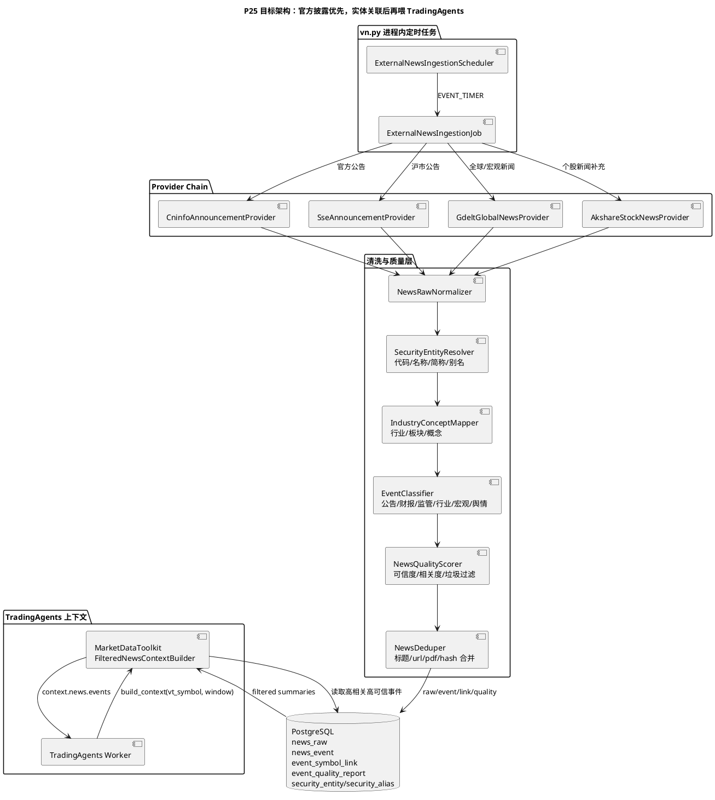
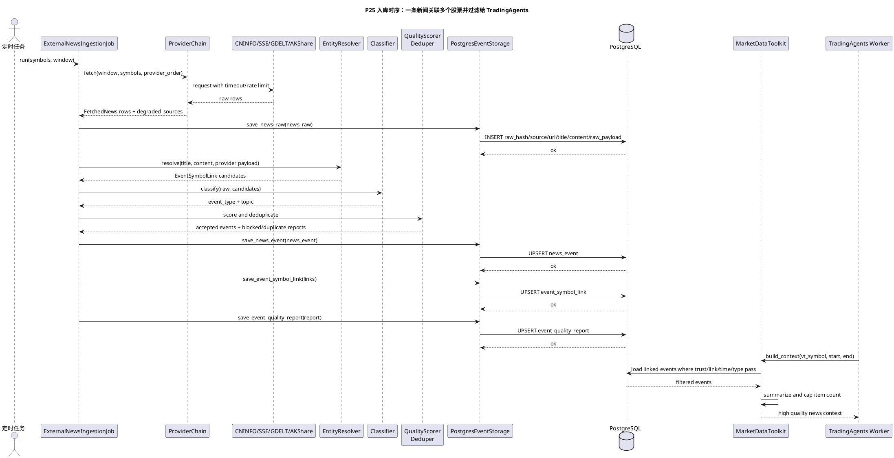

# P25 生产级新闻/公告数据源与实体过滤

目标：在 P24 第一版新闻入库链路上，补齐生产可用的官方公告数据源、股票实体识别、行业/板块/概念映射、多标的关联、分类、可信度评分、去重和 TradingAgents 上下文过滤。完成后，TradingAgents 不再消费“抓到什么就喂什么”的新闻，而是只读取 PostgreSQL 中高相关、高可信、时间窗口内的摘要事件。

## 资料来源

| 来源 | 地址 | 生产定位 |
| --- | --- | --- |
| 巨潮资讯 CNINFO | https://www.cninfo.com.cn/ | 官方披露入口，优先接公告、财报、回购、减持、监管函等硬事件 |
| 上海证券交易所公告 | https://www.sse.com.cn/assortment/stock/list/info/announcement/index.shtml | 官方披露入口，补沪市公告和交叉校验 |
| GDELT DOC 2.0 API | https://blog.gdeltproject.org/gdelt-doc-2-0-api-debuts/ | 免费公共全球新闻 API，用于宏观/海外事件，不作为 A 股个股主源 |
| AKShare 个股新闻 | https://akshare.akfamily.xyz/data/stock/stock.html | 低成本补充源，保留但降低可信权重，不作为唯一来源 |

说明：

- 本阶段使用 GDELT 公共 `api.gdeltproject.org/api/v2/doc/doc` DOC API。不要误接到需要付费 API key 的 GDELT Cloud 商业 API。
- 官方网页/公开接口仍要做限流、缓存、重试和降级。免费官方入口可靠度高，但不等于有 SLA。
- 所有数据先写 PostgreSQL，再由 `MarketDataToolkit` 读取。禁止 TradingAgents Worker 在分析时临时直连外部新闻源。

## 当前差距

P24 已经具备外部新闻入库骨架：

- `ExternalNewsProvider`、`NewsProviderChain`、`ExternalNewsIngestionJob`、`ExternalNewsIngestionScheduler`。
- `LocalFileExternalNewsProvider`、`AkshareStockNewsProvider`、`AkshareGlobalNewsProvider`。
- `news_raw`、`news_event`、`event_symbol_link`、`event_quality_report` 基础表和 reader。

离生产可用还缺：

- 缺 CNINFO/上交所/GDELT 官方或半官方数据源 provider。
- 缺股票名称、简称、代码、别名的实体识别目录。
- `event_symbol_link` 表已存在，但新闻入库时还没有真正把一条新闻关联到多个股票。
- 缺行业、板块、概念映射，不能把行业/板块新闻传给相关股票。
- 缺事件分类、可信度评分、重复新闻合并和低质量过滤。
- `MarketDataToolkit` 当前读取 `news_event` 后直接转上下文，还没有按 `trust_score`、`link_confidence`、`event_type`、时间窗口和条数做生产级过滤。

## 目标架构

## 入库与过滤时序

## 数据源策略

### CNINFO/巨潮公告 Provider

生产定位：

- 作为 A 股公司公告主源。
- 优先覆盖定期报告、业绩预告、回购、减持/增持、监管函、问询函、重大合同、诉讼仲裁、停复牌等硬事件。
- 源可信度默认 `source_quality=official_disclosure`，初始 `trust_score=0.95`。

实现原则：

- Provider 名：`cninfo_announcement`。
- 输入：时间窗口、可选股票列表、公告分类白名单。
- 输出：`NewsRaw`，必须包含 `source=cninfo`、`url/pdf_url`、`title`、`published_at`、`provider_version`、`raw_payload`。
- 如果 CNINFO 行里已经有代码和简称，直接生成高置信候选 link；如果只有标题和正文，则走实体识别。
- 保留原始 PDF 链接，不在入库主流程解析 PDF 全文。PDF 解析可后置为离线 enrichment，避免拖慢定时任务。

降级：

- CNINFO 超时或结构变化时只记录 degraded，不阻塞 SSE、GDELT、AKShare。
- 同一公告如果 SSE 也抓到，合并为同一个事件簇，保留两个 source trace。

### 上交所公告 Provider

生产定位：

- 补沪市公告入口，尤其用于沪市公司公告交叉校验。
- 默认 `source_quality=official_disclosure`，初始 `trust_score=0.93`。

实现原则：

- Provider 名：`sse_announcement`。
- 只负责沪市官方公告，不扩展成行情或交易接口。
- 优先按股票代码、起止日期、公告关键词拉取。
- 解析字段与 CNINFO 归一到同一 `NewsRaw`。

降级：

- 上交所失败不影响 CNINFO。
- 与 CNINFO 重复时，按 `normalized_title + code + disclosure_date` 或 PDF URL 合并。

### GDELT GlobalNews Provider

生产定位：

- 免费、无需 key 的全球新闻补充源。
- 用于宏观、海外政策、地缘、产业链、商品价格、出口管制等外围事件。
- 不作为 A 股公司新闻主源，不默认把 GDELT 新闻强行绑定个股。
- 默认 `source_quality=global_public_news`，初始 `trust_score=0.60` 到 `0.70`，按 source domain、语言、关键词命中调整。

实现原则：

- Provider 名：`gdelt_global_news`。
- 调用公共 DOC API：`https://api.gdeltproject.org/api/v2/doc/doc`。
- 默认查询按宏观/行业主题配置，不按全市场个股名称暴力查询。
- 只在实体识别高置信时生成个股 link，否则作为 `GLOBAL.MACRO` 或行业/主题事件入库。

降级：

- GDELT 请求慢或不可用时不影响官方公告入库。
- GDELT 只进入长期研究/复盘上下文，日内上下文默认最多给少量高相关宏观摘要。

### AKShare News Provider

生产定位：

- 保留为低成本补充源。
- 适合补个股新闻、财经快讯，但不作为唯一来源。
- 默认 `source_quality=public_web`，初始 `trust_score=0.40` 到 `0.55`。

实现原则：

- 已有 `akshare_stock_news`、`akshare_global_news` 继续保留。
- Provider chain 默认顺序改为 `cninfo_announcement,sse_announcement,gdelt_global_news,akshare_stock_news`。
- 官方公告与 AKShare 新闻冲突时，官方公告优先；AKShare 只作为补充证据。

## 实体识别方案

### Security Entity Catalog

新增稳定实体目录，先本地维护，后续可由 QMT/TuShare/交易所文件刷新：

| 表 | 作用 |
| --- | --- |
| `security_entity` | 股票主数据，包含 `vt_symbol`、代码、交易所、名称、简称、行业、板块、概念、状态 |
| `security_alias` | 别名表，包含股票简称、曾用名、英文名、常见缩写、歧义状态 |

建议字段：

| 字段 | 表 | 说明 |
| --- | --- | --- |
| `vt_symbol` | `security_entity` | vn.py 标准标的，例如 `600519.SSE` |
| `symbol` | `security_entity` | 纯代码，例如 `600519` |
| `exchange` | `security_entity` | `SSE`、`SZSE`、`BSE` |
| `name` | `security_entity` | 公司全称 |
| `short_name` | `security_entity` | 股票简称 |
| `industry` | `security_entity` | 申万/中信等行业口径，带 provider/version |
| `sector` | `security_entity` | 大类板块 |
| `concept_tags` | `security_entity` | JSONB 数组，概念标签 |
| `alias` | `security_alias` | 可匹配别名 |
| `alias_type` | `security_alias` | `short_name`、`former_name`、`english_name`、`keyword` |
| `is_ambiguous` | `security_alias` | 别名是否歧义 |
| `confidence` | `security_alias` | 该别名默认置信度 |
| `provider_name` | 两表 | 来源 |
| `provider_version` | 两表 | 来源版本 |
| `updated_at` | 两表 | 更新时间 |

### 识别规则

优先级从高到低：

1. Provider payload 明确给出股票代码和市场。
2. 正文或标题中出现 `600519`、`600519.SH`、`600519.SSE` 等明确代码。
3. 标题中出现唯一股票简称或公司全称。
4. 正文中出现唯一股票简称，同时行业/上下文关键词匹配。
5. 板块/概念新闻只生成行业或主题 link，不强行落到个股。

歧义处理：

- 简称命中多个股票时，不自动生成个股 link，记录到 `event_quality_report`。
- ST、退市、曾用名通过 `security_alias` 解析，但置信度低于当前简称。
- GDELT 外文新闻中的中文公司英文名只在别名表明确配置时生成 link。

## 行业、板块、概念映射

生产目标：

- 每条事件可以关联到多个股票，也可以只关联行业、板块或宏观主题。
- 对 TradingAgents 来说，个股上下文优先读取直接关联事件，再补行业/板块事件。

建议口径：

| 层级 | 示例 | 用途 |
| --- | --- | --- |
| 个股 | `600519.SSE` | 直接进入个股 TradingAgents 上下文 |
| 行业 | 白酒、半导体、银行 | 给行业影响和同业比较 |
| 板块 | 沪深300、科创板、新能源 | 给组合/benchmark 影响 |
| 概念 | AI 算力、机器人、低空经济 | 给主题事件影响 |
| 宏观 | 利率、汇率、关税、地缘 | 默认进入长期研究和复盘 |

写入规则：

- 个股关联写 `event_symbol_link`。
- 行业/板块/概念写到 `event_symbol_link.topic`、`sector`，并在 `news_event.raw_payload` 或后续扩展表中保留映射详情。
- 如果一条事件影响多个股票，生成多条 `event_symbol_link`，每条都有独立 `confidence`。

## 分类、评分、去重和过滤

### 新闻分类

统一 `event_type` 枚举：

| 分类 | 触发例子 | 默认用途 |
| --- | --- | --- |
| `announcement` | 董事会、股东会、重大事项公告 | 短中长期均可用 |
| `earnings` | 年报、季报、业绩预告、业绩快报 | 长期研究、复盘、回测 |
| `regulatory` | 问询函、监管函、处罚、立案 | 风险提示优先 |
| `buyback` | 回购方案、回购进展 | 研究和交易意图参考 |
| `holding_change` | 增持、减持、股东变动 | 风险和情绪参考 |
| `industry` | 行业政策、行业景气、产业链 | 行业/主题 context |
| `macro` | 利率、汇率、海外政策、地缘事件 | 长期研究和复盘 |
| `sentiment` | 社媒/舆情聚合 | 后续阶段接入 |
| `other` | 未分类 | 默认不进 TradingAgents，除非人工审核 |

### 可信度评分

建议计算字段：

| 字段 | 范围 | 说明 |
| --- | --- | --- |
| `trust_score` | `0.0` 到 `1.0` | 来源可信度、结构完整度、去重状态综合分 |
| `relevance_score` | `0.0` 到 `1.0` | 与目标股票/行业/主题相关度 |
| `spam_score` | `0.0` 到 `1.0` | 标题党、重复转载、缺正文、异常来源惩罚 |
| `link_confidence` | `0.0` 到 `1.0` | 单个 `event_symbol_link` 的股票关联置信度 |

默认权重：

| 来源 | `trust_score` 起点 |
| --- | --- |
| CNINFO 官方公告 | `0.95` |
| 上交所公告 | `0.93` |
| GDELT 宏观新闻 | `0.65` |
| AKShare 个股新闻 | `0.50` |
| 本地人工事件 | `0.80` |
| 社媒原帖 | 后续阶段，默认不进交易上下文 |

### 重复合并

重复判断信号：

- `raw_hash` 完全相同。
- URL 或 PDF URL 相同。
- `normalized_title + vt_symbol + disclosure_date` 相同。
- 标题相似度高，来源不同但正文或公告编号相同。

合并策略：

- 官方公告优先作为主事件。
- 低权重来源作为 `raw_payload.evidence_sources`。
- 重复数量写入 `event_quality_report.duplicate_count`。
- TradingAgents 上下文只保留合并后的摘要，不喂重复标题。

### TradingAgents 过滤规则

默认只喂：

- `trust_score >= 0.70`，或官方披露事件。
- `link_confidence >= 0.75` 的个股直接关联事件。
- 时间窗口内事件：日内默认最近 1 到 3 天，长期/复盘默认最近 30 到 180 天，可配置。
- `event_type` 属于白名单：`announcement`、`earnings`、`regulatory`、`buyback`、`holding_change`、`industry`、`macro`。
- 每个股票每次上下文最多 `20` 条，按官方披露、监管/财报、相关度、时间倒序排序。

默认不喂：

- `review_status=blocked`。
- `spam_score >= 0.70`。
- 只有板块/概念但无法解释个股关联的低置信新闻。
- 重复转载、缺时间、缺来源、缺 URL 且非人工审核的数据。

## 配置建议

继续复用 vn.py 全局配置，不新增独立服务和独立 DSN：

| 配置项 | 默认值 | 说明 |
| --- | --- | --- |
| `news.ingestion.providers` | `cninfo_announcement,sse_announcement,gdelt_global_news,akshare_stock_news` | 第二版 provider 顺序 |
| `news.ingestion.official_lookback_days` | `7` | 官方公告回看天数 |
| `news.ingestion.gdelt_query` | 宏观/行业主题表达式 | GDELT 默认查询，不按全市场股票暴力查询 |
| `news.entity.catalog_path` | 空 | 本地股票主数据/别名 CSV 或 JSON 路径 |
| `news.entity.refresh_interval_hours` | `24` | 实体目录刷新间隔 |
| `news.filter.min_trust_score` | `0.70` | TradingAgents 新闻上下文最低可信度 |
| `news.filter.min_link_confidence` | `0.75` | 个股关联最低置信度 |
| `news.filter.max_items_per_symbol` | `20` | 单次上下文最多新闻数 |
| `news.filter.allowed_event_types` | `announcement,earnings,regulatory,buyback,holding_change,industry,macro` | 入上下文事件类型白名单 |
| `news.filter.intraday_window_days` | `3` | 日内分析新闻窗口 |
| `news.filter.research_window_days` | `180` | 长期/复盘新闻窗口 |

## 阶段任务

- [x] **P25-T01: 固化第二版技术文档和验收口径**
  - 修改：`docs/community/tasks/tradingagents_next_steps/25-production-news-source-entity-filtering.md`、`docs/community/tasks/tradingagents_next_steps/README.md`。
  - 验收：文档明确官方公告优先、GDELT 宏观补充、AKShare 降权补充、TradingAgents 不直连外部新闻源。

- [x] **P25-T02: 扩展 Peewee 表模型**
  - 修改：`vnpy_router/extension_models.py`、`vnpy_router/event_storage.py`。
  - 目标：增加 `security_entity`、`security_alias`，并为 event/link/quality 补足 `relevance_score`、`link_reason`、`cluster_id` 等生产字段。
  - 验收：继续复用 vn.py `database.*` 和 Peewee `create_tables()`；不新增 migration runner 和独立 DSN。

- [x] **P25-T03: 建立实体目录加载器**
  - 新增：`vnpy_router/security_catalog.py`。
  - 目标：从本地 CSV/JSON 和后续 provider 快照构建 `SecurityEntityCatalog`，支持代码、简称、全称、别名查询。
  - 验收：歧义别名返回多候选并标记 `ambiguous`，不能误链单只股票。

- [x] **P25-T04: 实现股票实体识别**
  - 新增：`vnpy_router/news_entity.py`。
  - 目标：实现 `SecurityEntityResolver`，按代码、`vt_symbol`、简称、全称、别名识别多股票 link。
  - 验收：一条公告可生成多条 `EventSymbolLink`；低置信或歧义候选只进质量报告。

- [x] **P25-T05: 实现行业/板块/概念映射**
  - 新增：`vnpy_router/news_taxonomy.py`。
  - 目标：从 `security_entity` 和 `industry_snapshot` 构建行业、板块、概念映射。
  - 验收：行业新闻不强行落到个股，个股新闻可带 sector/topic/concept trace。

- [x] **P25-T06: 实现事件分类器**
  - 新增：`vnpy_router/news_classifier.py`。
  - 目标：基于标题、来源、公告分类、关键词规则输出 `event_type`。
  - 验收：年报/季报进 `earnings`，监管函/问询函进 `regulatory`，回购进 `buyback`，减持/增持进 `holding_change`，GDELT 宏观主题进 `macro`。

- [x] **P25-T07: 实现质量评分和低质量过滤**
  - 新增：`vnpy_router/news_quality.py`。
  - 目标：按来源、结构完整度、实体置信、重复状态计算 `trust_score`、`relevance_score`、`spam_score`、`review_status`。
  - 验收：官方披露默认高分；AKShare 低分补充；缺标题、缺时间、缺来源、疑似垃圾内容被 blocked。

- [x] **P25-T08: 实现重复新闻合并**
  - 修改：`vnpy_router/providers/news_external.py` 或新增 `vnpy_router/news_dedup.py`。
  - 目标：按 raw hash、URL/PDF、标准化标题、公告编号和日期合并重复新闻。
  - 验收：CNINFO 与 SSE 同一公告只进入一个 `news_event`，重复来源保留在 evidence trace。

- [x] **P25-T09: 实现 CNINFO/巨潮公告 Provider**
  - 修改：`vnpy_router/providers/news_external.py` 或拆分到 `vnpy_router/providers/cninfo.py`。
  - 目标：拉取官方公告，转为 `NewsRaw`。
  - 验收：fixture 单测覆盖公告列表、空结果、超时降级、字段结构变化降级。

- [x] **P25-T10: 实现上交所公告 Provider**
  - 修改：`vnpy_router/providers/news_external.py` 或拆分到 `vnpy_router/providers/sse_announcement.py`。
  - 目标：拉取沪市公告，转为 `NewsRaw`。
  - 验收：fixture 单测覆盖按代码/日期拉取、公告 PDF URL、与 CNINFO 重复合并。

- [x] **P25-T11: 实现 GDELT GlobalNews Provider**
  - 修改：`vnpy_router/providers/news_external.py` 或拆分到 `vnpy_router/providers/gdelt.py`。
  - 目标：调用 GDELT 公共 DOC API，生成宏观/海外新闻 `NewsRaw`。
  - 验收：默认不生成个股 link；只有实体识别高置信时才生成个股 link；API 超时可降级。

- [x] **P25-T12: 调整 Provider Chain 默认顺序和权重**
  - 修改：`vnpy_tradingagents/news_ingestion.py`、`vnpy/trader/setting.py`、`vnpy/trader/ui/widget.py`。
  - 目标：默认 provider 顺序改为官方优先，AKShare 补充。
  - 验收：UI help 说明每个 provider 的来源、可靠度、是否需要 key、是否适合实盘。

- [x] **P25-T13: 入库 Job 接入实体、分类、评分和 link 持久化**
  - 修改：`vnpy_tradingagents/news_ingestion.py`。
  - 目标：`ExternalNewsIngestionJob` 在保存 raw 后，执行 resolve -> classify -> score -> dedup -> save event -> save event_symbol_link -> quality report。
  - 验收：同一 raw 能生成多条 link；blocked 事件不进入 `news_event` 主表或以 blocked 状态保存但不被 toolkit 读取。

- [x] **P25-T14: MarketDataToolkit 只读取高质量摘要**
  - 修改：`vnpy_tradingagents/toolkit.py`、`vnpy_router/event_storage.py`。
  - 目标：按 `min_trust_score`、`min_link_confidence`、`allowed_event_types`、时间窗口和最大条数过滤。
  - 验收：TradingAgents context 中包含过滤统计和 degraded_sources；不包含低质量、重复或 blocked 新闻。

- [x] **P25-T15: readiness 增加新闻生产健康检查**
  - 修改：`vnpy_tradingagents/readiness.py`。
  - 目标：检查官方 provider 最近成功时间、实体目录是否存在、link 覆盖率、重复率、blocked 比例。
  - 验收：新闻增强关闭不阻塞系统；开启后官方源连续失败或实体目录缺失给 warning/failed。

- [x] **P25-T16: 测试和离线 E2E 验证**
  - 新增/修改：`tests/test_production_news_sources.py`、`tests/test_news_entity_filtering.py`。
  - 验收：
    - CNINFO fixture 可识别股票并分类。
    - SSE fixture 与 CNINFO 重复公告合并。
    - GDELT fixture 默认只产生宏观/行业事件。
    - 一条行业新闻可关联多个股票。
    - 低可信 AKShare 新闻不会进入 TradingAgents context。
    - `event_symbol_link` 多标的入库可读。

- [x] **P25-T17: 真实公网 smoke 与验证落档**
  - 新增：`docs/community/ops/validation_results/<date>-production-news-v2.md`。
  - 目标：在本地 PostgreSQL + vn.py 环境做小范围真实源 smoke。
  - 验收：记录测试时间、配置、拉取股票、成功/失败 provider、入库数量、重复数量、过滤后进入 TradingAgents 的摘要数量。
  - 当前状态：已完成本地 PostgreSQL + 真实公网 smoke。CNINFO/AKShare 成功；GDELT 429 降级；SSE 本窗口为空，详见 `docs/community/ops/validation_results/2026-05-06-production-news-v2-real-smoke.md`。

## 验收标准

代码级完成标准：

- 所有 provider 都有 fixture 单测，不依赖公网才能跑 CI。
- CNINFO、上交所、GDELT、AKShare 任一源失败都不会影响 vn.py 主流程。
- `event_symbol_link` 真正被入库和读取。
- `MarketDataToolkit` 默认只输出高可信、高相关、有限数量的摘要事件。
- LLM/TradingAgents 只消费 context，不直接访问外部新闻接口。
- PostgreSQL 表初始化继续复用 vn.py `database.*` 和 Peewee `create_tables()`。

生产候选标准：

- 本地 PostgreSQL 连续 5 个交易日定时任务稳定运行并落档。
- 官方公告 provider 最近成功时间小于 24 小时。
- 实体目录覆盖目标股票池 100%。
- `event_symbol_link` 直接 link 事件误链率经抽样低于 2%。
- 重复新闻在 TradingAgents context 中不重复出现。
- 低质量/低可信新闻不会进入日内交易建议上下文。
- 日内 context 构建 P95 小于 3 秒，长期/复盘 context 构建 P95 小于 30 秒。

## 完成记录

| 任务 | 日期 | 提交 | 验证 |
| --- | --- | --- | --- |
| P25-T01 | 2026-05-06 | 未提交 | `uv run python -m tools.plantuml.check_plantuml --jar /private/tmp/plantuml-java8.jar --output-dir /private/tmp/vnpy-p25-plantuml-check docs/community/tasks/tradingagents_next_steps/25-production-news-source-entity-filtering.md docs/community/tasks/tradingagents_next_steps/24-news-ingestion-scheduler.md` |
| P25-T02 | 2026-05-06 | 未提交 | `uv run --with pytest pytest tests/test_news_entity_filtering.py tests/test_production_news_sources.py -q` |
| P25-T03 | 2026-05-06 | 未提交 | `uv run --with pytest pytest tests/test_news_entity_filtering.py::test_security_catalog_resolves_code_name_alias_and_blocks_ambiguous_alias -q` |
| P25-T04 | 2026-05-06 | 未提交 | `uv run --with pytest pytest tests/test_news_entity_filtering.py::test_security_catalog_resolves_code_name_alias_and_blocks_ambiguous_alias -q` |
| P25-T05 | 2026-05-06 | 未提交 | `uv run --with pytest pytest tests/test_production_news_sources.py::test_ingestion_job_persists_entity_links_and_blocks_low_quality_context -q` |
| P25-T06 | 2026-05-06 | 未提交 | `uv run --with pytest pytest tests/test_news_entity_filtering.py::test_classifier_quality_scorer_and_deduper_apply_production_news_rules -q` |
| P25-T07 | 2026-05-06 | 未提交 | `uv run --with pytest pytest tests/test_news_entity_filtering.py::test_classifier_quality_scorer_and_deduper_apply_production_news_rules tests/test_production_news_sources.py::test_ingestion_job_persists_entity_links_and_blocks_low_quality_context -q` |
| P25-T08 | 2026-05-06 | 未提交 | `uv run --with pytest pytest tests/test_news_entity_filtering.py::test_classifier_quality_scorer_and_deduper_apply_production_news_rules -q` |
| P25-T09 | 2026-05-06 | 未提交 | `uv run --with pytest pytest tests/test_production_news_sources.py::test_official_and_global_news_providers_convert_fixture_rows -q` |
| P25-T10 | 2026-05-06 | 未提交 | `uv run --with pytest pytest tests/test_production_news_sources.py::test_official_and_global_news_providers_convert_fixture_rows -q` |
| P25-T11 | 2026-05-06 | 未提交 | `uv run --with pytest pytest tests/test_production_news_sources.py::test_official_and_global_news_providers_convert_fixture_rows -q` |
| P25-T12 | 2026-05-06 | 未提交 | `uv run --with pytest pytest tests/test_news_ingestion_scheduler.py tests/test_production_news_sources.py -q` |
| P25-T13 | 2026-05-06 | 未提交 | `uv run --with pytest pytest tests/test_production_news_sources.py::test_ingestion_job_persists_entity_links_and_blocks_low_quality_context -q` |
| P25-T14 | 2026-05-06 | 未提交 | `uv run --with pytest pytest tests/test_production_news_sources.py::test_ingestion_job_persists_entity_links_and_blocks_low_quality_context tests/test_tradingagents_toolkit.py -q` |
| P25-T15 | 2026-05-06 | 未提交 | `uv run --with pytest pytest tests/test_production_news_sources.py::test_news_readiness_accepts_official_providers_and_requires_entity_catalog tests/test_tradingagents_production_readiness.py -q` |
| P25-T16 | 2026-05-06 | 未提交 | `uv run --with pytest pytest tests/test_news_entity_filtering.py tests/test_production_news_sources.py -q` |
| P25-T17 | 2026-05-06 | 未提交 | `uv run python - <<'PY' ... ExternalNewsIngestionJob + PostgresEventStorage real smoke ... PY`；结果见 `docs/community/ops/validation_results/2026-05-06-production-news-v2-real-smoke.md` |

## 后续阶段

行业、板块、概念和宏观消息的语义股票关联继续按 [P26 LLM 消息语义分类与行业板块股票关联](26-llm-message-classifier.md) 推进。P26 不替代本阶段规则分类器，而是在规则无法明确个股时，让 LLM 自由提名股票，再通过本地 `security_entity/security_alias` 校验后写入 `event_symbol_link`。
