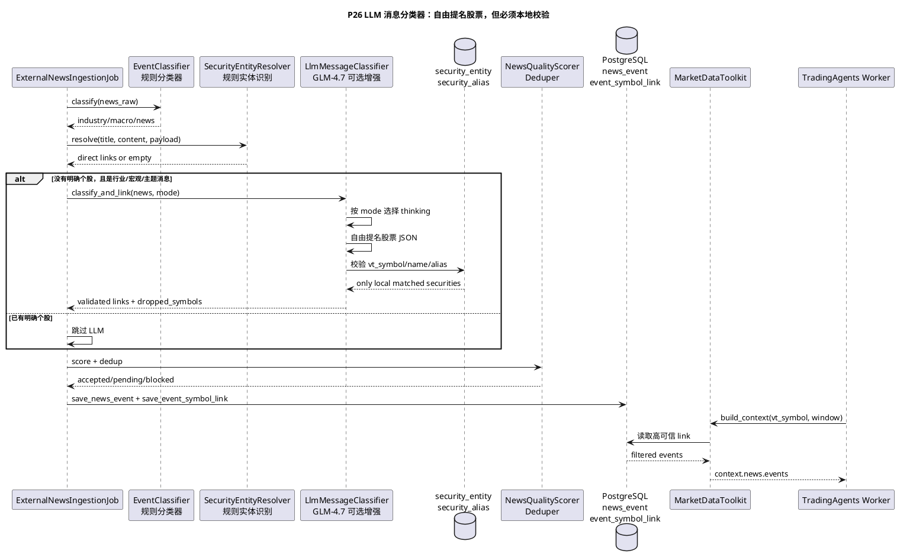

# P26 LLM 消息语义分类与行业板块股票关联

目标：在 P25 规则分类、实体识别和质量过滤基础上，新增一个可选的 LLM 增强分类器。它专门处理行业、板块、概念、宏观政策类消息：允许 LLM 自由提名最相关 A 股，但最终必须经过本地 `security_entity/security_alias` 校验后，才允许写入 `event_symbol_link`。

## 核心原则

- 规则分类器仍是主路径，`vnpy_router.news_classifier.EventClassifier` 负责快速、可复现的硬事件分类。
- LLM 分类器默认关闭，只作为行业/板块/宏观消息的增强层。
- LLM 可以自由提名股票，但不能自由入库；代码、名称、简称或别名必须命中本地 `SecurityEntityCatalog`。
- 日内/定时新闻入库不开 Thinking，避免单条消息耗时过长。
- 盘后复盘、长期研究、批量行业映射可以开 Thinking，提高语义关联质量。
- LLM 失败只降级，不阻塞 `news_raw/news_event` 入库和 vn.py 主交易链路。

## Thinking 策略

| 场景 | 配置项 | 默认值 | 说明 |
| --- | --- | --- | --- |
| 日内/分时 | `news.llm_classifier.intraday_thinking_type` | `disabled` | 低延迟，适合盘中快速处理 |
| 定时新闻入库 | `news.llm_classifier.scheduled_thinking_type` | `disabled` | 避免新闻入库任务被单条消息拖慢 |
| 长期研究 | `news.llm_classifier.research_thinking_type` | `enabled` | 可以慢一些，换更细的行业/股票推理 |
| 复盘/回测 | `news.llm_classifier.replay_thinking_type` | `enabled` | 用于盘后解释和样本标注 |
| 批量行业映射 | `news.llm_classifier.batch_thinking_type` | `enabled` | 可异步运行，用于补齐行业/概念到股票的关联 |

本地实测同一条“新型电力系统/特高压/储能”消息：

- `thinking=disabled`：约 13 秒。
- `thinking=enabled`：约 78 秒，其中 reasoning tokens 约 1500。

因此生产默认选择：日内/定时快链路不开 Thinking，深度链路异步开 Thinking。

## 目标流程



## 当前实现

- 新增 `vnpy_router.news_llm_classifier.LlmMessageClassifier`。
- 新增 `LlmClassifierRuntimeConfig`，按 runtime mode 选择 Thinking 和 timeout。
- 新增 `ZhipuGlmChatClient`，支持智谱 `glm-4.7` Chat Completions。
- `ExternalNewsIngestionJob` 增加可选 `llm_classifier` 和 `llm_mode`。
- 当规则识别没有直接股票 link，且消息类型为 `industry/macro/news` 时，才调用 LLM 增强。
- LLM 输出股票必须经过本地 `SecurityEntityCatalog` 校验。
- 校验失败股票写入 `dropped_symbols`，不写 `event_symbol_link`。
- LLM link 写入 `event_symbol_link.link_reason=llm_industry_linker`。
- UI 全局配置补充 `news.llm_classifier.*`。
- readiness 在 LLM 分类器开启时检查 API key 和实体目录。

## 配置

| 配置项 | 默认值 | 说明 |
| --- | --- | --- |
| `news.llm_classifier.enabled` | `false` | 是否启用 LLM 消息分类器 |
| `news.llm_classifier.model` | `glm-4.7` | 智谱模型名 |
| `news.llm_classifier.api_key_env_var` | `ZHIPU_API_KEY` | API key 环境变量名 |
| `news.llm_classifier.intraday_thinking_type` | `disabled` | 日内/分时 Thinking 策略 |
| `news.llm_classifier.scheduled_thinking_type` | `disabled` | 定时新闻入库 Thinking 策略 |
| `news.llm_classifier.research_thinking_type` | `enabled` | 长期研究 Thinking 策略 |
| `news.llm_classifier.replay_thinking_type` | `enabled` | 复盘/回测 Thinking 策略 |
| `news.llm_classifier.batch_thinking_type` | `enabled` | 批量行业映射 Thinking 策略 |
| `news.llm_classifier.fast_timeout_seconds` | `360` | 不开 Thinking 的超时时间 |
| `news.llm_classifier.deep_timeout_seconds` | `2700` | 开 Thinking 的超时时间，默认 45 分钟 |
| `news.llm_classifier.min_confidence` | `0.65` | LLM 提名股票进入候选 link 的最低置信度 |

## 任务清单

- [x] **P26-T01: 固化 LLM 消息分类器文档**
  - 目标：明确日内/定时不开 Thinking，盘后/长期/批量可开 Thinking。
  - 验收：本文档包含 PlantUML 流程和配置说明。

- [x] **P26-T02: 实现 LLM runtime policy**
  - 修改：`vnpy_router/news_llm_classifier.py`。
  - 验收：`intraday/scheduled` 返回 `disabled`，`research/replay/batch` 返回 `enabled`。

- [x] **P26-T03: 实现 LLM 自由提名 + 本地校验**
  - 修改：`vnpy_router/news_llm_classifier.py`。
  - 验收：LLM 返回的股票必须命中本地 `SecurityEntityCatalog`，否则进入 `dropped_symbols`。

- [x] **P26-T04: 接入 ExternalNewsIngestionJob**
  - 修改：`vnpy_tradingagents/news_ingestion.py`。
  - 验收：行业/宏观消息无直接个股时，可用 LLM 生成 `event_symbol_link`。

- [x] **P26-T05: UI 和 readiness 配置**
  - 修改：`vnpy/trader/setting.py`、`vnpy/trader/ui/widget.py`、`vnpy_tradingagents/readiness.py`。
  - 验收：UI 能看到 LLM 分类器配置说明；开启 LLM 分类器但缺 key 或实体目录时 readiness warning。

- [x] **P26-T06: 单测和回归**
  - 新增：`tests/test_llm_message_classifier.py`。
  - 验收：LLM policy、股票校验、Job 接入、UI/readiness 均有测试。

- [x] **P26-T07: 真实 GLM-4.7 smoke 落档**
  - 目标：用真实 `ZHIPU_API_KEY` 对行业消息跑不开 Thinking 和开 Thinking 两种模式，记录耗时、tokens、命中股票和本地校验结果。
  - 当前状态：已完成。`scheduled_ingestion` 不开 Thinking 用时 68.61s、1,276 tokens；`batch_industry_mapping` 开 Thinking 用时 247.27s、3,192 tokens。详见 `docs/community/ops/validation_results/2026-05-06-llm-message-classifier-real-smoke.md`。

## 验证命令

```bash
uv run --with pytest pytest tests/test_llm_message_classifier.py -q
```

结果：

```text
5 passed
```
