# P27 TradingAgents 独立 AI 策略定位与落地任务

目标：把 TradingAgents 从“传统策略增强器”纠正为独立的 AI 投研、AI 策略和 AI 回测链路。`DoubleMaStrategy`、`TurtleSignalStrategy`、`AtrRsiStrategy` 等传统规则策略默认保持纯规则；需要 AI 参与时，用户必须显式创建 `TradingAgentsSignalStrategy`、`TradingAgentsBacktestStrategy` 或后续的混合过滤策略。

## 核心原则

- TradingAgents 可以做买入、卖出、减仓、持有判断，但输出只能是 `RatingSignal`、`TradeIntent`、`IntradayAdvice`，不能直接下单。
- 指标仍然可以进入 AI 上下文，但它们是“材料”，不是硬编码触发条件。
- 传统策略用于验证 vn.py 主链路和规则策略实盘稳定性，不默认读取 AI 信号。
- 独立 AI 策略负责把 TradingAgents 的交易意图转成受控 `OrderIntent`，再进入 Risk App。
- AI 回测不在每根 K 线上实时调用 LLM；必须先按历史时点生成并固化 AI 信号，回测时只读取 PostgreSQL。
- 混合 AI 过滤器后置实现，必须单独命名、单独开关、单独回测，例如 `DoubleMaWithAIFilter`。

## 目标架构

```plantuml
@startuml
title P27 TradingAgents 策略定位：独立AI策略，不默认混入传统策略

skinparam shadowing false
skinparam packageStyle rectangle

package "传统规则策略\n保持纯规则" {
  component "DoubleMaStrategy" as DoubleMa
  component "TurtleSignalStrategy" as Turtle
  component "AtrRsiStrategy" as AtrRsi
}

package "TradingAgents 独立AI链路" {
  component "TradingAgentsManualAnalysis\n手动分析页" as Manual
  component "TradingAgentsSignalStrategy\n独立AI策略" as AIStrategy
  component "TradingAgentsCtaSignalStrategy\nCTA UI包装策略" as CtaAIStrategy
  component "TradingAgentsBacktestStrategy\nAI信号回测策略" as AIBacktest
  component "HistoricalAiSignalJob\n历史时点信号生成" as SignalJob
}

package "后续显式混合策略" {
  component "DoubleMaWithAIFilter\n规则信号 + AI过滤" as Hybrid
}

database "PostgreSQL\nsnapshot/report/rating/trade_intent/audit" as PG
component "MarketDataToolkit\n只读上下文" as Toolkit
component "TradingAgents Worker\ncontext-only" as Worker
component "Risk App\n硬风控" as Risk
component "MainEngine" as Main
component "Gateway\nQMT/XTP/TORA/仿真" as Gateway

Manual -> Toolkit : build_context(vt_symbol, window)
SignalJob -> Toolkit : build_point_in_time_context(vt_symbol, trade_time)
Toolkit -> Worker : native_input.context
Worker -> PG : report/rating/trade_intent
AIStrategy -> PG : 读取最新有效AI意图
CtaAIStrategy -> AIStrategy : CTA tick/bar驱动\n不直接调用LLM
AIBacktest -> PG : 读取历史时点AI信号
Hybrid -> PG : 读取AI确认/否决

DoubleMa -> Risk : 规则交易意图
Turtle -> Risk : 规则交易意图
AtrRsi -> Risk : 规则交易意图
AIStrategy -> Risk : AI交易意图
Hybrid -> Risk : 规则+AI过滤后的交易意图
Risk -> Main : 风控通过后发单
Main -> Gateway : 委托/撤单

@enduml
```



## 任务清单

- [x] **P27-T01: 技术方案定位纠偏**
  - 修改：`docs/community/info/custom_quant_architecture.md`、`docs/community/info/vnpy_reuse_extension_route.md`、`docs/community/info/tradingagents_llm_env.md`、`docs/community/tasks/tradingagents_next_steps/README.md`。
  - 验收：文档明确传统规则策略、独立 AI 策略、混合 AI 过滤策略三类边界；P27 已进入任务索引。

- [x] **P27-T02: TradingAgents 手动分析页**
  - 目标：在 TradingAgents App 中提供一个用户入口，输入 `vt_symbol`、分析窗口、运行模式后，展示报告、评级、建议动作、置信度、风险点和耗时。
  - 修改：`vnpy_tradingagents/ui/widget.py`、`vnpy_tradingagents/engine.py`。
  - 验收：关闭实盘开关时，手动分析仍可运行并落库，但不会产生订单。

- [x] **P27-T03: 手动分析服务和审计落库**
  - 目标：封装 `TradingAgentsManualAnalysisService`，统一执行 context 构造、Worker 调用、输出校验、`agent_run/agent_report/rating_signal/trade_intent` 写入；手动分析不产生订单，`decision_audit` 由独立 AI 策略和 AI 回测策略在订单意图阶段写入。
  - 修改：`vnpy_tradingagents/manual_analysis.py`、`vnpy_tradingagents/storage.py`。
  - 验收：单测覆盖成功、LLM 失败、依赖缺失、输出非法 action 四类场景。

- [x] **P27-T04: 独立 AI 策略 `TradingAgentsSignalStrategy`**
  - 目标：新增一个独立策略，只读取已落库的最新有效 `TradeIntent/IntradayAdvice`，不依赖均线、突破、RSI 等固定交易规则。
  - 修改：`vnpy_tradingagents/strategies.py`。
  - 验收：AI 关闭时策略不产生交易意图；AI 输出 `hold/watch` 时不发单；`buy/sell/reduce/cover` 必须先过 Risk App。

- [x] **P27-T05: 历史 AI 信号生成任务**
  - 目标：新增 `HistoricalAiSignalJob`，按 `vt_symbol + trade_time` 构建历史时点上下文，批量调用 TradingAgents 并固化信号。
  - 修改：`vnpy_tradingagents/backtesting.py`、`vnpy_tradingagents/storage.py`。
  - 验收：同一个 `vt_symbol + trade_time + model + context_hash` 可幂等重跑；失败记录可追踪，不阻塞其他标的。

- [x] **P27-T06: 独立 AI 回测策略 `TradingAgentsBacktestStrategy`**
  - 目标：回测时读取 P27-T05 已生成的历史 AI 信号，不能在回测循环里实时调用 LLM。
  - 修改：`vnpy_tradingagents/backtesting.py`、`tests/test_tradingagents_backtest_strategy.py`。
  - 验收：没有历史 AI 信号时回测输出“无信号”而不是报错；存在 `buy/sell` 信号时产生可审计成交；同一数据重复回测结果一致。

- [x] **P27-T07: 混合 AI 过滤器边界**
  - 目标：设计但暂不默认启用 `DoubleMaWithAIFilter` 这类显式混合策略；确认传统 `DoubleMaStrategy` 不读取 AI。
  - 修改：`docs/community/info/custom_quant_architecture.md`、`tests/test_vnpy_cta_strategy_ai_isolation.py`。
  - 验收：单测证明传统策略实例没有 AI 配置时，不访问 `TradingAgents` 表和服务。

- [x] **P27-T08: UI 文案和开关收敛**
  - 目标：在 UI 中说明 TradingAgents 开关只控制 AI 分析/AI 策略；传统策略不受影响。
  - 修改：`vnpy/trader/setting.py`、`vnpy/trader/ui/widget.py`、`vnpy_tradingagents/ui/widget.py`。
  - 验收：全局配置里能看到 `tradingagents.enabled`、`tradingagents.signal_strategy_enabled`、`tradingagents.live_enabled` 的说明。

- [x] **P27-T09: 验证文档和回归用例**
  - 目标：记录手动分析、AI 策略、AI 回测、AI 关闭降级、传统策略不受影响五类验证结果。
  - 新增：`docs/community/ops/validation_results/<date>-tradingagents-strategy-positioning.md`。
  - 验收：验证文档包含命令、输入参数、结果、失败原因和下一步处理。

- [x] **P27-T10: CTA UI 可见的独立 AI 策略包装**
  - 目标：让用户能在 vn.py `功能 -> CTA策略` 的策略下拉框里看到 `TradingAgentsCtaSignalStrategy`，同时保持核心 AI 策略仍是独立 `TradingAgentsSignalStrategy`。
  - 新增：`strategies/tradingagents_cta_signal_strategy.py`、`tests/test_tradingagents_cta_signal_strategy.py`。
  - 验收：CTA 包装策略继承 `CtaTemplate` 并可被 vn.py 从根目录 `strategies/` 自动扫描；tick/bar 回调只读取 PostgreSQL 已落库 AI 意图，不在策略回调里调用 LLM；传统规则策略仍不受影响。

- [x] **P27-T11: TradingAgents App 启动装配**
  - 目标：`examples/veighna_trader/run.py` 添加 `TradingAgentsApp` 后，自动把手动分析服务、PostgreSQL 快照读取、Worker Adapter 和运行状态存储挂到 `TradingAgentsEngine`。
  - 新增：`vnpy_tradingagents/bootstrap.py`、`tests/test_tradingagents_app_bootstrap.py`。
  - 验收：点击 TradingAgents 页面“运行手动分析”时不再报 `manual analysis service is not configured`；若 PostgreSQL 未配置或不可用，UI 显示明确启动失败原因，而不是服务未配置。

- [x] **P27-T12: TradingAgents 分析管理与分析历史**
  - 目标：区分 vn.py 原生 `数据管理` 和 TradingAgents AI 分析页。左侧 toolbar 同时保留原生 `DataManagerApp` 和 `TradingAgents分析管理`；TradingAgents 也可从 `功能 -> TradingAgents分析管理` 打开，像 `CTA策略` 一样作为独立大窗口；窗口内部提供“运行控制 / 分析历史 / 分析报告”三个 Tab。
  - 修改：`vnpy/trader/ui/mainwindow.py`、`vnpy_tradingagents/app.py`、`vnpy_tradingagents/ui/widget.py`、`vnpy_tradingagents/engine.py`、`vnpy_tradingagents/storage.py`。
  - 验收：每次分析结果从 `agent_run/agent_report/rating_signal/trade_intent` 读取，可按股票过滤；点击历史表最后一列 `分析报告` 后跳转展示完整 Markdown 报告；原生数据管理仍只负责 K 线/历史数据导入下载。

## 验证计划

```bash
uv run --with pytest pytest tests/test_tradingagents_manual_analysis.py -q
uv run --with pytest pytest tests/test_tradingagents_signal_strategy.py -q
uv run --with pytest pytest tests/test_tradingagents_backtest_strategy.py -q
uv run --with pytest pytest tests/test_vnpy_cta_strategy_ai_isolation.py -q
uv run --with pytest pytest tests/test_tradingagents_cta_signal_strategy.py -q
uv run --with pytest pytest tests/test_tradingagents_app_bootstrap.py -q
uv run --with pytest pytest tests/test_tradingagents_ui.py tests/test_tradingagents_storage_service.py -q
```

验收重点：

- `DoubleMaStrategy` 等传统策略在默认配置下不访问 TradingAgents。
- `TradingAgentsSignalStrategy` 只在 AI 开关打开且信号有效时产生意图。
- `TradingAgentsCtaSignalStrategy` 只作为 CTA UI 包装层，便于用户在 CTA 策略下拉框中创建独立 AI 策略实例。
- 回测只读历史 AI 信号，不同步调用 LLM。
- `hold/watch` 不会被当成成交或卖出。
- 所有 AI 影响过的意图都能按 `source_run_id` 追溯。

## 完成记录

| 任务 | 日期 | 提交 | 验证 |
| --- | --- | --- | --- |
| P27-T01 | 2026-05-08 | 待本次文档提交后补充 | 文档已更新并新增本任务文档 |
| P27-T02 | 2026-05-08 | 待本次代码提交后补充 | `tests/test_tradingagents_manual_analysis.py` |
| P27-T03 | 2026-05-08 | 待本次代码提交后补充 | `tests/test_tradingagents_manual_analysis.py`、`tests/test_tradingagents_storage_service.py` |
| P27-T04 | 2026-05-08 | 待本次代码提交后补充 | `tests/test_tradingagents_signal_strategy.py` |
| P27-T05 | 2026-05-08 | 待本次代码提交后补充 | `tests/test_tradingagents_backtest_strategy.py` |
| P27-T06 | 2026-05-08 | 待本次代码提交后补充 | `tests/test_tradingagents_backtest_strategy.py` |
| P27-T07 | 2026-05-08 | 待本次代码提交后补充 | `tests/test_vnpy_cta_strategy_ai_isolation.py` |
| P27-T08 | 2026-05-08 | 待本次代码提交后补充 | `tests/test_tradingagents_ui.py`、ruff |
| P27-T09 | 2026-05-08 | 待本次代码提交后补充 | `docs/community/ops/validation_results/2026-05-08-tradingagents-strategy-positioning.md` |
| P27-T10 | 2026-05-08 | 待本次代码提交后补充 | `tests/test_tradingagents_cta_signal_strategy.py` |
| P27-T11 | 2026-05-08 | 待本次代码提交后补充 | `tests/test_tradingagents_app_bootstrap.py` |
| P27-T12 | 2026-05-08 | 待本次代码提交后补充 | `tests/test_tradingagents_ui.py`、`tests/test_tradingagents_storage_service.py`、ruff |
