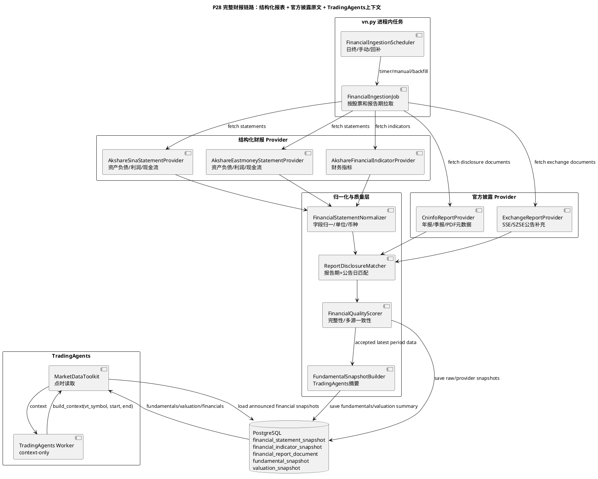
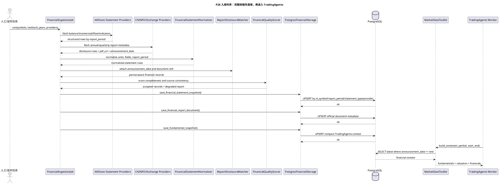

# P28 完整财报信息入库与 TradingAgents 上下文 Implementation Plan

> **For agentic workers:** REQUIRED SUB-SKILL: Use superpowers:subagent-driven-development or superpowers:executing-plans to implement this plan task-by-task. Steps use checkbox (`- [ ]`) syntax for tracking.

**Goal:** 拉取 A 股完整财报信息，落入 vn.py 复用的 PostgreSQL 扩展表，并把可审计、点时正确的财务上下文提供给 TradingAgents。

**Architecture:** 财报链路分成两层：AKShare 等公开结构化接口负责快速拿到三大报表和财务指标；巨潮资讯、上交所、深交所公告负责保存官方披露原文和 PDF 元数据，用于审计、补漏和可信度校验。TradingAgents 不直连外部财报源，只读取 PostgreSQL 中经过 provider trace、报告期、公告日和点时过滤后的快照。

**Tech Stack:** vn.py `database.*` 配置、`vnpy_postgresql` Peewee `create_tables()`、PostgreSQL JSONB、AKShare、CNINFO/交易所公告、MarketDataToolkit、TradingAgents context-only worker。

---

## 当前状态

当前 `MarketDataToolkit` 已经预留 `fundamentals` 和 `valuation` 上下文：

- `MarketDataToolkit.snapshot_types` 包含 `fundamentals`、`valuation`。
- `PostgresSnapshotReader.load_latest_snapshot()` 可以读取 `fundamental_snapshot` 和 `valuation_snapshot`。
- `TradingAgents` 分析时会把这两个字段传入模型上下文。

但现在还缺完整财报入库任务：

- 没有定时或手动任务把三大报表、财务指标、估值数据写入 PostgreSQL。
- `fundamental_snapshot` 只适合给 TradingAgents 提供摘要，不适合作为完整三大报表明细表。
- 还没有保存官方年报/季报 PDF 的披露元数据和来源审计。
- 回测/复盘需要按 `announcement_date <= analysis_time` 读取，当前没有财报点时防穿越规则。

结论：目前 TradingAgents 具备读取财报上下文的接口，但没有完整财报数据供它读取。

## 数据源分层

| 层级 | 数据源 | 用途 | 是否需要 key | 生产定位 |
| --- | --- | --- | --- | --- |
| 结构化报表 | AKShare 新浪三大报表接口 | 快速拉资产负债表、利润表、现金流量表 | 不需要 | 第一版可用结构化来源 |
| 结构化报表 | AKShare 东方财富三大报表接口 | 与新浪口径互补、做字段补齐和交叉校验 | 不需要 | 第一版可用结构化来源 |
| 财务指标 | AKShare 财务分析指标接口 | ROE、毛利率、净利率、成长、偿债等指标 | 不需要 | 生成 `fundamental_snapshot` 摘要 |
| 官方披露 | 巨潮资讯 CNINFO | 年报、季报、半年报、公告 PDF 元数据 | 不需要 | 官方主审计源 |
| 官方披露 | 上交所/深交所公告 | 交易所侧披露补充和交叉校验 | 不需要 | 官方补充源 |
| 未来增强 | TuShare Pro、Wind、Choice、QMT 数据服务 | 更稳定结构化财务数据 | 通常需要账号/积分/授权 | 生产增强，不作为当前阻塞 |

实现原则：

- 结构化字段优先从 AKShare 拉，保证先可用。
- 官方 PDF 不在主流程中全文解析，先保存报告元数据、链接、标题、公告日期、文件 hash；后续再做异步 PDF 表格抽取。
- 同一报告期存在多源数据时，保存所有 provider 的 raw payload，同时生成一个 `quality_status=primary` 的合成快照。
- 所有下游读取都必须按公告日点时过滤，避免把未来财报喂给历史回测。

## 目标架构



## 入库时序



## 目标表设计

继续复用 vn.py 原有 `database.*` PostgreSQL 配置，不新增 `router.postgres.dsn` 这类旁路配置。新增表通过 `vnpy_router.extension_models` 或同类 Peewee model 注册到扩展表初始化列表，启动时使用 `create_tables(safe=True)`。

### `financial_statement_snapshot`

保存完整三大报表的结构化原始快照。

| 字段 | 含义 |
| --- | --- |
| `vt_symbol` | vn.py 本地代码，例如 `600519.SSE` |
| `report_period` | 报告期，例如 `2025-12-31` |
| `statement_type` | `balance_sheet`、`income_statement`、`cash_flow` |
| `report_type` | `annual`、`half_year`、`q1`、`q3`、`quarterly` |
| `announcement_date` | 公告日期，用于防止回测穿越 |
| `provider_name` | `akshare_sina`、`akshare_eastmoney` 等 |
| `provider_version` | provider 版本或接口版本 |
| `currency` | 默认 `CNY` |
| `unit` | 元、万元、亿元等，归一后必须标明 |
| `payload` | JSONB，保存完整字段和值 |
| `source_document_id` | 关联官方 PDF 元数据 |
| `quality_status` | `primary`、`fallback`、`degraded`、`failed` |
| `quality_report` | JSONB，保存缺字段、多源差异、单位转换等信息 |

主键建议：

```text
(vt_symbol, report_period, statement_type, provider_name)
```

### `financial_indicator_snapshot`

保存 ROE、毛利率、净利率、资产负债率、营收同比、净利润同比、经营现金流等指标。

主键建议：

```text
(vt_symbol, report_period, provider_name)
```

### `financial_report_document`

保存官方披露文件元数据，不在主任务中解析 PDF 全文。

字段重点：

- `document_id`
- `vt_symbol`
- `report_period`
- `report_type`
- `announcement_date`
- `title`
- `source`
- `url`
- `pdf_url`
- `file_hash`
- `raw_payload`

### `fundamental_snapshot` 和 `valuation_snapshot`

保持现有表不变，只写 TradingAgents 需要的摘要：

- 最近 4 期营收、净利润、经营现金流。
- 最近 4 期 ROE、毛利率、净利率、资产负债率。
- 同比/环比变化。
- 财报公告日期和报告期。
- 数据源、质量状态、缺失项。
- 估值数据，例如 PE、PB、PS、市值、股息率，若暂无可靠 provider，则 `quality_status=degraded` 并明确缺失原因。

## 字段归一化规则

- 所有金额统一转为元，保留原始单位字段。
- 报告期统一为自然日 `YYYY-MM-DD`。
- 公告日单独保存，不能用报告期替代公告日。
- 字段名采用英文标准键，原始中文字段完整保留在 `payload.raw_fields`。
- 同一字段多源值差异超过阈值时，不静默覆盖，写入 `quality_report.differences`。
- 负数、空值、`--`、`None` 必须显式规范化。
- 回测或历史分析只能读取 `announcement_date <= query.end` 的数据。

## TradingAgents 上下文形态

`MarketDataToolkit.build_context()` 后续应输出：

```json
{
  "fundamentals": {
    "latest_report_period": "2025-12-31",
    "announcement_date": "2026-04-28",
    "revenue": {"current": 123456789.0, "yoy": 0.12},
    "net_profit": {"current": 23456789.0, "yoy": -0.03},
    "operating_cash_flow": {"current": 34567890.0},
    "roe": 0.15,
    "gross_margin": 0.42,
    "debt_to_assets": 0.38,
    "quality_status": "primary",
    "missing_fields": []
  },
  "valuation": {
    "pe_ttm": 18.2,
    "pb": 2.1,
    "market_cap": 12000000000.0,
    "quality_status": "degraded"
  },
  "financials": {
    "statements": {
      "balance_sheet": {"report_period": "2025-12-31", "fields": {}},
      "income_statement": {"report_period": "2025-12-31", "fields": {}},
      "cash_flow": {"report_period": "2025-12-31", "fields": {}}
    },
    "documents": [
      {"title": "2025年年度报告", "source": "cninfo", "pdf_url": "..."}
    ]
  }
}
```

第一版可以只把摘要写入 `fundamentals` 和 `valuation`，完整三大报表保存在 PostgreSQL 供历史详情页和后续报告展开使用。

## 配置方案

配置放到 TradingAgents 分析管理的“配置”Tab，不再继续分散到全局配置里让用户硬找。

建议配置项：

| 配置 | 默认值 | 说明 |
| --- | --- | --- |
| `financial.ingestion.enabled` | `true` | 默认开启财报自动入库；vn.py 启动时默认注册 scheduler，并激活盘后和早晨定时任务，关闭时定时任务暂停 |
| `financial.ingestion.providers` | `akshare_sina,akshare_eastmoney,akshare_indicator,cninfo_report,exchange_report` | provider 顺序 |
| `financial.ingestion.symbols` | 空 | 空表示按 `financial.ingestion.catalog_path`、`news.entity.catalog_path`、vn.py 已缓存 A 股合约、AKShare A 股列表依次生成股票池；不建议一上来全市场无限回补 |
| `financial.ingestion.catalog_path` | 空 | 财报入库股票池路径；留空时复用 `news.entity.catalog_path`，再退回 vn.py 合约和 AKShare A 股列表 |
| `financial.ingestion.lookback_years` | `5` | 回补历史年限 |
| `financial.ingestion.schedule` | `20:30` | 默认盘后每日拉取一次；财报是低频数据，不做分钟级轮询 |
| `financial.ingestion.morning_retry_enabled` | `true` | 次日早晨轻量补偿，补晚间披露、接口延迟和前一轮失败 |
| `financial.ingestion.morning_retry_schedule` | `08:30` | 早晨补偿任务时间 |
| `financial.ingestion.full_market_backfill_enabled` | `false` | 是否允许全市场历史回补；默认关闭，只能由用户手动触发 |
| `financial.ingestion.max_workers` | `2` | 并发数，避免公开接口限流 |
| `financial.ingestion.request_timeout` | `30` | 单 provider 请求超时秒数 |
| `financial.context.max_statement_periods` | `4` | 喂给 TradingAgents 的最多报告期 |
| `financial.context.require_announced_only` | `true` | 历史分析必须防穿越 |

说明：

- 财报 scheduler 默认随 vn.py 启动注册，不需要单独的“启动后是否注册”配置。
- `financial.ingestion.enabled` 是唯一总开关，默认 `true`：盘后和早晨定时任务默认生效，用户手动改为 `false` 后定时任务暂停。
- `enabled=true` 不等于“启动 vn.py 后马上拉取全市场”；启动时只注册任务并等待下一个调度时间。
- `symbols` 空值不等于立刻全市场爬取；系统先使用 `financial.ingestion.catalog_path`，再复用 `news.entity.catalog_path`，如果都没有则读取 vn.py 当前已缓存 A 股合约，最后懒加载 AKShare A 股列表作为无账号兜底。
- 财报数据页的 `vt_symbol` 查询框可以留空；留空时展示 PostgreSQL 中最近公告/拉取到的一只股票财报上下文，方便确认最新入库数据是否可见。
- 盘后任务只做增量拉取，默认每天一次；财报、公告和财务指标不需要像行情那样高频轮询。
- 早晨补偿任务只重试最近窗口和失败任务，不做大规模历史回补。
- 历史 3 年、5 年回补必须走 UI 手动按钮，例如“回补当前股票”“回补股票池”“停止回补”。
- 如果用户明确选择全市场，应启用慢速批处理、断点续跑、限流、失败重试和进度展示。
- 配置修改后，运行中的定时器可以点击“应用”热加载；provider 列表和并发数如果已经在任务中运行，应提示下一轮生效。

## 执行频率策略

财报入库是低频任务，不能按新闻或行情的思路设计。

| 场景 | 默认行为 | 原因 |
| --- | --- | --- |
| vn.py 启动 | 注册 scheduler，不自动全量执行 | 保持启动速度，避免公开接口限流 |
| 盘后增量 | 每天 `20:30` 跑一次 | 财报和公告通常盘后披露 |
| 次日补偿 | 每天 `08:30` 轻量重试 | 补接口延迟、晚间披露和失败任务 |
| 单股分析前 | 发现财报缺失时可提示用户手动拉取 | 避免分析时长不可控 |
| 历史回补 | 用户手动触发 | 数据量大，需要进度、限速和可取消 |
| 全市场回补 | 默认关闭 | 全市场任务慢且容易触发限流 |

推荐启动逻辑：

```text
1. vn.py 启动。
2. 读取 TradingAgents 财报配置。
3. 初始化 PostgreSQL 扩展表。
4. 注册 FinancialIngestionScheduler。
5. 如果 financial.ingestion.enabled=true，则激活盘后和早晨定时任务，并等待下一个调度时间。
6. 如果 financial.ingestion.enabled=false，则 scheduler 保持注册但自动任务暂停。
7. 如果用户手动触发回补，则进入慢速批处理并显示进度。
```

## 任务清单

- [x] **P28-T01: 财报数据模型和初始化**
  - 新增 Peewee models：`financial_statement_snapshot`、`financial_indicator_snapshot`、`financial_report_document`。
  - 修改扩展表初始化列表，继续复用 vn.py `database.*` 和 `create_tables(safe=True)`。
  - 单测：验证 PostgreSQL 初始化会包含新增表，且不会要求独立 DSN。

- [x] **P28-T02: AKShare 结构化三大报表 Provider**
  - 新增 `AkshareSinaStatementProvider` 和 `AkshareEastmoneyStatementProvider`。
  - 覆盖资产负债表、利润表、现金流量表。
  - 单测：用 fixture 覆盖字段缺失、单位转换、接口失败降级。

- [x] **P28-T03: AKShare 财务指标 Provider**
  - 新增 `AkshareFinancialIndicatorProvider`。
  - 生成 ROE、毛利率、净利率、资产负债率、成长性和现金流指标。
  - 单测：验证指标能归一到 `financial_indicator_snapshot`。

- [x] **P28-T04: 巨潮/交易所官方报告 Provider**
  - 新增 `CninfoReportProvider` 和 `ExchangeReportProvider`。
  - 保存年报、半年报、一季报、三季报 PDF 元数据。
  - 单测：验证官方公告能按 `vt_symbol + report_period + report_type` 匹配结构化报表。

- [x] **P28-T05: 质量评分和多源合成**
  - 新增 `FinancialQualityScorer`。
  - 生成 `primary/fallback/degraded/failed` 状态。
  - 多源差异写入 `quality_report`，不静默丢弃。

- [x] **P28-T06: TradingAgents 摘要快照生成**
  - 新增 `FundamentalSnapshotBuilder`。
  - 从完整三大报表和指标生成 `fundamental_snapshot`、`valuation_snapshot`。
  - 单测：验证摘要包含报告期、公告日、核心指标、缺失项和 provider trace。

- [x] **P28-T07: MarketDataToolkit 财务上下文增强**
  - 新增 `financials` 上下文读取。
  - 保持现有 `fundamentals`、`valuation` 兼容。
  - 单测：没有财报时降级为 `degraded_sources=["fundamentals","valuation","financials"]`；有财报时输出完整上下文。

- [x] **P28-T08: 财报入库定时任务和 UI 配置**
  - 新增 `FinancialIngestionScheduler` 和 TradingAgents 配置 Tab。
  - 启动 vn.py 时默认注册 scheduler，不默认全量拉取；只保留 `financial.ingestion.enabled` 一个总开关控制自动定时任务是否开启。
  - 支持盘后每日增量、次日早晨轻量补偿、手动拉取单股、按股票池慢速回补。
  - 历史回补和全市场回补必须由用户手动触发，并支持进度、限流、失败重试和取消。
  - 单测：验证配置可热加载，任务失败不会影响 vn.py 主进程；启动时不会自动执行全市场任务。
  - 进度：2026-05-09 已完成默认注册 scheduler、盘后/早晨调度、配置归集、Toolkit 接入、单股手动回补、按股票池批次回补、任务状态展示、取消请求、配置热更新和 `tools.production.financial_ingestion_smoke`。
  - 进度：2026-05-11 已补齐空 `financial.ingestion.symbols` 的自动股票池来源：`financial.ingestion.catalog_path` -> `news.entity.catalog_path` -> vn.py 已缓存 A 股合约 -> AKShare A 股列表。
  - 实现说明：`financial.ingestion.enabled=false` 时 scheduler 仍注册但自动定时暂停，用户仍可在 UI 查看状态。

- [x] **P28-T09: 财报数据管理和分析报告展示**
  - 在 TradingAgents 分析管理中新增“财报数据”Tab。
  - 支持按股票查看报告期、三大报表、指标、官方 PDF 链接、质量报告。
  - 历史分析详情页展示本次分析使用的财报版本。
  - 进度：2026-05-11 已支持 `vt_symbol` 留空时展示最近入库财报上下文，便于确认数据页不是空白。

- [x] **P28-T10: 端到端验证和落档**
  - 用至少 3 只股票验证：沪市、深市、科创/创业板各一只。
  - 验证 PostgreSQL 表数量、样例字段、TradingAgents 上下文、回测点时过滤。
  - 新增验证文档到 `docs/community/ops/validation_results/`。
  - 进度：2026-05-09 已完成真实 PostgreSQL + 公网 Provider 三股票 smoke、样例字段检查、`MarketDataToolkit.financials` 上下文检查、公告日点时过滤检查，并落档到 `docs/community/ops/validation_results/2026-05-09-financial-report-ingestion.md` 和 `docs/community/ops/validation_results/2026-05-09-210449-financial-ingestion-smoke.md`。

- [x] **P28-T11: F10 财务分析方法论接入**
  - 新增 `F10_FINANCIAL_ANALYSIS_PROMPT`，要求 TradingAgents 按公司类型、三大报表、杜邦、现金流质量和 PE/PB/PEG/PS 适用性输出财务分析。
  - 新增 `F10FinancialAnalyzer`，在 `MarketDataToolkit` 中生成 `context["f10_financial_analysis"]`，作为可审计的财务分析底稿。
  - 修复 `get_context_balance_sheet/cashflow/income_statement` 的 `financials.statements.*` 嵌套读取。
  - 扩展 `FundamentalSnapshotBuilder`，支持 AKShare/东方财富英文字段映射：`OPERATE_INCOME`、`NETPROFIT`、`NETCASH_OPERATE`、`TOTAL_ASSETS`、`TOTAL_LIABILITIES`、`ROEJQ`、`XSMLL`、`XSJLL`、`ZCFZL`、`BPS`、`EPSJB`。
  - 单测：覆盖 prompt、财报工具路径、指标映射和 F10 分析底稿。

## 验证计划

建议命令：

```bash
uv run --with pytest pytest tests/test_financial_report_ingestion.py -q
uv run --with pytest pytest tests/test_tradingagents_ui.py -q
uv run --with pytest pytest tests/test_tradingagents_app_bootstrap.py -q
uv run --with ruff ruff check vnpy_router vnpy_tradingagents tests tools/production/financial_ingestion_smoke.py
```

真实 smoke：

```bash
uv run python -m tools.production.financial_ingestion_smoke \
  --symbols 600519.SSE,000001.SZSE,688008.SSE \
  --lookback-years 2 \
  --write-validation-doc
```

验收标准：

- 三大报表至少能写入 `financial_statement_snapshot`。
- 官方报告元数据至少能写入 `financial_report_document`。
- `fundamental_snapshot` 对每只测试股票至少有一条可用于 TradingAgents 的摘要。
- `MarketDataToolkit` 对同一股票在不同 `query.end` 下能读取不同点时版本。
- 关闭财报入库时，TradingAgents 主流程仍可运行，只把财报标记为 degraded。

## 风险和边界

- AKShare 是公开数据封装，没有生产 SLA；必须限流、缓存、重试和保存失败原因。
- 官方披露网页结构可能变化；Provider 失败不应阻断行情、新闻和 AI 手动分析。
- PDF 全文解析不进入第一版主链路，避免拖慢定时任务。
- 财务字段口径存在差异，第一版只做标准字段摘要，不把所有字段强行映射成固定列。
- 历史回测必须使用公告日过滤，不能用报告期过滤。
- QMT 接入后如果提供财务数据，也应作为新增 provider 接入同一 storage，而不是替换整条链路。

## 完成记录

| 任务 | 日期 | 提交 | 验证 |
| --- | --- | --- | --- |
| P28-T01 | 2026-05-09 | 待提交 | `uv run --with pytest pytest tests/test_financial_report_ingestion.py -q` |
| P28-T02 | 2026-05-09 | 待提交 | `uv run --with pytest pytest tests/test_financial_report_ingestion.py -q` |
| P28-T03 | 2026-05-09 | 待提交 | `uv run --with pytest pytest tests/test_financial_report_ingestion.py -q` |
| P28-T04 | 2026-05-09 | 待提交 | `uv run --with pytest pytest tests/test_financial_report_ingestion.py -q` |
| P28-T05 | 2026-05-09 | 待提交 | `uv run --with pytest pytest tests/test_financial_report_ingestion.py -q` |
| P28-T06 | 2026-05-09 | 待提交 | `uv run --with pytest pytest tests/test_financial_report_ingestion.py -q` |
| P28-T07 | 2026-05-09 | 待提交 | `uv run --with pytest pytest tests/test_financial_report_ingestion.py -q` |
| P28-T08 | 2026-05-11 | 待提交 | `uv run --with pytest python -m pytest tests/test_tradingagents_app_bootstrap.py tests/test_financial_report_ingestion.py::test_engine_delegates_financial_reader_and_manual_trigger -q` |
| P28-T09 | 2026-05-11 | 待提交 | `uv run --with pytest python -m pytest tests/test_financial_report_ingestion.py::test_postgres_financial_storage_saves_and_loads_context_rows tests/test_financial_report_ingestion.py::test_postgres_financial_storage_loads_latest_context_when_symbol_is_empty tests/test_tradingagents_ui.py::test_financial_context_tab_has_refresh_and_trigger_helpers -q` |
| P28-T10 | 2026-05-09 | 待提交 | `uv run python -m tools.production.financial_ingestion_smoke --symbols 600519.SSE,000001.SZSE,688008.SSE --lookback-years 2 --write-validation-doc`; `uv run python /private/tmp/p28_t10_point_in_time.py`; `uv run python /private/tmp/p28_t10_toolkit_context.py` |
| P28-T11 | 2026-05-09 | 待提交 | `uv run --with pytest python -m pytest tests/test_tradingagents_prompts.py::test_worker_system_prompt_contains_f10_financial_methodology tests/test_tradingagents_f10_financial.py tests/test_financial_report_ingestion.py::test_financial_snapshot_builder_maps_akshare_em_indicator_keys tests/test_financial_report_ingestion.py::test_market_data_toolkit_includes_financials_when_reader_supports_it` |
