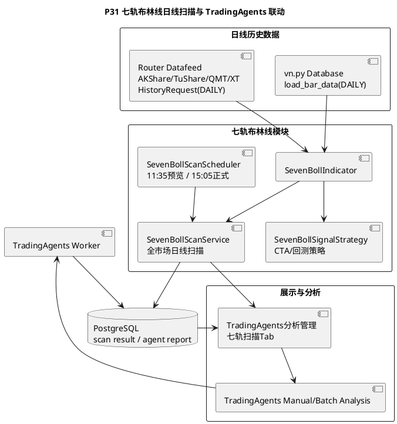

# P31 七轨布林线日线扫描与 TradingAgents 联动任务

目标：基于 [seven_bollinger_bands_strategy.md](/Users/cong.zhou/Documents/quantitative/vnpy/docs/community/info/seven_bollinger_bands_strategy.md) 在当前 vn.py fork 中落地一条完整但受控的日线级别技术分析链路，包括七轨布林线指标计算、CTA/回测策略、全市场日线扫描、定时触发，以及和 TradingAgents 的单点/批量异步分析联动。该模块只生成波段观察信号、候选股票和分析报告入口，不直接绕过现有风控自动下单。

## 范围边界

- 七轨布林线首先作为“技术信号模块”接入，不直接替代 TradingAgents，也不改写现有 `DoubleMaStrategy`、`AtrRsiStrategy`、`TurtleSignalStrategy` 等传统规则策略。
- 第一阶段只做 A 股股票场景，复用现有 vn.py `database.*`、Router Datafeed、AKShare Gateway、TradingAgents App、PostgreSQL 扩展表，不新增独立 DSN。
- 第一阶段只使用日线数据，不做 1 分钟、5 分钟、15 分钟、60 分钟等分时/日内短线扫描。
- 七轨布林线默认参数固定为日线口径：
  - K 线周期：`Interval.DAILY`
  - `N = 20`
  - `DEV = MA(STD(C, N), 5)`
  - 收口/分位判断窗口：`120` 根日 K
  - 默认加载历史：`250` 根日 K
- CTA 回测链路只复用 vn.py `CtaBacktesterApp` 的现有机制；若需要单独的扫描结果回放，必须以后续阶段单独实现。
- 全市场扫描结果只输出：
  - `buy_watch`
  - `sell_watch`
  - `hold`
  不直接生成订单。
- TradingAgents 联动只做“从扫描结果跳转/批量触发分析”，仍然通过已有 `ManualAnalysisService` 或其扩展服务落库到 `agent_run/agent_report/rating_signal/trade_intent`。
- 定时扫描默认只在午盘休息和 15:00 收盘后触发；午盘扫描只作为“当日未完成日 K 的预览观察”，收盘扫描作为“完整日 K 的正式信号”。如果 vn.py 未启动，该定时任务不单独在后台常驻服务运行。
- 本模块不用于盘口异动、分时低吸、日内 T+0 或秒级交易建议。

## 当前状态

- 已有七轨布林线设计文档，公式、信号定义、扫描方向和接入建议已明确。
- 当前代码库中还没有正式的七轨布林线指标模块、扫描服务、扫描 UI 和扫描结果落库。
- 当前 `TradingAgents分析管理` 已支持：
  - 单票手动分析
  - 历史分析查询
  - Markdown 报告展示
  - 新闻/财报查询
- 当前 `每日市场复盘` 和 `TradingAgents` 都已经有独立 App/UI，可以复用现有 UI 模式，不需要再发明新的启动方式。
- 当前工作区里已经有少量七轨相关试写代码，但本任务文档一律按“未完成”管理，后续要按文档逐项核对，不以试写代码视为已交付。

## 目标架构

## 阶段任务

- [ ] **P31-T01: 文档与边界定稿**
  - 修改：`docs/community/info/seven_bollinger_bands_strategy.md`
  - 修改：`docs/community/tasks/tradingagents_next_steps/README.md`
  - 内容：
    - 把最终落地边界固定为“日线指标计算 + CTA/回测策略 + 全市场日线扫描 + TradingAgents 分析联动”。
    - 明确哪些是第一阶段交付，哪些延后：
      - 第一阶段交付：指标、扫描、策略回测、UI、分析联动。
      - 延后：自动实盘下单、组合级扫描资金分配、分时/日内扫描、分钟级异步流式扫描。
    - 明确本模块只做日线级别趋势/波段观察，不作为短线盘口工具。
  - 验收：
    - 文档口径与现有 P27/P29/P30 不冲突。
    - README 中能看到 P31 入口。

- [x] **P31-T02: 七轨布林线指标计算模块**
  - 新增：`vnpy_seven_boll/indicator.py`
  - 新增：`vnpy_seven_boll/__init__.py`
  - 测试：`tests/test_seven_boll_indicator.py`
  - 内容：
    - 实现：
      - `MID = MA(C, N)`
      - `STD0 = STD(C, N)`
      - `DEV = MA(STD0, 5)`
      - 顶轨 / 一轨 / 二轨 / 三轨 / 四轨 / 五轨 / 底轨
    - 补衍生字段：
      - `zscore`
      - `bandwidth7`
      - `bandwidth_percentile`
      - `mid_slope`
      - `bandwidth_slope`
      - `rail_zone`
      - `regime`
    - 输出结构要既能服务 CTA，也能服务全市场扫描和 TradingAgents context。
  - 验收：
    - 单测覆盖上升趋势、震荡、极端超买/超卖、收口样本。
    - 单测输入全部使用日线 bars，指标模块不包含分钟线分支。
    - 指标计算不依赖 Qt、不依赖 TradingAgents、不依赖数据库。

- [x] **P31-T03: 七轨信号规则引擎**
  - 新增：`vnpy_seven_boll/signals.py`
  - 测试：`tests/test_seven_boll_signals.py`
  - 内容：
    - 实现至少五类规则：
      - `trend_pullback_long`
      - `squeeze_breakout_long`
      - `mean_reversion_long`
      - `trend_exit`
      - `overheat_reduce`
    - 每个信号都要输出：
      - `signal_type`
      - `side`
      - `score`
      - `reason`
      - `risk`
    - 规则只做确定性判断，不直接发单。
  - 验收：
    - 对同一组历史 bars，多次运行结果一致。
    - `buy` 和 `sell` 规则不会同时高分冲突；如冲突，必须有统一优先级。

- [x] **P31-T04: CTA 可见策略与回测策略**
  - 新增：`strategies/seven_boll_signal_strategy.py`
  - 测试：`tests/test_seven_boll_cta_strategy.py`
  - 内容：
    - 基于 vn.py `CtaTemplate` 新增 CTA 可见策略。
    - 初版建议策略名：
      - `SevenBollSignalStrategy`
    - 策略默认面向日线回测和波段信号，初始化/回测时要求 `Interval.DAILY`。
    - 支持参数：
      - `window`
      - `std_ma_window`
      - `squeeze_lookback`
      - `squeeze_percentile`
      - `pullback_tolerance`
      - `fixed_size`
      - `stop_loss_pct`
      - `enable_trend_pullback`
      - `enable_squeeze_breakout`
      - `enable_mean_reversion`
    - 策略内只消费七轨信号，不调用 TradingAgents。
  - 验收：
    - 能在 `功能 -> CTA策略` 下拉框中看到。
    - 能正常初始化、启动、停止、在回测里读取日线 K 线。

- [x] **P31-T05: 回测闭环验证**
  - 新增：`tests/test_seven_boll_backtest_strategy.py`
  - 新增：`docs/community/ops/validation_results/<date>-seven-boll-backtest.md`
  - 内容：
    - 用已有历史日线 K 线样本或 fixture 跑通至少三类场景：
      - 强趋势回踩二轨
      - 收口后突破
      - 震荡均值回归
    - 落档记录：
      - 交易次数
      - 胜率
      - 盈亏比
      - 最大回撤
      - 假突破率
  - 验收：
    - 至少能在 vn.py `CTA回测` 中手动选择策略并执行。
    - 文档中明确说明示例回测只用于验证逻辑，不代表生产收益。

- [x] **P31-T06: 全市场扫描服务**
  - 新增：`vnpy_seven_boll/scanner.py`
  - 测试：`tests/test_seven_boll_scanner.py`
  - 内容：
    - 扫描服务只处理日线 bars，禁止直接绑定某个外部数据源。
    - 行情获取必须复用现有 vn.py 标准链路：
      - 优先：`vn.py database.load_bar_data(..., Interval.DAILY, ...)`
      - 其次：`get_datafeed().query_bar_history(HistoryRequest(..., Interval.DAILY, ...))`
      - 如果 `datafeed.name=router`，由 Router Datafeed 决定使用 `local_file / akshare / tushare / qmt / xt`
    - AKShare 只允许作为 Router/Datafeed 的 provider 或股票池兜底来源，`scanner.py` 不直接调用 AKShare 接口。
    - 股票池来源优先级：
      - vn.py 当前合约表 / MainEngine contracts
      - vn.py database `get_bar_overview()`
      - AKShare A 股股票列表兜底
    - 扫描输出分类：
      - 买点候选
      - 卖点候选
      - 保留观察
    - 结果字段至少包括：
      - `vt_symbol`
      - `name`
      - `action`
      - `score`
      - `signal_types`
      - `close`
      - `zscore`
      - `bandwidth_percentile`
      - `mid_slope`
      - `rail_zone`
      - `regime`
      - `bar_datetime`
      - `interval`，固定为 `d`
  - 验收：
    - 支持手动指定股票池。
    - 股票池为空时，能自动从现有 vn.py 合约表 / bar overview / AKShare 股票列表生成 universe。
    - 扫描请求只生成日线 `HistoryRequest`，不会读取或请求分钟线。

- [x] **P31-T07: 扫描结果持久化**
  - 新增：`vnpy_seven_boll/storage.py`
  - 修改：`vnpy_tradingagents/schema_init.py`
  - 测试：`tests/test_seven_boll_storage.py`
  - 内容：
    - 新增扫描结果表，建议：
      - `seven_boll_scan_run`
      - `seven_boll_scan_result`
    - 复用当前 PostgreSQL 和 Peewee `create_tables()` 初始化，不新增 migration runner。
    - 只保存扫描结果和信号解释，不重复保存原始 K 线行情；原始行情继续复用 vn.py bar 表或 `market_bar_snapshot`。
    - 保留 `scan_run_id`，支持历史回看和 UI 展示。
    - 扫描结果必须记录 `interval = d`，避免以后扩展分钟线时混淆历史记录。
  - 验收：
    - 同一天多次扫描可区分不同 run。
    - UI 可读取最近一次和历史 run。
    - 删除或重跑扫描不会影响 vn.py 原始行情数据。

- [x] **P31-T08: 定时扫描调度器**
  - 新增：`vnpy_seven_boll/scheduler.py`
  - 修改：`vnpy/trader/setting.py`
  - 修改：`vnpy_tradingagents/bootstrap.py` 或新增独立 bootstrap
  - 测试：`tests/test_seven_boll_scheduler.py`
  - 内容：
    - 支持配置：
      - `seven_boll.scan.enabled`
      - `seven_boll.scan.schedule`
      - 默认 `11:35,15:05`
    - 运行方式：
      - 在 vn.py 主进程里注册 `EVENT_TIMER`
      - 命中配置时间时异步触发日线扫描
      - `11:35` 扫描标记为 `preview`
      - `15:05` 扫描标记为 `official`
    - 防止重复触发：
      - 同一分钟只触发一次
      - 正在扫描时拒绝再次启动
  - 验收：
    - 不会因为用户频繁点击或 timer 抖动启动多个并发扫描。
    - 扫描失败只记录错误，不影响 vn.py 主程序。
    - 定时任务不请求分钟线，不承诺日内交易信号。

- [x] **P31-T09: TradingAgents Engine 扩展扫描能力**
  - 修改：`vnpy_tradingagents/engine.py`
  - 测试：`tests/test_seven_boll_engine_integration.py`
  - 内容：
    - 在 `TradingAgentsEngine` 上新增：
      - `run_seven_boll_scan()`
      - `load_latest_seven_boll_scan()`
      - `list_seven_boll_scan_history()`
      - `run_scan_analysis(vt_symbol)`
      - `run_batch_scan_analysis(symbols)`
    - 其中分析联动默认复用已有 `TradingAgentsManualAnalysisService`，只是在 context 中增加 `seven_boll_scan` 结构化输入。
  - 验收：
    - 单点分析和批量分析都能返回 run id。
    - 未配置 TradingAgents 时，扫描功能仍可正常使用。

- [x] **P31-T10: TradingAgents 分析管理页新增七轨扫描 Tab**
  - 修改：`vnpy_tradingagents/ui/widget.py`
  - 测试：`tests/test_seven_boll_ui.py`
  - 内容：
    - 在现有 `TradingAgents分析管理` 中新增 `七轨扫描` Tab。
    - 页面至少包含：
      - 扫描参数区
      - 手动触发按钮
      - 最近一次扫描摘要
      - 买点候选表
      - 卖点候选表
      - 历史扫描 run 选择
      - “单点分析”“批量分析”按钮
    - 候选表中每行要展示：
      - 股票
      - 信号类型
      - 分数
      - 所属 regime
      - 操作建议
      - 分析报告入口
  - 验收：
    - 手动扫描完成后无需重启 UI 即可查看结果。
    - 用户点单行后能跳转或联动到已有 TradingAgents 分析报告页。

- [ ] **P31-T11: 扫描结果与 TradingAgents 上下文联动**
  - 修改：`vnpy_tradingagents/manual_analysis.py`
  - 修改：`vnpy_tradingagents/toolkit.py` 或新增 scan context helper
  - 测试：`tests/test_seven_boll_tradingagents_context.py`
  - 内容：
    - 当分析来源是七轨扫描时，在 `context_overrides` 中注入：
      - 当前 scan result
      - 命中的七轨信号
      - 技术状态摘要
      - 日线时间窗口和 `interval=d`
    - 让 TradingAgents 在报告里能解释：
      - 为什么这只股票进入买点/卖点候选
      - 当前是趋势回踩、收口突破还是均值回归
    - 提示词要求：
      - TradingAgents 必须把七轨信号当作“日线技术面证据”，不能当作唯一买卖依据。
      - 如果基本面、新闻、财报与技术信号冲突，必须明确写出冲突。
      - 报告输出应定位为波段/明日观察计划，不输出日内分时交易建议。
  - 验收：
    - 分析报告能引用七轨扫描结果，不再只是普通手动分析。
    - 未命中扫描结果时，不会污染原有手动分析逻辑。

- [ ] **P31-T12: 分析报告跳转与异步状态展示**
  - 修改：`vnpy_tradingagents/ui/widget.py`
  - 测试：`tests/test_seven_boll_ui.py`
  - 内容：
    - 单点/批量触发分析后，UI 显示：
      - `queued`
      - `running`
      - `completed`
      - `failed`
    - 结果表增加：
      - `analysis_run_id`
      - `analysis_status`
      - `查看报告`
    - 报告入口点击后跳到现有 Markdown 报告展示页。
  - 验收：
    - 大模型分析耗时较长时，界面有明确状态，不会误以为卡死。
    - 同一股票重复点分析时，要有最小防重策略或直接给出“已有运行中任务”提示。

- [x] **P31-T13: 配置项收口**
  - 修改：`vnpy/trader/setting.py`
  - 修改：`vnpy/trader/ui/widget.py`
  - 修改：`vnpy_tradingagents/ui/widget.py`
  - 内容：
    - 新增配置项：
      - `seven_boll.scan.enabled`
      - `seven_boll.scan.schedule`
      - `seven_boll.scan.lookback_bars`
      - `seven_boll.scan.max_symbols`
      - `seven_boll.scan.min_buy_score`
      - `seven_boll.scan.min_sell_score`
      - `seven_boll.scan.symbols`
      - `seven_boll.indicator.window`
      - `seven_boll.indicator.std_ma_window`
      - `seven_boll.indicator.squeeze_lookback`
      - `seven_boll.indicator.squeeze_percentile`
      - `seven_boll.indicator.pullback_tolerance`
      - `seven_boll.indicator.volume_breakout_ratio`
    - 固定口径：
      - `interval=d` 不作为用户可编辑项。
      - 默认 `lookback_bars=250`。
      - 默认 `schedule=11:35,15:05`，分别代表午盘预览和收盘正式扫描。
    - 这些配置优先放到 `TradingAgents分析管理 -> 配置` Tab 中统一管理。
  - 验收：
    - 用户不需要改代码即可调扫描参数。
    - 配置说明文本能解释参数作用，并明确说明“仅日线扫描，不用于日内短线”。

- [ ] **P31-T14: 验证落档**
  - 新增：`docs/community/ops/validation_results/<date>-seven-boll-scan-tradingagents.md`
  - 内容：
    - 记录：
      - 指标单测
      - 扫描单测
      - CTA 策略单测
      - 调度器单测
      - UI 冒烟
      - TradingAgents 联动冒烟
    - 真实验证至少覆盖：
      - 手动扫描一次
      - 午盘预览/收盘正式定时触发一次
      - 单点分析一次
      - 批量分析一次
  - 验收：
    - 有独立验证文档。
    - 文档明确哪些是代码级通过，哪些还不是生产级 SLA。
    - 文档说明是否全程只使用日线数据。

## 推荐实施顺序

1. 先做 `P31-T02` 和 `P31-T03`，把指标和信号规则做扎实。
2. 再做 `P31-T04` 和 `P31-T05`，确保 CTA/回测先跑通。
3. 然后做 `P31-T06` 到 `P31-T08`，把扫描和定时调度闭环打通。
4. 最后做 `P31-T09` 到 `P31-T13`，把 UI 和 TradingAgents 联动接上。
5. 全部完成后再做 `P31-T14` 验证落档。

## 风险

- 全市场扫描的历史数据覆盖度强依赖本地数据库和 `router.providers`，如果大量股票没有日线数据，扫描结果会天然不完整。
- 本阶段明确不做分时/日内扫描；如果以后扩展分钟线，需要单独评估数据源成本、限流、性能和 UI 解释。
- TradingAgents 批量分析的耗时和成本都可能较高，必须保留人工触发和状态可见性，不能静默后台狂跑。
- 七轨布林线是技术分析框架，不保证收益；如果后续接到自动交易，必须再经过独立风控和仿真验证。

## 完成记录

| 任务 | 日期 | 提交 | 验证 |
| --- | --- | --- | --- |
| P31-T01 | 2026-05-12 | 未开始 | 未开始 |
| P31-T02 | 2026-05-12 | `1d247adb` | `uv run --with pytest python -m pytest tests/test_seven_boll_indicator.py tests/test_seven_boll_signals.py -q`，5 passed |
| P31-T03 | 2026-05-12 | `1d247adb` | `uv run --with pytest python -m pytest tests/test_seven_boll_indicator.py tests/test_seven_boll_signals.py -q`，5 passed |
| P31-T04 | 2026-05-12 | 未提交 | `uv run --with pytest python -m pytest tests/test_seven_boll_cta_strategy.py -q`，5 passed |
| P31-T05 | 2026-05-12 | 未提交 | `uv run --with pytest python -m pytest tests/test_seven_boll_backtest_strategy.py -q`，1 passed；见 `docs/community/ops/validation_results/20260512-seven-boll-backtest.md` |
| P31-T06 | 2026-05-12 | 未提交 | `uv run --with pytest python -m pytest tests/test_seven_boll_scanner.py -q`，5 passed |
| P31-T07 | 2026-05-12 | 未提交 | `uv run --with pytest python -m pytest tests/test_seven_boll_storage.py -q`，2 passed |
| P31-T08 | 2026-05-12 | 未提交 | `uv run --with pytest python -m pytest tests/test_seven_boll_scheduler.py -q`，5 passed |
| P31-T09 | 2026-05-12 | 未提交 | `uv run --with pytest python -m pytest tests/test_seven_boll_engine_integration.py -q`，4 passed |
| P31-T10 | 2026-05-12 | 未提交 | `uv run --with pytest python -m pytest tests/test_seven_boll_ui.py -q`，2 passed |
| P31-T11 至 P31-T12 | 2026-05-12 | 未开始 | 未开始 |
| P31-T13 | 2026-05-12 | 未提交 | `uv run --with pytest python -m pytest tests/test_seven_boll_ui.py tests/test_seven_boll_scanner.py -q`，7 passed |
| P31-T14 | 2026-05-12 | 未开始 | 未开始 |
