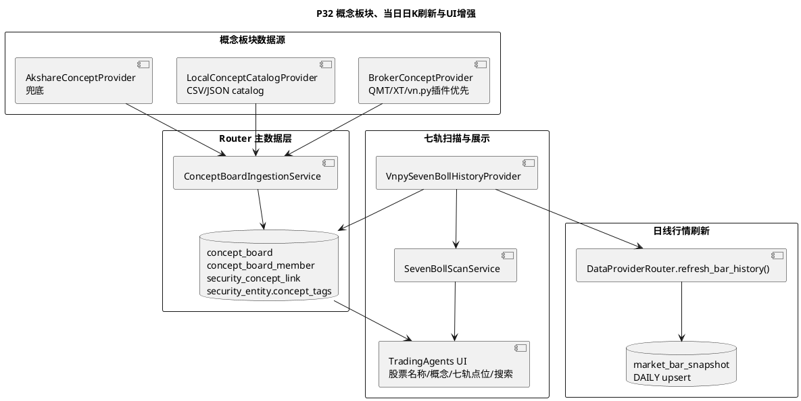

# P32 概念板块主数据、当日日 K 刷新与 TradingAgents 展示增强任务

目标：在 P31 七轨布林线日线扫描基础上补齐三类生产化能力：概念板块主数据和股票关联、当日 `Interval.DAILY` 最新 K 线刷新策略、TradingAgents/七轨扫描 UI 的股票名称与技术点位展示增强。该阶段继续遵守 vn.py 复用边界：scanner 不直接绑定 AKShare，行情刷新必须通过 vn.py database/datafeed/router 链路，概念板块优先使用券商数据，AKShare 只作为兜底来源。

## 范围边界

- 概念板块数据优先级固定为：
  - 第一优先：券商数据源，例如 QMT/XT/vn.py XT datafeed 或 gateway 插件可暴露的板块/概念能力。
  - 第二优先：本地股票主数据 catalog，例如 `news.entity.catalog_path` 或 `financial.ingestion.catalog_path`。
  - 第三优先：AKShare 概念/行业板块接口兜底。
- 七轨 scanner 只读取标准化后的概念结果，不直接调用 AKShare、xtquant 或任何券商 SDK。
- 当日日 K 刷新只处理 `Interval.DAILY`，不新增分时、分钟线或日内短线扫描。
- 手动扫描盘中刷新当天未收盘日 K 只能标记为 preview/观察用途；收盘后刷新才可作为完整日 K 的正式扫描依据。
- TradingAgents 页面展示股票名称是 UI/报告可读性增强，不改变 `vt_symbol` 作为系统主键。
- 概念板块只作为标签和上下文证据，不直接变成交易建议。

## 当前状态

- `security_entity` 已有 `concept_tags` 字段，但当前没有自动入库流程；本地数据库中 `security_entity` 为空。
- `seven_boll_scan_result` 已有 `concept` 字段，七轨 scanner 会尝试读取 `security_entity.concept_tags` 或 catalog，但因为概念主数据未入库，当前 UI 概念列为空。
- `vnpy_router` 当前 QMT/XT provider 只是 `VnpyDatafeedProvider` 的历史行情兼容包装，尚未定义概念板块 provider 协议。
- `vnpy_router.DataProviderRouter.query_bar_history()` 当前优先读取 `market_bar_snapshot` 缓存；缓存命中时不会强制刷新当天最新日 K。
- TradingAgents UI 的七轨扫描表已显示股票名，但分析历史、新闻、财报、报告详情、运行状态等页面仍有若干只显示 `vt_symbol` 的位置。
- 七轨扫描 UI 当前没有候选表模糊搜索，也没有完整展示七轨点位数据。

## 目标架构

## 阶段任务

- [x] **P32-T01: 概念板块领域模型与 provider 协议**
  - 新增：`vnpy_router/concepts.py`
  - 测试：`tests/test_concept_board_domain.py`
  - 内容：
    - 定义领域对象：
      - `ConceptBoard`
      - `ConceptBoardMember`
      - `SecurityConceptLink`
      - `ConceptIngestionSummary`
    - 定义 provider 协议：
      - `ConceptBoardProvider.list_boards(board_type)`
      - `ConceptBoardProvider.list_members(board)`
    - 字段统一使用 vn.py `vt_symbol`，并保留 provider 原始 board code/name。
  - 验收：
    - 单测覆盖板块、成分股、股票概念关联对象。
    - provider 协议不依赖 Qt、不依赖 TradingAgents、不依赖七轨 scanner。

- [x] **P32-T02: 概念板块扩展表和持久化仓储**
  - 修改：`vnpy_router/extension_models.py`
  - 修改：`vnpy_router/event_storage.py`
  - 修改：`vnpy_tradingagents/schema_init.py`
  - 新增：`vnpy_router/concept_storage.py`
  - 测试：`tests/test_concept_board_storage.py`
  - 内容：
    - 新增表：
      - `concept_board`
      - `concept_board_member`
      - `security_concept_link`
    - 对 `security_entity` 做 upsert 补全：
      - `vt_symbol`
      - `symbol`
      - `exchange`
      - `name`
      - `short_name`
      - `industry`
      - `sector`
      - `concept_tags`
    - 提供查询：
      - 按股票查概念列表
      - 按概念查成分股
      - 按股票查主概念
  - 验收：
    - `create_tables(..., safe=True)` 可幂等创建。
    - PostgreSQL 已存在旧表时可通过 additive SQL 补字段，不引入独立 migration runner。
    - 七轨扫描只读取结果表，不重复保存概念源原始大表。

- [x] **P32-T03: 券商优先的概念 provider 链**
  - 新增：`vnpy_router/providers/concepts.py`
  - 测试：`tests/test_concept_board_providers.py`
  - 内容：
    - 实现 provider 链：
      - `BrokerConceptProvider`
      - `LocalConceptCatalogProvider`
      - `AkshareConceptProvider`
    - `BrokerConceptProvider` 优先尝试券商插件边界：
      - `xtquant.xtdata` 可用时读取券商板块/概念能力。
      - `vnpy_xt` 或 vn.py datafeed/gateway 暴露概念接口时优先复用。
      - 未安装券商 SDK 时返回 degraded，不抛出致命异常。
    - `LocalConceptCatalogProvider` 读取 CSV/JSON catalog。
    - `AkshareConceptProvider` 只作为兜底，使用：
      - `stock_board_concept_name_em`
      - `stock_board_concept_cons_em`
      - 可选行业接口 `stock_board_industry_name_em` / `stock_board_industry_cons_em`
  - 验收：
    - provider 顺序默认是 `broker,local_catalog,akshare`。
    - 本机未安装 `xtquant/vnpy_xt` 时测试仍可通过。
    - AKShare 不进入七轨 scanner，只出现在概念 provider 层。

- [x] **P32-T04: 概念板块入库服务和配置**
  - 新增：`vnpy_tradingagents/concept_ingestion.py`
  - 修改：`vnpy/trader/setting.py`
  - 修改：`vnpy_tradingagents/bootstrap.py`
  - 修改：`vnpy_tradingagents/ui/widget.py`
  - 测试：`tests/test_concept_board_ingestion.py`
  - 内容：
    - 新增配置：
      - `concept.ingestion.enabled`
      - `concept.ingestion.providers`
      - `concept.ingestion.schedule`
      - `concept.ingestion.catalog_path`
      - `concept.ingestion.max_boards_per_run`
      - `concept.ingestion.max_concepts_per_symbol`
      - `concept.ingestion.refresh_interval_hours`
    - 实现 `ConceptBoardIngestionService`：
      - 拉取板块列表。
      - 分批拉取板块成分。
      - upsert 概念板块、成分股和股票关联。
      - 汇总每只股票前 N 个概念写回 `security_entity.concept_tags`。
    - 在 TradingAgents 配置页显示中文说明。
  - 验收：
    - 手动触发一次概念入库后，`security_entity` 和 `security_concept_link` 有数据。
    - 券商 provider 不可用时自动降级到 catalog/AKShare，并在状态中显示 degraded source。
    - 概念入库失败不影响 vn.py 主程序和七轨扫描。

- [x] **P32-T05: 七轨 scanner 读取概念关联**
  - 修改：`vnpy_seven_boll/scanner.py`
  - 修改：`vnpy_seven_boll/storage.py`
  - 测试：`tests/test_seven_boll_scanner.py`
  - 内容：
    - `VnpySevenBollHistoryProvider.load_concept()` 优先读取 `security_concept_link`。
    - 其次读取 `security_entity.concept_tags`。
    - 再次读取 catalog。
    - 返回多个概念时用逗号拼接，例如 `机器人概念,光伏概念`。
  - 验收：
    - 华翔股份这类股票只要概念关联入库，七轨扫描结果 concept 列可展示多个概念。
    - scanner 不直接调用券商 SDK 或 AKShare。

- [x] **P32-T06: Router 当日 DAILY 强制刷新接口**
  - 修改：`vnpy_router/router.py`
  - 修改：`vnpy_router/datafeed.py`
  - 修改：`vnpy_router/storage.py`
  - 测试：`tests/test_data_router.py`
  - 内容：
    - 新增 `DataProviderRouter.refresh_bar_history(req, output)`：
      - 跳过 snapshot cache。
      - 直接按 provider 顺序请求历史行情。
      - 成功后 upsert 到 `market_bar_snapshot`。
    - 新增 `Datafeed.refresh_bar_history(req, output)` 适配 vn.py router datafeed。
    - `market_bar_snapshot` 继续使用 `(vt_symbol, interval, datetime, provider_name)` 冲突更新。
  - 验收：
    - `query_bar_history()` 仍然缓存优先。
    - `refresh_bar_history()` 明确绕过缓存并更新 `pulled_at`。
    - 所有刷新仍走 router provider，不绕过 vn.py datafeed 边界。

- [x] **P32-T07: 七轨扫描当日日 K 最新刷新策略**
  - 修改：`vnpy_seven_boll/scanner.py`
  - 修改：`vnpy/trader/setting.py`
  - 修改：`vnpy_tradingagents/ui/widget.py`
  - 测试：`tests/test_seven_boll_scanner.py`
  - 内容：
    - 新增配置：
      - `seven_boll.scan.refresh_latest_daily`
      - `seven_boll.scan.latest_daily_ttl_seconds`
    - 手动扫描和定时扫描读取日线时：
      - 先加载历史 bars。
      - 如果 end 日期是今天，且最新日 K 缓存缺失或超过 TTL，则调用 router `refresh_bar_history()` 刷新今天这根日 K。
      - 刷新结果按日期覆盖合并，不重复保存原始 K 线到七轨表。
    - 盘中刷新标记为 preview 语义，收盘后扫描标记为 official 语义。
  - 验收：
    - 今天多次手动扫描会按 TTL 刷新当天日 K。
    - 非今天历史日期不会触发强制刷新。
    - 未支持 `refresh_bar_history()` 的 datafeed 会降级为当前 cache-first 行为，并在状态中提示。

- [x] **P32-T08: TradingAgents 全页面股票名称展示**
  - 修改：`vnpy_tradingagents/ui/widget.py`
  - 新增或修改：`vnpy_tradingagents/stock_display.py`
  - 测试：`tests/test_tradingagents_ui.py`
  - 内容：
    - 增加统一 `StockDisplayResolver`：
      - 优先 `main_engine.get_contract(vt_symbol).name`
      - 其次 `security_entity.short_name/name`
      - 其次七轨扫描结果 name
      - 最后只展示 `vt_symbol`
    - 所有 TradingAgents 页面有股票代码展示的位置追加股票名称：
      - 运行控制手动分析结果
      - 分析历史表格和详情
      - 新闻查询表格和详情
      - 财报数据详情
      - 七轨扫描表格、状态和报告跳转
      - 分析报告 Markdown 元信息
      - Replay/Gray 状态文本
  - 验收：
    - `600519.SSE` 有名称时显示为 `600519.SSE 贵州茅台`。
    - 无名称时仍显示原始 `vt_symbol`。
    - 所有下游查询仍使用纯 `vt_symbol`，不会把中文名拼进请求。

- [x] **P32-T09: 七轨扫描候选表模糊搜索**
  - 修改：`vnpy_tradingagents/ui/widget.py`
  - 测试：`tests/test_seven_boll_ui.py`
  - 内容：
    - 在七轨扫描 Tab 增加搜索框：
      - 支持股票代码模糊搜索，例如 `603112`
      - 支持股票名称模糊搜索，例如 `华翔`
      - 支持概念模糊搜索，例如 `机器人`
      - 支持信号/regime 中文搜索，例如 `趋势回踩`、`上升趋势`
    - UI 保存完整候选列表，搜索只过滤展示，不修改扫描结果。
    - 增加清空搜索按钮。
  - 验收：
    - 搜索 `华翔` 能过滤出华翔股份和宁波华翔等名称匹配行。
    - 搜索 `机器人` 能过滤出概念包含机器人的候选。
    - 清空搜索后恢复完整买点/卖点候选。

- [x] **P32-T10: 当前股价和七轨点位展示**
  - 修改：`vnpy_seven_boll/scanner.py`
  - 修改：`vnpy_seven_boll/storage.py`
  - 修改：`vnpy_seven_boll/models.py`
  - 修改：`vnpy_tradingagents/ui/widget.py`
  - 测试：`tests/test_seven_boll_scanner.py`
  - 测试：`tests/test_seven_boll_storage.py`
  - 测试：`tests/test_seven_boll_ui.py`
  - 内容：
    - 扫描结果增加七轨点位快照：
      - `current_price`
      - `bar_datetime`
      - `top_band`
      - `upper2_band`
      - `upper1_band`
      - `mid`
      - `lower1_band`
      - `lower2_band`
      - `bottom_band`
      - `zscore`
      - `bandwidth_percentile`
      - `mid_slope`
      - `rail_zone`
    - 存储可采用 `boll_point_json`，避免结果表列过宽；UI 从结构化 JSON 渲染。
    - 七轨扫描表格增加重点列：
      - 当前价
      - 中轨
      - 二轨/一轨区间
      - rail_zone 中文化
      - 日 K 时间
    - 详情区域展示完整七轨点位。
  - 验收：
    - 用户无需打开报告即可看到当前价和七轨位置。
    - 落库结果可回放同一次扫描的七轨点位，不依赖实时重新计算。
    - 底层仍保持日线口径，不引入分钟线字段。

- [x] **P32-T11: UI 状态、文案和验证落档**
  - 修改：`docs/community/tasks/tradingagents_next_steps/32-concept-board-daily-refresh-ui-enhancement.md`
  - 新增：`docs/community/ops/validation_results/<date>-concept-board-daily-refresh-ui.md`
  - 内容：
    - 记录概念入库 smoke：
      - 券商 provider 可用性
      - catalog fallback
      - AKShare fallback
    - 记录当天日 K 刷新 smoke：
      - 缓存命中
      - 强刷更新
      - TTL 未过期跳过
    - 记录 UI smoke：
      - 股票名展示
      - 七轨搜索
      - 当前价和七轨点位展示
  - 验收：
    - 文档明确哪些是代码级验证，哪些需要券商真实环境验证。
    - 未安装券商 SDK 时，不宣称券商概念生产可用。

## 推荐实施顺序

1. 先做 `P32-T01` 到 `P32-T04`，把概念板块主数据和券商优先 provider 链打通。
2. 再做 `P32-T05`，让七轨扫描读取标准化后的概念关联。
3. 然后做 `P32-T06` 和 `P32-T07`，补当日日 K 强制刷新和 TTL 策略。
4. 最后做 `P32-T08` 到 `P32-T10`，统一 TradingAgents 股票名展示、七轨模糊搜索和七轨点位展示。
5. 完成后做 `P32-T11` 验证落档，区分本机代码级通过和券商真实环境验证结果。

## 风险

- 券商概念板块接口没有统一 vn.py 标准，QMT/XT 插件是否暴露概念能力取决于本机安装和账号权限。
- AKShare 概念板块成分接口较多，批量拉取全市场概念可能触发限流，需要分批和缓存。
- 概念标签存在同名、过期、主题漂移等问题，不能把概念命中作为买卖依据。
- 盘中日 K 是未收盘数据，手动扫描结果可能随当日行情变化，必须在 UI 中区分 preview 和 official。
- 全页面股票名展示不能污染下游查询参数，所有引擎调用仍必须使用纯 `vt_symbol`。

## 完成记录

| 任务 | 日期 | 提交 | 验证 |
| --- | --- | --- | --- |
| P32-T01/P32-T02 | 2026-05-13 | 待提交 | `uv run --with pytest python -m pytest tests/test_concept_board_domain.py tests/test_concept_board_storage.py -q` |
| P32-T03/P32-T04 | 2026-05-13 | 待提交 | `uv run --with pytest python -m pytest tests/test_concept_board_domain.py tests/test_concept_board_storage.py tests/test_concept_board_providers.py tests/test_concept_board_ingestion.py -q` |
| P32-T05 | 2026-05-13 | 待提交 | `uv run --with pytest python -m pytest tests/test_seven_boll_scanner.py -q` |
| P32-T06/P32-T07 | 2026-05-13 | 待提交 | `uv run --with pytest python -m pytest tests/test_data_router.py tests/test_seven_boll_scanner.py -q` |
| P32-T08/P32-T09/P32-T10 | 2026-05-13 | 待提交 | `uv run --with pytest python -m pytest tests/test_seven_boll_scanner.py tests/test_seven_boll_storage.py tests/test_seven_boll_ui.py tests/test_stock_display.py tests/test_tradingagents_ui.py -q` |
| P32-T11 | 2026-05-13 | 待提交 | `docs/community/ops/validation_results/2026-05-13-concept-board-daily-refresh-ui.md` |
